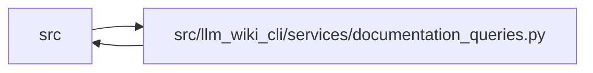

# documentation_queries Module

**Path:** `src/llm_wiki_cli/services/documentation_queries.py`

## Description

Pure documentation graph query helpers.

This module indexes already-built inventory, call graph, data-flow, dependency,
and wiki-surface payloads. It intentionally performs no file writes, file reads,
network calls, or adapter registration so CLI, Python API, MCP, and context
surfaces can consume the same deterministic query answers later.

## Imports

| Source | Symbols |
|--------|---------|
| `.contracts` | `SECTION_OWNERSHIP_EXTENSION_KEY` |
| `.dependencies` | `build_dependency_graph`, `dependency_metrics`, `detect_cycles`, `topological_order` |
| `.knowledge_consumption` | `KnowledgeAvailability`, `KnowledgeReadReason`, `KnowledgeReadView` |
| `.knowledge_governance` | `GOVERNANCE_EXTENSION_KEY` |
| `.knowledge_graph` | `CORE_RELATIONSHIP_KINDS`, `GRAPH_ORIGINS`, `GRAPH_RESOLUTIONS`, `KnowledgeGraphError`, `typed_graph_from_knowledge_extensions` |
| `.knowledge_model` | `knowledge_index_to_payload` |
| `.knowledge_observability` | `knowledge_freshness_hint`, `knowledge_status_payload` |
| `.relationships` | `build_entity_relationship_summaries` |
| `.validation` | `normalize_legacy_portable_relative_path`, `require_nonempty_text` |
| `__future__` | `annotations` |
| `collections` | `defaultdict` |
| `collections.abc` | `Iterable` |
| `dataclasses` | `dataclass` |
| `enum` | `Enum` |
| `json` | `json` |
| `pathlib` | `PurePosixPath` |
| `re` | `re` |
| `typing` | `Any`, `Iterable`, `Mapping`, `Optional`, `Sequence`, `cast` |

## Local dependency map

<!-- Auto-generated local dependency summary. Do not edit by hand. -->

> Module-level dependencies exceed the generated-diagram limits, so the diagram and table below group them by top-level package. Counts report the number of module neighbors in each package.

### Internal neighbors

| Direction | Module |
|---|---|
| Inbound | `src` (8) |
| Outbound | `src` (9) |

> All 17 module neighbor(s) are summarized by package because the module-level view exceeds the 12-node limit.

## Classes

| Class | Line | Bases | Description |
|-------|------|-------|-------------|
| [DocumentationQueryError](../entities/DocumentationQueryError.md) | 66 | `ValueError` | Raised when a documentation graph query request is invalid. |
| [_BoundedResult](../entities/BoundedResult.md) | 71 | — | One deterministic collection plus its exact response bounds. |
| [DocumentationGraphQueryService](../entities/DocumentationGraphQueryService.md) | 339 | — | Read-only graph query service over already-derived documentation payloads. |

## Functions

| Function | Signature | Decorators | Description |
|----------|-----------|------------|-------------|
| `_text_key` | `(value: object) -> tuple[str, str]` | — | — |
| `_value_key` | `(value: object) -> tuple` | — | — |
| `_record_sort_key` | `(record: Mapping[str, Any]) -> tuple` | — | — |
| `_jsonable` | `(value: object) -> object` | — | — |
| `_jsonable_mapping` | `(value: Mapping[str, Any]) -> dict[str, Any]` | — | — |
| `_jsonable_mapping_list` | `(values: Iterable[Mapping[str, Any]]) -> list[dict[str, Any]]` | — | — |
| `_require_query` | `(value: object, field: str) -> str` | — | Retain query-request whitespace normalization for API compatibility. |
| `_normalise_source_path` | `(value: object, *, field: str, required: bool) -> Optional[str]` | — | — |
| `_module_name` | `(filepath: Optional[str]) -> Optional[str]` | — | — |
| `_callable_ref` | `(summary: Mapping[str, Any]) -> dict[str, Any]` | — | — |
| `_class_ref` | `(summary: Mapping[str, Any]) -> dict[str, Any]` | — | — |
| `_flow_ref` | `(flow: Mapping[str, Any]) -> dict[str, Any]` | — | — |
| `_page_ref` | `(page: Mapping[str, Any]) -> dict[str, Any]` | — | — |
| `_edge_pair` | `(edge: object) -> Optional[tuple[str, str]]` | — | — |
| `_call_endpoint_ref` | `(endpoint: Mapping[str, Any], edge: Mapping[str, Any]) -> dict` | — | — |
| `_dedupe_sorted_all` | `(records: Iterable[Mapping[str, Any]]) -> list[dict[str, Any]]` | — | — |
| `_summary_relationship_records` | `(summary: Mapping[str, Any], field: str) -> list[dict[str, Any]]` | — | — |
| `_wire_value` | `(value: object) -> object` | — | — |
| `_canonical_json` | `(value: object) -> str` | — | — |
| `_knowledge_target_ref` | `(target: Mapping[str, Any], resolution: object) -> dict[str, Any]` | — | Return only the coordinates needed to understand a compact target. |
| `_freshness_basis_payload` | `(value: object) -> Optional[dict[str, Any]]` | — | — |
