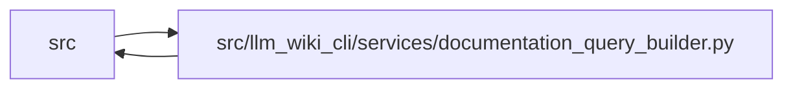

# documentation_query_builder Module

**Path:** `src/llm_wiki_cli/services/documentation_query_builder.py`

## Description

Shared construction for supported documentation query services.

## Imports

| Source | Symbols |
|--------|---------|
| `.` | `context_service`, `extraction_service` |
| `.dependencies` | `analyze_dependencies` |
| `.documentation_queries` | `DocumentationGraphQueryService`, `DocumentationQueryError` |
| `.entrypoints` | `build_flow` |
| `.knowledge_consumption` | `KnowledgeReadView`, `load_knowledge_read_view` |
| `.knowledge_verification` | `attach_machine_verification_read_view`, `verification_summaries_for_concepts` |
| `.source_selection` | `SourceSelectionError`, `resolve_source_selection`, `validate_persisted_source_selection_identity` |
| `.source_snapshot` | `build_source_snapshot`, `capture_source_selection_inputs` |
| `.sync_manifest` | `SyncManifest`, `SyncManifestError` |
| `.wiki_surface_index` | `evaluate_surface_index` |
| `__future__` | `annotations` |
| `collections.abc` | `Callable`, `Iterable`, `Mapping` |
| `os` | `os` |
| `pathlib` | `Path` |
| `typing` | `Any` |

## Local dependency map

<!-- Auto-generated local dependency summary. Do not edit by hand. -->

> Module-level dependencies exceed the generated-diagram limits, so the diagram and table below group them by top-level package. Counts report the number of module neighbors in each package.

### Internal neighbors

| Direction | Module |
|---|---|
| Inbound | `src` (8) |
| Outbound | `src` (11) |

> All 18 module neighbor(s) are summarized by package because the module-level view exceeds the 12-node limit.

## Functions

| Function | Signature | Decorators | Description |
|----------|-----------|------------|-------------|
| `_wiki_has_persisted_read_state` | `(wiki_root: Path) -> bool` | — | Return whether a wiki contains anything beyond empty scaffolding. |
| `validate_live_query_source_selection` | `(*, source_root: Path, wiki_root: Path, live_identity: Mapping[str, object] \| None, live_selection_inputs: Mapping[str, object] \| None \| object = _UNSET_LIVE_SELECTION_INPUTS, operation: str, allow_empty_wiki: bool = False) -> None` | — | Require a live query profile to match the persisted wiki boundary. |
| `_live_source_selection_identity` | `(source_root: Path, source_selection: str \| Path \| None, inventory_result: object) -> Mapping[str, object] \| None` | — | — |
| `assemble_documentation_query_service` | `(*, inventory: Mapping[str, Mapping[str, Any]], call_edges: Iterable[Mapping[str, Any]], flows: Iterable[Mapping[str, Any]], data_flows: object, dependency_analysis: Mapping[str, Any] \| None, surface_index: Mapping[str, Any] \| None, limit: int, knowledge_view: object, machine_verification: Mapping[str, Mapping[str, Any]], service_factory: Any = DocumentationGraphQueryService) -> DocumentationGraphQueryService` | — | Assemble the shared service with a caller-supplied service factory. |
| `build_documentation_query_service_from_view` | `(*, wiki_root: Path, knowledge_view: KnowledgeReadView, limit: int, inventory: Mapping[str, Mapping[str, Any]] \| None = None, call_edges: Iterable[Mapping[str, Any]] = (), flows: Iterable[Mapping[str, Any]] = (), data_flows: object = (), dependency_analysis: Mapping[str, Any] \| None = None, surface_index: Mapping[str, Any] \| None = None) -> DocumentationGraphQueryService` | — | Assemble one service around an already evaluated native read view. |
| `build_snapshot_documentation_query_service` | `(*, wiki_root: Path, limit: int) -> DocumentationGraphQueryService` | — | Build a snapshot-only service without source extraction. |
| `build_live_documentation_query_service` | `(*, source_root: Path, wiki_root: Path, limit: int, read_only: bool, helper_cache_dir: Path \| None = None, include_plugins: bool = True, source_plugins_only: bool = False, require_live_freshness: bool = False, source_selection: str \| Path \| None = None, extract_payload_builder: Callable[..., Any] \| None = None, source_snapshot_builder: Callable[..., Any] \| None = None, call_edge_resolver: Callable[[Any], Any] \| None = None, flow_builder: Callable[[Any, Any], Any] = build_flow, surface_evaluator: Callable[..., Any] = evaluate_surface_index, knowledge_view_builder: Callable[..., Any] \| None = None, query_surface_builder: Callable[..., Any] \| None = None, dependency_analyzer: Callable[..., Any] = analyze_dependencies, verification_view_attacher: Callable[..., Any] = attach_machine_verification_read_view, verification_summarizer: Callable[..., Any] = verification_summaries_for_concepts, service_factory: Any = DocumentationGraphQueryService) -> DocumentationGraphQueryService` | — | Build a live service using one operation-scoped extraction. |
