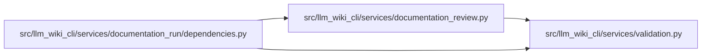

# documentation_review Module

**Path:** `src/llm_wiki_cli/services/documentation_review.py`

## Description

Deterministic review-ledger and adjustment-loop contracts.

The service consumes already-produced checker or agent-review records.  It does
not run commands, touch the filesystem, or advance a documentation run.  A
caller can therefore persist the returned ledger and make the lifecycle change
only after independently reconciling it with the run and workspace evidence.

Finding identity deliberately excludes prose, severity, evidence ordering, and
path ordering.  Rewording a diagnostic or presenting its affected paths in a
different order must not reset its occurrence counter.

## Imports

| Source | Symbols |
|--------|---------|
| `.validation` | `coerce_nonnegative_int`, `coerce_positive_int`, `coerce_trimmed_text`, `normalize_observational_posix_path`, `require_bool`, `require_choice`, `require_exact_fields`, `require_mapping`, `require_nonempty_text`, `require_nonnegative_int`, `require_positive_int`, `require_string`, `require_trimmed_text_list` |
| `__future__` | `annotations` |
| `collections.abc` | `Iterable` |
| `dataclasses` | `asdict`, `dataclass`, `is_dataclass`, `replace` |
| `hashlib` | `hashlib` |
| `json` | `json` |
| `re` | `re` |
| `typing` | `Any`, `Iterable`, `Mapping`, `Sequence` |

## Local dependency map

<!-- Auto-generated local dependency summary. Do not edit by hand. -->

### Internal neighbors

| Direction | Module |
|---|---|
| Inbound | [documentation_run_dependencies](../modules/documentation_run_dependencies.md) |
| Outbound | [validation](../modules/validation.md) |

## Classes

| Class | Line | Bases | Description |
|-------|------|-------|-------------|
| [DocumentationReviewError](../entities/DocumentationReviewError.md) | 170 | `ValueError` | Raised when review evidence cannot satisfy the ledger contract. |
| [DocumentationReviewFinding](../entities/DocumentationReviewFinding.md) | 175 | — | One stable finding accumulated across review iterations. |
| [DocumentationReviewPacket](../entities/DocumentationReviewPacket.md) | 256 | — | Auditable reference to one role-specific packet and result. |
| [SupervisorReconciliation](../entities/SupervisorReconciliation.md) | 310 | — | Independent supervisor disposition for a clean review ledger. |
| [DocumentationReviewLedger](../entities/DocumentationReviewLedger.md) | 359 | — | Versioned, JSON-friendly state for the bounded review loop. |
| [ReviewLoopDecision](../entities/ReviewLoopDecision.md) | 481 | — | Controller instruction returned without mutating lifecycle state. |
| [ReviewLoopResult](../entities/ReviewLoopResult.md) | 507 | — | — |

## Functions

| Function | Signature | Decorators | Description |
|----------|-----------|------------|-------------|
| `create_review_ledger` | `(run_id: str, *, max_loops: int = 3) -> DocumentationReviewLedger` | — | Create an empty bounded ledger without reading or writing run state. |
| `normalize_review_records` | `(source: str, records: object, *, observed_at: str) -> tuple[DocumentationReviewFinding, ...]` | — | Normalize one checker/reviewer result set into stable findings. |
| `normalize_review_findings` | `(records_by_source: Mapping[str, object], *, observed_at: str) -> tuple[DocumentationReviewFinding, ...]` | — | Normalize all supported result sources into one deterministic tuple. |
| `apply_review_loop` | `(ledger: DocumentationReviewLedger, records_by_source: Mapping[str, object], *, observed_at: str, worker_packet: DocumentationReviewPacket, reviewer_packet: DocumentationReviewPacket) -> ReviewLoopResult` | — | Merge one review pass and return the bounded controller decision. |
| `reconcile_review_ledger` | `(ledger: DocumentationReviewLedger, *, supervisor_packet: DocumentationReviewPacket, approved: bool, rationale: str, evidence: Iterable[str], reconciled_at: str) -> DocumentationReviewLedger` | — | Record independent supervisor reconciliation before ``publish_ready``. |
| `_normalise_record` | `(source: str, record: Mapping[str, Any], observed_at: str) -> DocumentationReviewFinding` | — | — |
| `_combine_same_iteration` | `(left: DocumentationReviewFinding, right: DocumentationReviewFinding) -> DocumentationReviewFinding` | — | — |
| `_merge_occurrence` | `(previous: DocumentationReviewFinding, observation: DocumentationReviewFinding) -> DocumentationReviewFinding` | — | — |
| `_decision_for_ledger` | `(ledger: DocumentationReviewLedger) -> ReviewLoopDecision` | — | — |
| `_validate_loop_packets` | `(worker: DocumentationReviewPacket, reviewer: DocumentationReviewPacket, *, iteration: int) -> None` | — | — |
| `_validate_ledger` | `(ledger: DocumentationReviewLedger) -> None` | — | — |
| `_record_mapping` | `(record: object) -> Mapping[str, Any]` | — | — |
| `_iter_review_records` | `(records: object) -> Iterable[Mapping[str, Any]]` | — | Flatten common checker report envelopes without losing severity class. |
| `_normalise_source` | `(value: object) -> str` | — | — |
| `_normalise_category` | `(value: object) -> str` | — | — |
| `_normalise_severity` | `(value: object) -> str` | — | — |
| `_normalise_status` | `(value: object) -> str` | — | — |
| `_normalise_paths` | `(values: object) -> tuple[str, ...]` | — | Keep unsafe spellings visible in non-authoritative review metadata. |
| `_normalise_targets` | `(values: object) -> tuple[str, ...]` | — | — |
| `_canonical_evidence_values` | `(values: object) -> tuple[str, ...]` | — | — |
| `_combined_values` | `(record: Mapping[str, Any], *keys: str) -> list[Any]` | — | — |
| `_first_present` | `(record: Mapping[str, Any], *keys: str) -> object` | — | — |
| `_iter_scalar_values` | `(value: object) -> list[Any]` | — | — |
| `_is_sequence` | `(value: object) -> bool` | — | — |
| `_text_tuple` | `(values: object) -> tuple[str, ...]` | — | — |
| `_merge_text` | `(left: Iterable[str], right: Iterable[str]) -> tuple[str, ...]` | — | — |
| `_merge_rationale` | `(left: str, right: str) -> str` | — | — |
| `_higher_severity` | `(left: str, right: str) -> str` | — | — |
| `_require_terminal_rationale` | `(status: str, rationale: str) -> None` | — | — |
| `_require_terminal_evidence` | `(status: str, evidence: Iterable[str]) -> None` | — | — |
| `_validate_finding` | `(finding: DocumentationReviewFinding) -> None` | — | — |
| `_validate_packet_evidence` | `(packet: DocumentationReviewPacket) -> None` | — | — |
| `_validate_text_items` | `(values: object, label: str) -> None` | — | Preserve free-form tuple items stored by the review-ledger contract. |
| `_require_exact_fields` | `(payload: Mapping[str, Any], expected: frozenset[str], label: str) -> None` | — | — |
| `_required_json_string` | `(value: object, label: str) -> str` | — | — |
| `_required_json_text` | `(value: object, label: str) -> str` | — | Preserve review-ledger whitespace normalization and embedded controls. |
| `_required_enum` | `(value: object, supported: frozenset[str], label: str) -> str` | — | — |
| `_required_string_list` | `(value: object, label: str) -> tuple[str, ...]` | — | Preserve untrimmed free-form strings in persisted review arrays. |
| `_required_positive_int` | `(value: object, label: str) -> int` | — | — |
| `_required_non_negative_int` | `(value: object, label: str) -> int` | — | — |
| `_required_text` | `(value: object, label: str) -> str` | — | Preserve the v1 review contract's coercion of scalar display values. |
| `_optional_text` | `(value: object) -> str` | — | Preserve the v1 review contract's loose optional display-text coercion. |
| `_required_bool` | `(value: object, label: str) -> bool` | — | — |
| `_positive_int` | `(value: object, label: str) -> int` | — | Preserve legacy integer coercion while still requiring a positive result. |
| `_non_negative_int` | `(value: object, label: str) -> int` | — | Preserve legacy integer coercion for review summary counters. |
| `_require_mapping` | `(value: object, label: str) -> Mapping[str, Any]` | — | — |
