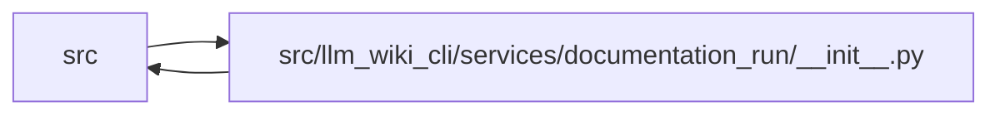

# __init__ Module

**Path:** `src/llm_wiki_cli/services/documentation_run/__init__.py`

## Description

Deterministic lifecycle contract for agent-driven documentation workspaces.

## Imports

| Source | Symbols |
|--------|---------|
| `.` | `dependencies`, `contracts`, `schema`, `workspace`, `integrity`, `refresh`, `prepare`, `packet`, `record`, `verify`, `export` |
| `.contracts` | `DEFAULT_DOCUMENTATION_SKILLS`, `DocumentationAgentPacket`, `DocumentationAgentResult`, `DocumentationIntegrityError`, `DocumentationIntakeBrief`, `DocumentationRun`, `DocumentationRunError`, `DocumentationRunStatus`, `DocumentationSchemaError`, `DocumentationTransitionError`, `DocumentationVerificationReport`, `POLICY_FILENAME`, `RUN_CONTROL_DIR`, `SUPPORTED_AGENT_STAGES`, `SUPPORTED_BASELINE_STRATEGIES`, `SUPPORTED_DOCUMENTATION_KNOWLEDGE_MODES`, `SUPPORTED_FRESHNESS_POLICIES`, `workspace_paths`, `__version__`, `_MAX_BUILDER_LOG_BYTES`, `_RefreshArchiveTransaction` |
| `.dependencies` | `os`, `refresh_documentation_native_projection` |
| `.export` | `export_documentation_run`, `_run_authorized_builder` |
| `.integrity` | `capture_generated_ownership`, `compare_generated_ownership`, `_export_documentation_skills`, `_hash_exported_skill`, `_hash_skill_tree` |
| `.packet` | `build_documentation_agent_packet` |
| `.prepare` | `prepare_documentation_run` |
| `.record` | `record_documentation_agent_result`, `_record_review_ledger_iteration` |
| `.refresh` | `source_identity`, `_archive_owned_run` |
| `.schema` | `_validate_documentation_projection_policy`, `_portable_path`, `_portable_path_tuple` |
| `.verify` | `verify_documentation_run`, `_load_documentation_knowledge_projection` |
| `.workspace` | `documentation_run_path`, `get_documentation_run_status`, `load_documentation_run`, `save_documentation_run`, `transition_documentation_run`, `_write_json`, `_write_workspace_text`, `_supports_descriptor_bound_workspace_writes`, `_fsync_directory_after_replace` |
| `__future__` | `annotations` |
| `sys` | `_sys` |
| `types` | `_types` |
| `typing` | `_typing` |

## Local dependency map

<!-- Auto-generated local dependency summary. Do not edit by hand. -->

> Module-level dependencies exceed the generated-diagram limits, so the diagram and table below group them by top-level package. Counts report the number of module neighbors in each package.

### Internal neighbors

| Direction | Module |
|---|---|
| Inbound | `src` (3) |
| Outbound | `src` (11) |

> All 14 module neighbor(s) are summarized by package because the module-level view exceeds the 12-node limit.

## Classes

| Class | Line | Bases | Description |
|-------|------|-------|-------------|
| [_CompatibilityModule](../entities/CompatibilityModule.md) | 242 | `_types.ModuleType` | Mirror compatibility monkeypatches into the owning role modules. |

## Functions

| Function | Signature | Decorators | Description |
|----------|-----------|------------|-------------|
| `_restore_definition_module` | `(value: object, owner: str, seen: set[int] \| None = None) -> None` | — | Preserve historical introspection and pickle lookup paths. |
