# contracts Module

**Path:** `src/llm_wiki_cli/services/documentation_run/contracts.py`

## Description

Persisted contracts for documentation runs.

## Imports

| Source | Symbols |
|--------|---------|
| `.dependencies` | `*` |
| `.packet` | `_render_packet_markdown` |
| `.schema` | `_assert_no_forbidden_packet_fields`, `_portable_path_tuple`, `_require_exact_fields`, `_required_agent_result_text`, `_require_utc_timestamp`, `_text_tuple`, `_validate_agent_result_findings`, `_validate_imported_page_edits`, `_validate_run_payload` |
| `__future__` | `annotations` |
| `typing` | `TYPE_CHECKING` |

## Local dependency map

```mermaid
flowchart LR
    n0["src/llm_wiki_cli/services/documentation_run/__init__.py"]
    n1["src/llm_wiki_cli/services/documentation_run/contracts.py"]
    n2["src/llm_wiki_cli/services/documentation_run/dependencies.py"]
    n3["src/llm_wiki_cli/services/documentation_run/export.py"]
    n4["src/llm_wiki_cli/services/documentation_run/integrity.py"]
    n5["src/llm_wiki_cli/services/documentation_run/packet.py"]
    n6["src/llm_wiki_cli/services/documentation_run/prepare.py"]
    n7["src/llm_wiki_cli/services/documentation_run/record.py"]
    n8["src/llm_wiki_cli/services/documentation_run/refresh.py"]
    n9["src/llm_wiki_cli/services/documentation_run/schema.py"]
    n10["src/llm_wiki_cli/services/documentation_run/verify.py"]
    n11["src/llm_wiki_cli/services/documentation_run/workspace.py"]
    n0 ==> n1
    n0 ==> n2
    n0 ==> n3
    n0 ==> n4
    n0 ==> n5
    n0 ==> n6
    n0 ==> n7
    n0 ==> n8
    n0 ==> n9
    n0 ==> n10
    n0 ==> n11
    n1 ==> n2
    n1 ==> n5
    n1 ==> n9
    n3 ==> n1
    n3 ==> n2
    n3 ==> n4
    n3 ==> n7
    n3 ==> n8
    n3 ==> n9
    n3 ==> n10
    n3 ==> n11
    n4 ==> n1
    n4 ==> n2
    n4 ==> n9
    n4 ==> n11
    n5 ==> n1
    n5 ==> n2
    n5 ==> n4
    n5 ==> n9
    n5 ==> n11
    n6 ==> n1
    n6 ==> n2
    n6 ==> n4
    n6 ==> n8
    n6 ==> n9
    n6 ==> n11
    n7 ==> n1
    n7 ==> n2
    n7 ==> n4
    n7 ==> n8
    n7 ==> n9
    n7 ==> n11
    n8 ==> n1
    n8 ==> n2
    n8 ==> n4
    n8 ==> n9
    n8 ==> n11
    n9 ==> n1
    n9 ==> n2
    n10 ==> n1
    n10 ==> n2
    n10 ==> n4
    n10 ==> n7
    n11 ==> n1
    click n0 "../modules/documentation_run___init__.md"
    click n1 "../modules/documentation_run_contracts.md"
    click n2 "../modules/documentation_run_dependencies.md"
    click n3 "../modules/export.md"
    click n4 "../modules/integrity.md"
    click n5 "../modules/packet.md"
    click n6 "../modules/prepare.md"
    click n7 "../modules/record.md"
    click n8 "../modules/refresh.md"
    click n9 "../modules/documentation_run_schema.md"
    click n10 "../modules/verify.md"
    click n11 "../modules/workspace.md"
```

<!-- Auto-generated local dependency summary. Do not edit by hand. -->
<!-- Thick arrows (==>) mark edges inside an import cycle. -->

> Diagram shows 55 of 60 local dependency edges; 5 omitted to keep the visualization within the generated-diagram limits. Complete inbound and outbound dependencies remain in the tables below.

### Internal neighbors

| Direction | Module |
|---|---|
| Inbound | [documentation_run___init__](../modules/documentation_run___init__.md) |
| Inbound | [export](../modules/export.md) |
| Inbound | [integrity](../modules/integrity.md) |
| Inbound | [packet](../modules/packet.md) |
| Inbound | [prepare](../modules/prepare.md) |
| Inbound | [record](../modules/record.md) |
| Inbound | [refresh](../modules/refresh.md) |
| Inbound | [documentation_run_schema](../modules/documentation_run_schema.md) |
| Inbound | [verify](../modules/verify.md) |
| Inbound | [workspace](../modules/workspace.md) |
| Outbound | [documentation_run_dependencies](../modules/documentation_run_dependencies.md) |
| Outbound | [packet](../modules/packet.md) |
| Outbound | [documentation_run_schema](../modules/documentation_run_schema.md) |

## Classes

| Class | Line | Bases | Description |
|-------|------|-------|-------------|
| [DocumentationRunError](../entities/DocumentationRunError.md) | 235 | `RuntimeError` | Base error raised by the documentation lifecycle service. |
| [DocumentationSchemaError](../entities/DocumentationSchemaError.md) | 239 | `DocumentationRunError` | Raised when a persisted or returned contract is invalid. |
| [DocumentationTransitionError](../entities/DocumentationTransitionError.md) | 243 | `DocumentationRunError` | Raised when a stage transition violates the lifecycle graph. |
| [DocumentationIntegrityError](../entities/DocumentationIntegrityError.md) | 247 | `DocumentationRunError` | Raised when source, input-wiki, or generated ownership changed. |
| [DocumentationPersistedStateError](../entities/DocumentationPersistedStateError.md) | 251 | `DocumentationIntegrityError`, `DocumentationSchemaError` | Raised when a stored documentation-run contract is corrupt. |
| [DocumentationIntakeBrief](../entities/DocumentationIntakeBrief.md) | 259 | — | — |
| [DocumentationRun](../entities/DocumentationRun.md) | 565 | — | — |
| [DocumentationRunStatus](../entities/DocumentationRunStatus.md) | 714 | — | — |
| [DocumentationAgentPacket](../entities/DocumentationAgentPacket.md) | 741 | — | — |
| [DocumentationAgentResult](../entities/DocumentationAgentResult.md) | 763 | — | — |
| [DocumentationVerificationReport](../entities/DocumentationVerificationReport.md) | 892 | — | — |
| [_RefreshContinuationSnapshot](../entities/RefreshContinuationSnapshot.md) | 914 | — | Safe in-memory handoff from an archived run to a refreshed baseline. |
| [_RefreshArchiveTransaction](../entities/RefreshArchiveTransaction.md) | 925 | — | Tracks an archived run until its replacement is safely committed. |
| [_NativeEvidenceTransaction](../entities/NativeEvidenceTransaction.md) | 939 | — | Captured controller state for refresh plus evidence reconciliation. |
| [_InitialPrepareTransaction](../entities/InitialPrepareTransaction.md) | 949 | — | Tracks a pristine workspace root until initial preparation commits. |

## Functions

| Function | Signature | Decorators | Description |
|----------|-----------|------------|-------------|
| `workspace_paths` | `() -> dict[str, str]` | — | — |
| `_optional_text` | `(value: Any) -> str \| None` | — | — |
| `_next_actions` | `(run: DocumentationRun) -> tuple[str, ...]` | — | — |
| `_state_to_stage` | `(state: str) -> str \| None` | — | — |
| `_json_round_trip` | `(payload: Mapping[str, Any]) -> dict[str, Any]` | — | — |
| `_utc_now` | `() -> str` | — | — |
| `_new_run_id` | `() -> str` | — | — |
| `_sha256_json` | `(payload: Mapping[str, Any]) -> str` | — | — |
