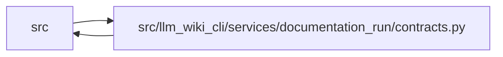

# contracts Module

**Path:** `src/llm_wiki_cli/services/documentation_run/contracts.py`

## Description

Persisted contracts for documentation runs.

Ownership coverage is a fixed declaration of the existing root-file and
generated-section inventory. It names ordinary authority markers and immutable
storage omitted from byte fingerprints and root rollback, without probing
their presence or declaring them valid. Role disclosure does not expand worker
permissions, the five rollback roots or the four refresh-mutable roots.

## Imports

| Source | Symbols |
|--------|---------|
| `..canonical_json` | `ascii_compact_bytes`, `sha256_digest` |
| `..contracts` | `SUPPORTED_DOCUMENTATION_KNOWLEDGE_MODES` |
| `.dependencies` | `*` |
| `.packet` | `_render_packet_markdown` |
| `.schema` | `_assert_no_forbidden_packet_fields`, `_portable_path_tuple`, `_require_exact_fields`, `_required_agent_result_text`, `_require_utc_timestamp`, `_text_tuple`, `_validate_agent_result_findings`, `_validate_imported_page_edits`, `_validate_run_payload` |
| `__future__` | `annotations` |
| `typing` | `TYPE_CHECKING` |

## Local dependency map

<!-- Auto-generated local dependency summary. Do not edit by hand. -->

```mermaid
flowchart LR
    n0["src"]
    n1["src/llm_wiki_cli/services/documentation_run/contracts.py"]
    n0 --> n1
    n1 --> n0
    click n1 "../modules/documentation_run_contracts.md"
```

> Module-level dependencies exceed the generated-diagram limits, so the diagram and table below group them by top-level package. Counts report the number of module neighbors in each package.

### Internal neighbors

| Direction | Module |
|---|---|
| Inbound | `src` (11) |
| Outbound | `src` (5) |

> All 14 module neighbor(s) are summarized by package because the module-level view exceeds the 12-node limit.

## Classes

| Class | Line | Bases | Description |
|-------|------|-------|-------------|
| [DocumentationRunError](../entities/DocumentationRunError.md) | 297 | `RuntimeError` | Base error raised by the documentation lifecycle service. |
| [DocumentationSchemaError](../entities/DocumentationSchemaError.md) | 301 | `DocumentationRunError` | Raised when a persisted or returned contract is invalid. |
| [DocumentationTransitionError](../entities/DocumentationTransitionError.md) | 305 | `DocumentationRunError` | Raised when a stage transition violates the lifecycle graph. |
| [DocumentationIntegrityError](../entities/DocumentationIntegrityError.md) | 309 | `DocumentationRunError` | Raised when source, input-wiki, or generated ownership changed. |
| [DocumentationPersistedStateError](../entities/DocumentationPersistedStateError.md) | 313 | `DocumentationIntegrityError`, `DocumentationSchemaError` | Raised when a stored documentation-run contract is corrupt. |
| [DocumentationIntakeBrief](../entities/DocumentationIntakeBrief.md) | 321 | — | — |
| [DocumentationRun](../entities/DocumentationRun.md) | 627 | — | — |
| [DocumentationRunStatus](../entities/DocumentationRunStatus.md) | 776 | — | — |
| [DocumentationAgentPacket](../entities/DocumentationAgentPacket.md) | 803 | — | — |
| [DocumentationAgentResult](../entities/DocumentationAgentResult.md) | 825 | — | — |
| [DocumentationVerificationReport](../entities/DocumentationVerificationReport.md) | 957 | — | — |
| [_RefreshContinuationSnapshot](../entities/RefreshContinuationSnapshot.md) | 979 | — | Safe in-memory handoff from an archived run to a refreshed baseline. |
| [_RefreshArchiveTransaction](../entities/RefreshArchiveTransaction.md) | 990 | — | Tracks an archived run until its replacement is safely committed. |
| [_NativeEvidenceTransaction](../entities/NativeEvidenceTransaction.md) | 1004 | — | Captured controller state for refresh plus evidence reconciliation. |
| [_InitialPrepareTransaction](../entities/InitialPrepareTransaction.md) | 1014 | — | Tracks a pristine workspace root until initial preparation commits. |

## Functions

| Function | Signature | Decorators | Description |
|----------|-----------|------------|-------------|
| `_native_ownership_coverage` | `() -> dict[str, Any]` | — | Describe the fixed inventory scope without inspecting or granting custody. |
| `workspace_paths` | `() -> dict[str, str]` | — | — |
| `_optional_text` | `(value: Any) -> str \| None` | — | — |
| `_next_actions` | `(run: DocumentationRun) -> tuple[str, ...]` | — | — |
| `_state_to_stage` | `(state: str) -> str \| None` | — | — |
| `_json_round_trip` | `(payload: Mapping[str, Any]) -> dict[str, Any]` | — | — |
| `_utc_now` | `() -> str` | — | — |
| `_new_run_id` | `() -> str` | — | — |
| `_sha256_json` | `(payload: Mapping[str, Any]) -> str` | — | — |
