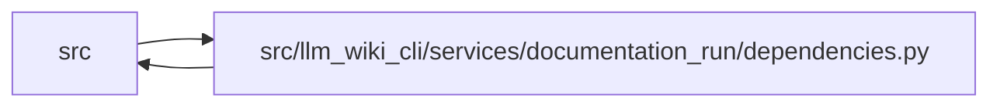

# dependencies Module

**Path:** `src/llm_wiki_cli/services/documentation_run/dependencies.py`

## Description

Imports shared by the mechanically split lifecycle modules.

## Imports

| Source | Symbols |
|--------|---------|
| `...` | `__version__` |
| `..bootstrap_service` | `BootstrapRequest` |
| `..calibration.contracts` | `build_flow_evidence_census`, `build_p0_calibration_shadow` |
| `..contracts` | `DOCUMENTATION_AGENT_PACKET_SCHEMA_VERSION`, `DOCUMENTATION_AGENT_RESULT_SCHEMA_VERSION`, `DOCUMENTATION_FINAL_REPORT_SCHEMA_VERSION`, `DOCUMENTATION_RUN_SCHEMA_VERSION`, `DOCUMENTATION_SEMANTIC_READINESS_SCHEMA_VERSION`, `DOCUMENTATION_VERIFICATION_SCHEMA_VERSION` |
| `..documentation_claim_evidence` | `DocumentationClaimEvidenceError`, `normalize_claim_evidence_records`, `normalize_runtime_capture_records`, `preflight_runtime_capture_records`, `reconcile_claim_evidence_records`, `reconcile_runtime_capture_records` |
| `..documentation_native` | `DocumentationNativeError`, `DocumentationNativeRefresh`, `refresh_documentation_native_projection` |
| `..documentation_policy` | `DocumentationMutationPolicy`, `DocumentationPolicyError`, `IntegrityDifference`, `TreeBaseline`, `capture_tree_baseline`, `compare_source_plugin_tree_baseline`, `compare_source_snapshot_baseline`, `compare_tree_baseline`, `hash_bytes`, `resolve_documentation_policy`, `source_plugin_tree_baseline`, `source_snapshot_tree_baseline`, `source_tree_baseline` |
| `..documentation_queries` | `DocumentationQueryError` |
| `..documentation_query_builder` | `build_documentation_query_service_from_view`, `build_live_documentation_query_service`, `build_snapshot_documentation_query_service` |
| `..documentation_review` | `DocumentationReviewError`, `DocumentationReviewLedger`, `DocumentationReviewPacket`, `apply_review_loop`, `create_review_ledger`, `normalize_review_findings`, `reconcile_review_ledger` |
| `..documentation_wiki_input` | `SUPPORTED_MANIFEST_VERSIONS` |
| `..documentation_worklist` | `DOCUMENTATION_WORKLIST_SCHEMA_VERSION`, `build_documentation_worklist` |
| `..filesystem_guard` | `WindowsDirectoryGuardError`, `guard_windows_directory_chain` |
| `..io` | `read_md`, `write_bytes_atomic`, `write_text_output` |
| `..knowledge_artifacts` | `KNOWLEDGE_INDEX_FILENAME` |
| `..knowledge_consumption` | `KnowledgeReadView` |
| `..knowledge_governance` | `GOVERNANCE_FILENAME` |
| `..skills` | `REFERENCE_DEPENDENT_SKILLS`, `REFERENCE_SKILL_ID`, `export_skills`, `list_bundled_skills` |
| `..source_selection` | `SourceSelectionError`, `SourceSelectionPolicy`, `resolve_source_selection`, `source_selection_identity_from_generation_inputs` |
| `..source_snapshot` | `SourceSnapshot`, `build_source_snapshot`, `capture_source_selection_inputs` |
| `..validation` | `parse_utc_timestamp`, `portable_path_key`, `require_exact_fields`, `require_nonempty_text`, `require_portable_relative_path`, `require_sha256`, `require_trimmed_text_list`, `resolve_workspace_path` |
| `..verification_contracts` | `VERIFICATION_RECEIPT_FILENAME` |
| `..wiki_media` | `iter_markdown_link_targets`, `local_link_path`, `strip_fenced_code_blocks` |
| `..wiki_surface_index` | `WIKI_SURFACE_INDEX_SCHEMA_VERSION` |
| `__future__` | `annotations` |
| `copy` | `copy` |
| `dataclasses` | `dataclass`, `field` |
| `datetime` | `datetime`, `timezone` |
| `errno` | `errno` |
| `hashlib` | `hashlib` |
| `importlib.util` | `importlib.util` |
| `json` | `json` |
| `os` | `os` |
| `pathlib` | `Path`, `PurePosixPath` |
| `re` | `re` |
| `shutil` | `shutil` |
| `stat` | `stat` |
| `subprocess` | `subprocess` |
| `sys` | `sys` |
| `tempfile` | `tempfile` |
| `typing` | `Any`, `Iterable`, `Mapping`, `Optional` |
| `urllib.parse` | `urlsplit` |
| `uuid` | `uuid` |

## Local dependency map

<!-- Auto-generated local dependency summary. Do not edit by hand. -->

> Module-level dependencies exceed the generated-diagram limits, so the diagram and table below group them by top-level package. Counts report the number of module neighbors in each package.

### Internal neighbors

| Direction | Module |
|---|---|
| Inbound | `src` (11) |
| Outbound | `src` (23) |

> All 34 module neighbor(s) are summarized by package because the module-level view exceeds the 12-node limit.

## Functions

| Function | Signature | Decorators | Description |
|----------|-----------|------------|-------------|
| `build_flow_evidence_census` | `(wiki_dir: str, *, source_root: Optional[str] = None, source_revision: str = 'unknown', source_fingerprint: str = 'unknown', dependency_evidence: Optional[Mapping[str, Any]] = None, tool_revision: str = 'unknown', allow_surface_fallback: bool = False) -> dict[str, Any]` | — | — |
| `build_p0_calibration_shadow` | `(worklist: Mapping[str, Any], census: Mapping[str, Any], *, candidate_records: Optional[Iterable[Mapping[str, Any]]] = None, policy_version: str = 'unscored-shadow/v1') -> dict[str, Any]` | — | — |
