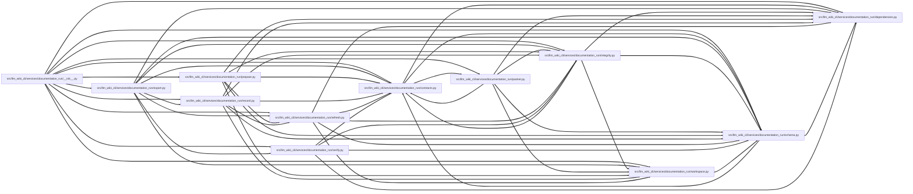

# schema Module

**Path:** `src/llm_wiki_cli/services/documentation_run/schema.py`

## Description

Documentation-run schema services.

## Imports

| Source | Symbols |
|--------|---------|
| `.contracts` | `*` |
| `.dependencies` | `*` |
| `__future__` | `annotations` |

## Local dependency map

<!-- Auto-generated local dependency summary. Do not edit by hand. -->
<!-- Thick arrows (==>) mark edges inside an import cycle. -->

> Diagram shows 55 of 60 local dependency edges; 5 omitted to keep the visualization within the generated-diagram limits. Complete inbound and outbound dependencies remain in the tables below.

### Internal neighbors

| Direction | Module |
|---|---|
| Inbound | [documentation_run___init__](../modules/documentation_run___init__.md) |
| Inbound | [documentation_run_contracts](../modules/documentation_run_contracts.md) |
| Inbound | [export](../modules/export.md) |
| Inbound | [integrity](../modules/integrity.md) |
| Inbound | [packet](../modules/packet.md) |
| Inbound | [prepare](../modules/prepare.md) |
| Inbound | [record](../modules/record.md) |
| Inbound | [refresh](../modules/refresh.md) |
| Inbound | [verify](../modules/verify.md) |
| Inbound | [workspace](../modules/workspace.md) |
| Outbound | [documentation_run_contracts](../modules/documentation_run_contracts.md) |
| Outbound | [documentation_run_dependencies](../modules/documentation_run_dependencies.md) |

## Functions

| Function | Signature | Decorators | Description |
|----------|-----------|------------|-------------|
| `_require_exact_fields` | `(payload: Mapping[str, Any], *, allowed: set[str], required: set[str], label: str) -> None` | — | — |
| `_assert_no_forbidden_packet_fields` | `(value: Any, *, label: str, path: str = '$') -> None` | — | — |
| `_validated_worklist_counts` | `(worklist: Mapping[str, Any]) -> dict[str, Any]` | — | Return a schema-checked count projection instead of copying raw JSON. |
| `_portable_packet_source` | `(source: Mapping[str, Any]) -> dict[str, Any]` | — | — |
| `_portable_packet_baseline` | `(baseline: Mapping[str, Any]) -> dict[str, Any]` | — | — |
| `_validate_run_payload` | `(payload: Mapping[str, Any]) -> None` | — | — |
| `_validate_source_contract` | `(source: Mapping[str, Any]) -> None` | — | — |
| `_validate_baseline_contract` | `(baseline: Mapping[str, Any], *, strategy: str, source: Mapping[str, Any]) -> None` | — | — |
| `_validate_policy_contract` | `(policy: Mapping[str, Any], *, source: Mapping[str, Any], baseline: Mapping[str, Any], intake: Mapping[str, Any]) -> None` | — | — |
| `_validate_documentation_projection_policy` | `(knowledge_mode: Any, public_repository_identity: Any) -> tuple[str, str \| None]` | — | — |
| `_validate_publication_contract` | `(publication: Mapping[str, Any]) -> None` | — | — |
| `_validate_skill_contracts` | `(skills: list[Any]) -> None` | — | — |
| `_validate_integrity_anchor_contract` | `(payload: Mapping[str, Any]) -> None` | — | — |
| `_validate_optional_run_collections` | `(payload: Mapping[str, Any]) -> None` | — | — |
| `_validate_run_state_contract` | `(payload: Mapping[str, Any]) -> None` | — | — |
| `_require_sha256` | `(value: Any, label: str) -> str` | — | — |
| `_require_utc_timestamp` | `(value: Any, label: str) -> datetime` | — | Preserve the documentation-run v1 ISO parser's timestamp acceptance. |
| `_required_agent_result_text` | `(value: Any, field_name: str) -> str` | — | — |
| `_validate_imported_page_edits` | `(value: Any) -> tuple[dict[str, Any], ...]` | — | — |
| `_validate_agent_result_findings` | `(value: Any, *, stage: str) -> tuple[dict[str, Any], ...]` | — | — |
| `_portable_path_tuple` | `(value: Any) -> tuple[str, ...]` | — | — |
| `_portable_path` | `(value: str, *, field_name: str = 'path', defer_non_nfc_error: bool = False) -> str` | — | Validate a path, with NFC deferral only for tuple collision preflights. |
| `_strict_string_tuple` | `(value: Any, *, label: str) -> tuple[str, ...]` | — | Preserve v1 result strings without trimming or control filtering. |
| `_text_tuple` | `(value: Any) -> tuple[str, ...]` | — | — |
