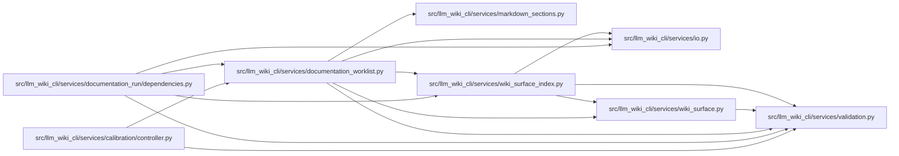

# documentation_worklist Module

**Path:** `src/llm_wiki_cli/services/documentation_worklist.py`

## Description

Deterministic semantic worklists for standalone documentation runs.

This module deliberately has no dependency on the documentation-run lifecycle.
It turns an already-materialized canonical wiki plus bounded deterministic
evidence into a portable, stable worklist that a later packet renderer can
consume.  It performs no source extraction, agent invocation, or file writes.

Imported semantic-page classification is intentionally separate from grounding:
``candidate_reuse`` describes reusable, compatible prose whose grounding was
confirmed; ``needs_grounding`` remains reuse-eligible but is not publishable
evidence yet.  Callers must never infer grounding from reuse eligibility alone.

## Imports

| Source | Symbols |
|--------|---------|
| `.io` | `read_md` |
| `.markdown_sections` | `GENERATED_INDEX_INTROS` |
| `.validation` | `nonnegative_int_or_none`, `normalize_legacy_portable_relative_path`, `require_nonnegative_int`, `require_positive_int` |
| `.wiki_surface` | `PageKind`, `WikiSurfacePage`, `collect_wiki_pages`, `is_safe_page_id` |
| `.wiki_surface_index` | `SURFACE_INDEX_FILENAME` |
| `__future__` | `annotations` |
| `dataclasses` | `dataclass`, `field` |
| `hashlib` | `hashlib` |
| `json` | `json` |
| `pathlib` | `Path`, `PurePosixPath` |
| `re` | `re` |
| `typing` | `Any`, `Iterable`, `Mapping`, `Sequence` |

## Local dependency map

<!-- Auto-generated local dependency summary. Do not edit by hand. -->

### Internal neighbors

| Direction | Module |
|---|---|
| Inbound | [controller](../modules/controller.md) |
| Inbound | [documentation_run_dependencies](../modules/documentation_run_dependencies.md) |
| Outbound | [io](../modules/io.md) |
| Outbound | [markdown_sections](../modules/markdown_sections.md) |
| Outbound | [validation](../modules/validation.md) |
| Outbound | [wiki_surface](../modules/wiki_surface.md) |
| Outbound | [wiki_surface_index](../modules/wiki_surface_index.md) |

## Classes

| Class | Line | Bases | Description |
|-------|------|-------|-------------|
| [DocumentationWorklistError](../entities/DocumentationWorklistError.md) | 132 | `ValueError` | Raised when deterministic worklist inputs are invalid. |
| [DocumentationWorkItem](../entities/DocumentationWorkItem.md) | 137 | — | One stable semantic-work unit or explicitly accounted reuse/deferral. |
| [DocumentationWorklist](../entities/DocumentationWorklist.md) | 180 | — | Stable semantic worklist and deterministic coverage summary. |
| [_Candidate](../entities/Candidate.md) | 216 | — | — |

## Functions

| Function | Signature | Decorators | Description |
|----------|-----------|------------|-------------|
| `build_documentation_worklist` | `(wiki_dir: str \| Path, *, imported_pages: Iterable[Mapping[str, Any]] \| None = None, unsupported_sources: Mapping[str, Mapping[str, Any]] \| None = None, user_profile_findings: Iterable[Mapping[str, Any]] \| None = None, dependency_metrics: Mapping[str, Any] \| None = None, entrypoint_evidence: Iterable[Mapping[str, Any]] \| None = None, source_inventory: Mapping[str, Mapping[str, Any]] \| None = None, surface_index: Mapping[str, Any] \| None = None, p1_budget: int = 30, max_context_entries: int = 5, max_acceptance_checks: int = 5) -> DocumentationWorklist` | — | Build a deterministic semantic worklist from bounded evidence. |
| `classify_imported_semantic_page` | `(wiki_dir: str \| Path, record: Mapping[str, Any]) -> tuple[str, bool, str]` | — | Return ``(classification, reuse_eligible, grounding_status)``. |
| `_classify_imported_semantic_page` | `(wiki: Path, record: Mapping[str, Any], canonical_pages: set[str]) -> tuple[str, bool, str]` | — | — |
| `_require_non_negative_int` | `(value: object, field_name: str) -> None` | — | — |
| `_require_positive_int` | `(value: object, field_name: str) -> None` | — | — |
| `_read_surface_index` | `(wiki: Path) -> Mapping[str, Any]` | — | — |
| `_surface_page_map` | `(surface_index: Mapping[str, Any]) -> dict[str, Mapping[str, Any]]` | — | — |
| `_normalise_relative_path` | `(value: object) -> str \| None` | — | — |
| `_source_path_from_page` | `(content: str) -> str \| None` | — | — |
| `_normalise_dependency_metrics` | `(evidence: Mapping[str, Any] \| None) -> tuple[dict[str, dict[str, int]], list[str]]` | — | — |
| `_safe_non_negative_int` | `(value: object) -> int` | — | — |
| `_normalise_entrypoints` | `(evidence: Iterable[Mapping[str, Any]]) -> dict[str, dict[str, Any]]` | — | — |
| `_entrypoint_completeness` | `(record: Mapping[str, Any]) -> tuple[int, int]` | — | — |
| `_centrality_score` | `(source_path: str \| None, metrics: Mapping[str, Mapping[str, int]], rank_index: Mapping[str, int], *, entrypoint_related: bool) -> int` | — | — |
| `_section_body` | `(content: str, heading: str) -> str` | — | — |
| `_section_needs_semantics` | `(content: str, heading: str) -> bool` | — | — |
| `_is_placeholder_text` | `(text: str) -> bool` | — | — |
| `_index_needs_context` | `(content: str) -> bool` | — | — |
| `_normalise_prose` | `(text: str) -> str` | — | — |
| `_is_copied_docstring_only` | `(page: WikiSurfacePage, description: str, *, source_path: str \| None, source_inventory: Mapping[str, Mapping[str, Any]]) -> bool` | — | — |
| `_first_heading` | `(content: str) -> str` | — | — |
| `_add_page_candidate` | `(candidates: dict[str, _Candidate], page: WikiSurfacePage, *, source_path: str \| None, category: str, priority: str, title: str, signal: str, acceptance: str, rank_score: int, context: Iterable[str] = ()) -> _Candidate` | — | — |
| `_merge_candidate_priority` | `(candidate: _Candidate, priority: str, category: str, title: str) -> None` | — | — |
| `_semantic_page_context` | `(canonical_path: str, source_path: str \| None) -> set[str]` | — | — |
| `_flow_context` | `(flow_id: str, source_path: str \| None, entrypoints: Mapping[str, Mapping[str, Any]]) -> set[str]` | — | — |
| `_add_missing_flow_candidates` | `(candidates: dict[str, _Candidate], pages_by_path: Mapping[str, WikiSurfacePage], entrypoints: Mapping[str, Mapping[str, Any]]) -> None` | — | — |
| `_flow_priority` | `(flow_id: str, evidence: Mapping[str, Any]) -> str` | — | Classify only externally meaningful boundaries as required work. |
| `_canonical_import_path` | `(record: Mapping[str, Any]) -> str \| None` | — | — |
| `_grounding_status` | `(record: Mapping[str, Any]) -> str` | — | — |
| `_import_record_compatible` | `(record: Mapping[str, Any]) -> bool` | — | — |
| `_imported_page_needs_enhancement` | `(canonical_path: str, content: str) -> bool` | — | — |
| `_import_priority` | `(canonical_path: str \| None, classification: str) -> tuple[str, bool]` | — | — |
| `_add_imported_page_candidates` | `(candidates: dict[str, _Candidate], wiki: Path, pages_by_path: Mapping[str, WikiSurfacePage], records: Iterable[Mapping[str, Any]], *, source_by_page: Mapping[str, str \| None], metric_map: Mapping[str, Mapping[str, int]], rank_index: Mapping[str, int], entrypoint_sources: set[str]) -> None` | — | — |
| `_canonical_finding_path` | `(raw_path: object) -> str \| None` | — | — |
| `_add_user_profile_candidates` | `(candidates: dict[str, _Candidate], findings: Iterable[Mapping[str, Any]], *, pages_by_path: Mapping[str, WikiSurfacePage]) -> None` | — | — |
| `_add_unsupported_source_candidates` | `(candidates: dict[str, _Candidate], unsupported_sources: Mapping[str, Mapping[str, Any]]) -> None` | — | — |
| `_apply_p1_budget` | `(candidates: Iterable[_Candidate], p1_budget: int) -> None` | — | — |
| `_candidate_sort_key` | `(candidate: _Candidate) -> tuple[Any, ...]` | — | — |
| `_context_sort_key` | `(value: str) -> tuple[int, str]` | — | — |
| `_candidate_to_item` | `(candidate: _Candidate, *, max_context_entries: int, max_acceptance_checks: int) -> DocumentationWorkItem` | — | — |
| `_stable_digest` | `(value: str) -> str` | — | — |
| `_stronger_import_classification` | `(current: str \| None, candidate: str) -> str` | — | — |
