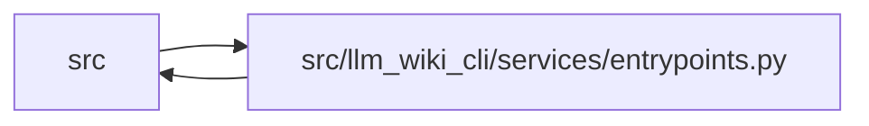

# entrypoints Module

**Path:** `src/llm_wiki_cli/services/entrypoints.py`

## Description

Entry-point detection and user-flow assembly.

An *entry point* is a function/class a user (or another system) can reach
directly: a public API symbol, a framework-decorated handler, or a process
entry. :func:`get_entry_points` finds them from a deep inventory (plus optional
console-script declarations), and :func:`build_flow` traces the resolved call
edges from an entry point into an ordered, bounded, de-cycled call path.

This module is deterministic and consumes only the structural inventory and
pre-computed call edges (see ``extract_cmd.resolve_call_edges``); it performs no
LLM calls and tolerates inventories that omit optional fields.

## Imports

| Source | Symbols |
|--------|---------|
| `.imports` | `build_module_path_resolver` |
| `.plugins` | `PluginError`, `entrypoint_detector_components`, `load_entry_point` |
| `.source_snapshot` | `SourceSnapshot` |
| `.validation` | `positive_int_or_none`, `resolved_paths_equal` |
| `__future__` | `annotations` |
| `collections` | `Counter` |
| `collections.abc` | `Iterable`, `Mapping` |
| `dataclasses` | `dataclass` |
| `pathlib` | `Path`, `PurePosixPath` |
| `re` | `re` |
| `typing` | `Any` |

## Local dependency map

<!-- Auto-generated local dependency summary. Do not edit by hand. -->

> Module-level dependencies exceed the generated-diagram limits, so the diagram and table below group them by top-level package. Counts report the number of module neighbors in each package.

### Internal neighbors

| Direction | Module |
|---|---|
| Inbound | `src` (8) |
| Outbound | `src` (4) |

> All 12 module neighbor(s) are summarized by package because the module-level view exceeds the 12-node limit.

## Classes

| Class | Line | Bases | Description |
|-------|------|-------|-------------|
| [EntryPointDetectionResult](../entities/EntryPointDetectionResult.md) | 57 | — | — |
| [_PluginEntryPointDetectionResult](../entities/PluginEntryPointDetectionResult.md) | 63 | — | — |

## Functions

| Function | Signature | Decorators | Description |
|----------|-----------|------------|-------------|
| `_entry` | `(category: str, file: str \| None, symbol: str, label: str \| None = None) -> dict` | — | — |
| `_local_symbols` | `(data: dict) -> set[str]` | — | Names of functions and classes defined in a single file entry. |
| `_iter_callables` | `(inventory: dict)` | — | Yield ``(filepath, symbol, fn)`` for every function, method, and decorated |
| `_detect_api` | `(inventory: dict) -> list[dict]` | — | Public API entry points: non-private local functions exported by ``__all__``. |
| `_constant_dict_items` | `(data: Mapping[str, Any], name: str) -> list[Mapping[str, Any]]` | — | — |
| `_import_targets` | `(data: Mapping[str, Any]) -> dict[str, str]` | — | — |
| `_module_ref_candidates` | `(ref: str, imports: Mapping[str, str]) -> list[str]` | — | — |
| `_resolve_command_module` | `(ref: str, filepath: str, data: Mapping[str, Any], resolver) -> str \| None` | — | — |
| `_has_run_function` | `(data: Mapping[str, Any]) -> bool` | — | — |
| `_dedup_paths` | `(paths: Iterable[str \| None]) -> list[str]` | — | — |
| `_related_internal_import_modules` | `(filepath: str \| None, data: Mapping[str, Any] \| None, resolver) -> list[str]` | — | — |
| `_entry_with_related_modules` | `(entry: dict, related_modules: list[str]) -> dict` | — | — |
| `_detect_argparse_dispatch_commands` | `(inventory: dict) -> list[dict]` | — | Detect top-level CLI commands declared in a module dispatch table. |
| `_decorator_leaf` | `(decorator: str) -> tuple[str, bool]` | — | Return ``(leaf_name, is_dotted)`` for a decorator string. |
| `_detect_decorated` | `(inventory: dict, leaves: frozenset[str], category: str, *, allow_bare: bool) -> list[dict]` | — | — |
| `_javascript_has_node_http_signal` | `(data: Mapping[str, Any]) -> bool` | — | — |
| `_module_call_args` | `(call: Mapping[str, Any]) -> list[str]` | — | — |
| `_javascript_server_symbol` | `(data: Mapping[str, Any], call: Mapping[str, Any]) -> str` | — | — |
| `_detect_javascript_http_servers` | `(inventory: dict, *, include_details: bool = False) -> list[dict]` | — | — |
| `_import_modules` | `(data: Mapping[str, Any]) -> set[str]` | — | — |
| `_source_text` | `(root: str \| Path, filepath: str) -> str` | — | — |
| `_detect_go_http_servers` | `(inventory: dict, *, root: str \| Path) -> list[dict]` | — | — |
| `_has_haskell_web_import` | `(data: Mapping[str, Any]) -> bool` | — | — |
| `_haskell_application_symbols` | `(data: Mapping[str, Any], source: str) -> list[str]` | — | — |
| `_detect_haskell_web_servers` | `(inventory: dict, *, root: str \| Path) -> list[dict]` | — | — |
| `_detect_process` | `(inventory: dict, console_scripts: list[dict] \| None) -> list[dict]` | — | Process entry points: ``__main__`` guards and console-script targets. |
| `_resolve_module_file` | `(module: str, resolver) -> str \| None` | — | — |
| `_plugin_warning` | `(component: Mapping[str, Any], message: str) -> str` | — | — |
| `_plugin_error` | `(message: str) -> PluginError` | — | — |
| `_iter_plugin_records` | `(value: Any) -> Iterable[Mapping[str, Any]]` | — | — |
| `_safe_plugin_file` | `(value: Any) -> str \| None` | — | — |
| `_safe_plugin_text` | `(record: Mapping[str, Any], key: str) -> str` | — | — |
| `_normalize_plugin_entry` | `(record: Any) -> dict` | — | — |
| `_load_plugin_detector` | `(component: Mapping[str, Any], root: str \| Path)` | — | — |
| `_roots_equal` | `(left: str \| Path, right: str \| Path) -> bool` | — | — |
| `_read_detector_components` | `(root: str \| Path, *, strict_plugin_errors: bool) -> tuple[list[dict[str, Any]], list[str]]` | — | — |
| `_detector_components` | `(root: str \| Path, *, fallback_root: str \| Path \| None, strict_plugin_errors: bool) -> tuple[list[tuple[dict[str, Any], str \| Path]], list[str]]` | — | — |
| `_source_line` | `(value: object) -> int \| None` | — | — |
| `_source_location` | `(source_path: object, line: object) -> dict` | — | — |
| `_plugin_detector_details` | `(component: Mapping[str, Any], record: Mapping[str, Any], entry: Mapping[str, Any]) -> dict` | — | — |
| `_detect_plugin_entries` | `(inventory: dict, *, root: str \| Path, fallback_root: str \| Path \| None, strict_plugin_errors: bool, include_provenance: bool, include_details: bool = False) -> _PluginEntryPointDetectionResult` | — | — |
| `_parse_scripts_section` | `(text: str) -> list[dict]` | — | Parse ``[project.scripts]`` entries without a TOML dependency. |
| `read_console_scripts` | `(project_root: str = '.', *, source_snapshot: SourceSnapshot \| None = None) -> list[dict]` | — | Read ``[project.scripts]`` from ``pyproject.toml`` (best-effort). |
| `_slug` | `(text: str) -> str` | — | — |
| `_label_rank` | `(entry: dict) -> int` | — | Prefer a specific label (script name, symbol) over the bare module stem. |
| `_dedup` | `(entries: list[dict]) -> list[dict]` | — | Collapse entries sharing ``(category, file, symbol)``, keeping the best label. |
| `_assign_ids` | `(entries: list[dict]) -> list[dict]` | — | Assign stable, collision-safe ids of the form ``<category>-<slug>``. |
| `_builtin_entry_points` | `(inventory: dict, console_scripts: list[dict] \| None, *, root: str \| Path, include_details: bool = False) -> list[dict]` | — | — |
| `_callable_record` | `(inventory: Mapping, entry: Mapping) -> Mapping[str, Any]` | — | — |
| `_matching_decorator` | `(record: Mapping[str, Any], category: str) -> str \| None` | — | — |
| `_javascript_detection_line` | `(data: Mapping[str, Any], symbol: object) -> int \| None` | — | — |
| `_builtin_detector_details` | `(inventory: Mapping, entry: Mapping[str, Any], console_scripts: list[dict] \| None) -> dict` | — | — |
| `_entry_key` | `(entry: Mapping) -> tuple` | — | — |
| `_public_entry` | `(entry: Mapping) -> dict` | — | — |
| `_detector_identity` | `(entry: Mapping) -> tuple[str, str, str \| None]` | — | — |
| `_finalize_entries` | `(entries: list[dict]) -> list[dict]` | — | — |
| `detect_entry_points` | `(inventory: dict, *, console_scripts: list[dict] \| None = None, root: str \| Path = '.', fallback_root: str \| Path \| None = None, include_plugins: bool = True, strict_plugin_errors: bool = False, include_provenance: bool = False) -> EntryPointDetectionResult` | — | Detect user-reachable entry points and non-fatal plugin warnings. |
| `get_entry_points` | `(inventory: dict, *, console_scripts: list[dict] \| None = None, root: str \| Path = '.', fallback_root: str \| Path \| None = None, include_plugins: bool = True) -> list[dict]` | — | Detect user-reachable entry points from a deep inventory. |
| `get_detailed_entry_points` | `(inventory: dict, *, console_scripts: list[dict] \| None = None, root: str \| Path = '.', fallback_root: str \| Path \| None = None, include_plugins: bool = True, strict_plugin_errors: bool = False, include_warnings: bool = False) -> dict` | — | Return versioned detector observations without changing legacy entries. |
| `entry_points_from_detailed_observations` | `(detailed: Mapping[str, Any], *, include_provenance: bool = False) -> list[dict]` | — | Recover the compatible de-duplicated entries from a detailed result. |
| `javascript_flow_limitations` | `(inventory: dict, entry_points: list[dict]) -> list[dict]` | — | Return JavaScript HTTP server files that lack flow entry-point coverage. |
| `_build_adjacency` | `(edges: list[dict]) -> dict[tuple, list[dict]]` | — | — |
| `_edge_metadata` | `(edge: dict) -> dict` | — | — |
| `_flow_step_from_edge` | `(edge: dict, depth: int) -> dict` | — | — |
| `_expand_flow` | `(node, depth, adjacency, steps, visited, max_depth, state) -> None` | — | — |
| `_modules_touched` | `(steps: list[dict]) -> list[str]` | — | — |
| `build_flow` | `(entry: dict, edges: list[dict], *, max_depth: int = _DEFAULT_FLOW_DEPTH) -> dict` | — | Trace an ordered call path from *entry* through resolved *edges*. |
| `_reachable_step_count` | `(start: tuple, adjacency: dict[tuple, list[dict]]) -> int` | — | Count the finite static traversal without applying the depth bound. |
| `build_flow_detailed` | `(entry: dict, edges: list[dict], *, max_depth: int = _DEFAULT_FLOW_DEPTH) -> dict` | — | Return the legacy flow plus versioned, exact reachable-step coverage. |
