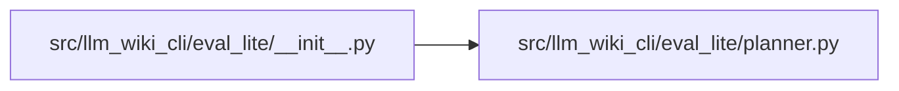

# __init__ Module

**Path:** `src/llm_wiki_cli/eval_lite/__init__.py`

## Description

Provider-free inspection planning for paired qualified-context arms.

## Imports

| Source | Symbols |
|--------|---------|
| `.planner` | `EVAL_LITE_PLAN_SCHEMA_VERSION`, `EVAL_LITE_TASK_SCHEMA_VERSION`, `EvaluationPlan`, `EvaluationPlanError`, `build_evaluation_plan`, `materialize_evaluation_plan`, `normalize_task_manifest` |

## Local dependency map

<!-- Auto-generated local dependency summary. Do not edit by hand. -->

### Internal neighbors

| Direction | Module |
|---|---|
| Outbound | [planner](../modules/planner.md) |
