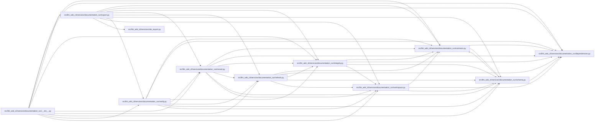

# export Module

**Path:** `src/llm_wiki_cli/services/documentation_run/export.py`

## Description

Documentation-run export services.

## Imports

| Source | Symbols |
|--------|---------|
| `..site_export` | `SiteExportError`, `check_site_mirror`, `export_site_mirror` |
| `.contracts` | `*` |
| `.dependencies` | `*` |
| `.integrity` | `*` |
| `.record` | `*` |
| `.refresh` | `*` |
| `.schema` | `*` |
| `.verify` | `*` |
| `.workspace` | `*` |
| `__future__` | `annotations` |

## Local dependency map

<!-- Auto-generated local dependency summary. Do not edit by hand. -->

### Internal neighbors

| Direction | Module |
|---|---|
| Inbound | [documentation_run___init__](../modules/documentation_run___init__.md) |
| Outbound | [documentation_run_contracts](../modules/documentation_run_contracts.md) |
| Outbound | [documentation_run_dependencies](../modules/documentation_run_dependencies.md) |
| Outbound | [integrity](../modules/integrity.md) |
| Outbound | [record](../modules/record.md) |
| Outbound | [refresh](../modules/refresh.md) |
| Outbound | [documentation_run_schema](../modules/documentation_run_schema.md) |
| Outbound | [verify](../modules/verify.md) |
| Outbound | [workspace](../modules/workspace.md) |
| Outbound | [site_export](../modules/site_export.md) |

## Functions

| Function | Signature | Decorators | Description |
|----------|-----------|------------|-------------|
| `_run_authorized_builder` | `(workspace_root: Path, run: DocumentationRun, *, build: bool, builder_command: Iterable[str] \| None) -> dict[str, Any]` | — | — |
| `_read_builder_output_tail` | `(stream) -> tuple[str, int, bool]` | — | — |
| `_remove_built_site_before_builder` | `(workspace_root: Path, built_root: Path) -> None` | — | Remove only the derived built-site root through qualified path guards. |
| `_build_final_report` | `(run: DocumentationRun, *, export_report: Mapping[str, Any], builder_evidence: Mapping[str, Any], site_check: Mapping[str, Any], verification: Mapping[str, Any]) -> dict[str, Any]` | — | — |
| `_render_final_report` | `(report: Mapping[str, Any]) -> str` | — | — |
| `export_documentation_run` | `(workspace: str \| Path, *, build: bool = False, builder_command: Iterable[str] \| None = None, knowledge_mode: str \| None = None, knowledge_public_repository_identity: str \| None = None) -> dict[str, Any]` | — | Export/check the user profile and write a reproducible local handoff. |
