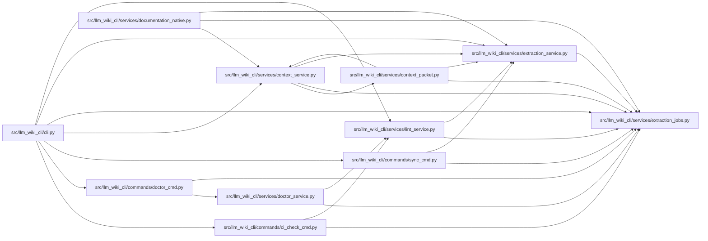

# extraction_jobs Module

**Path:** `src/llm_wiki_cli/services/extraction_jobs.py`

## Description

_Auto-generated from `src/llm_wiki_cli/services/extraction_jobs.py`._

## Imports

| Source | Symbols |
|--------|---------|
| `__future__` | `annotations` |
| `argparse` | `argparse` |
| `dataclasses` | `dataclass` |
| `os` | `os` |
| `sys` | `sys` |
| `typing` | `Literal`, `TextIO` |

## Local dependency map

<!-- Auto-generated local dependency summary. Do not edit by hand. -->

### Internal neighbors

| Direction | Module |
|---|---|
| Inbound | [cli](../modules/cli.md) |
| Inbound | [ci_check_cmd](../modules/ci_check_cmd.md) |
| Inbound | [doctor_cmd](../modules/doctor_cmd.md) |
| Inbound | [sync_cmd](../modules/sync_cmd.md) |
| Inbound | [context_packet](../modules/context_packet.md) |
| Inbound | [context_service](../modules/context_service.md) |
| Inbound | [doctor_service](../modules/doctor_service.md) |
| Inbound | [documentation_native](../modules/documentation_native.md) |
| Inbound | [extraction_service](../modules/extraction_service.md) |
| Inbound | [lint_service](../modules/lint_service.md) |

## Classes

| Class | Line | Bases | Description |
|-------|------|-------|-------------|
| [ExtractionJobRequest](../entities/ExtractionJobRequest.md) | 14 | — | The user-facing extractor job request and its resolved worker limit. |
| [ExtractionJobsAction](../entities/ExtractionJobsAction.md) | 39 | `argparse.Action` | Resolve ``--jobs`` while preserving whether automatic sizing was requested. |
| [ExtractionJobPlan](../entities/ExtractionJobPlan.md) | 52 | — | A deterministic description of the extraction work about to run. |

## Functions

| Function | Signature | Decorators | Description |
|----------|-----------|------------|-------------|
| `extraction_job_request_from_args` | `(args) -> ExtractionJobRequest` | — | Build a request from an argparse-compatible namespace. |
| `format_extraction_job_plan` | `(plan: ExtractionJobPlan) -> str` | — | — |
| `print_extraction_job_plan` | `(plan: ExtractionJobPlan, *, file: TextIO \| None = None) -> None` | — | — |
