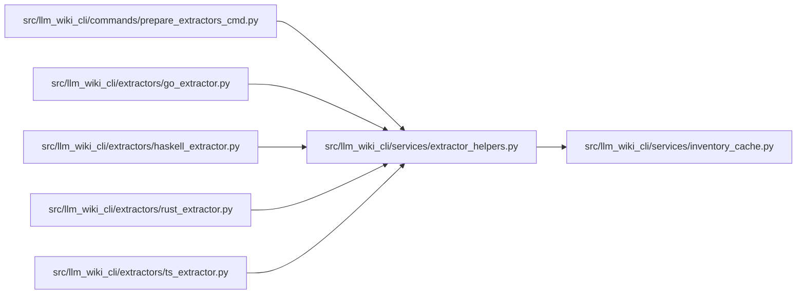

# extractor_helpers Module

**Path:** `src/llm_wiki_cli/services/extractor_helpers.py`

## Description

Preparation and lookup for external extractor helper tools.

## Imports

| Source | Symbols |
|--------|---------|
| `.inventory_cache` | `ENV_CACHE_DIR` |
| `__future__` | `annotations` |
| `dataclasses` | `dataclass` |
| `hashlib` | `hashlib` |
| `json` | `json` |
| `os` | `os` |
| `pathlib` | `Path` |
| `platform` | `platform` |
| `re` | `re` |
| `shutil` | `shutil` |
| `subprocess` | `subprocess` |
| `sys` | `sys` |
| `typing` | `Any` |

## Local dependency map

<!-- Auto-generated local dependency summary. Do not edit by hand. -->

### Internal neighbors

| Direction | Module |
|---|---|
| Inbound | [prepare_extractors_cmd](../modules/prepare_extractors_cmd.md) |
| Inbound | [go_extractor](../modules/go_extractor.md) |
| Inbound | [haskell_extractor](../modules/haskell_extractor.md) |
| Inbound | [rust_extractor](../modules/rust_extractor.md) |
| Inbound | [ts_extractor](../modules/ts_extractor.md) |
| Outbound | [inventory_cache](../modules/inventory_cache.md) |

## Classes

| Class | Line | Bases | Description |
|-------|------|-------|-------------|
| [HelperPrepareResult](../entities/HelperPrepareResult.md) | 43 | — | — |

## Functions

| Function | Signature | Decorators | Description |
|----------|-----------|------------|-------------|
| `extractor_timeout_seconds` | `() -> int` | — | Return the configured extractor runtime timeout, with a one-second floor. |
| `_binary_name` | `(base: str) -> str` | — | — |
| `_resolve_gitdir_file` | `(git_file: Path) -> Path \| None` | — | — |
| `_nearest_git_dir` | `(start: Path) -> Path \| None` | — | — |
| `resolve_helper_cache_root` | `(src_dir: str \| Path, cache_dir: str \| None = None, *, env: dict[str, str] \| None = None) -> Path \| None` | — | Resolve the helper cache root using CLI/env/git precedence. |
| `platform_id` | `() -> str` | — | — |
| `_hash_labeled_files` | `(paths: list[tuple[str, Path]]) -> str` | — | — |
| `helper_source_files` | `(language: str) -> list[tuple[str, Path]]` | — | — |
| `helper_source_fingerprint` | `(language: str) -> str` | — | — |
| `helper_artifact_fingerprint` | `(path: Path) -> str` | — | — |
| `command_output` | `(cmd: list[str], *, cwd: Path \| None = None, timeout: int = 15) -> str \| None` | — | — |
| `_resolve_go_executable` | `(env: dict[str, str] \| None = None) -> str \| None` | — | — |
| `_resolve_ghc_executable` | `(env: dict[str, str] \| None = None) -> str \| None` | — | — |
| `_go_version` | `(go_executable: str, *, timeout: int = 15) -> tuple[str \| None, str]` | — | — |
| `_ghc_version` | `(ghc_executable: str, *, timeout: int = 15) -> tuple[str \| None, str]` | — | — |
| `_parse_ghc_version` | `(toolchain: str) -> tuple[int, int, int] \| None` | — | — |
| `_ghc_support_error` | `(toolchain: str) -> str \| None` | — | — |
| `_env_has_value` | `(env: dict[str, str], name: str) -> bool` | — | Return True when *env* contains a non-empty variable named *name*. |
| `helper_cache_key` | `(language: str, *, toolchain_version: str \| None = None, platform_value: str \| None = None) -> str` | — | — |
| `_manifest_path` | `(cache_root: Path, language: str) -> Path` | — | — |
| `_load_manifest` | `(cache_root: Path, language: str) -> dict[str, Any] \| None` | — | — |
| `_write_manifest` | `(cache_root: Path, language: str, data: dict[str, Any]) -> None` | — | — |
| `_manifest_current` | `(cache_root: Path, language: str) -> dict[str, Any] \| None` | — | — |
| `_prepared_message` | `(language: str) -> str` | — | — |
| `get_prepared_binary` | `(language: str, src_dir: str \| Path = '.', cache_dir: str \| None = None) -> Path \| None` | — | — |
| `get_prepared_typescript_root` | `(src_dir: str \| Path = '.', cache_dir: str \| None = None) -> Path \| None` | — | — |
| `missing_helper_message` | `(language: str, src_dir: str \| Path = '.', cache_dir: str \| None = None) -> str` | — | — |
| `typescript_dependencies_ready` | `(src_dir: str \| Path = '.', cache_dir: str \| None = None) -> bool` | — | — |
| `prepare_typescript` | `(cache_root: Path) -> HelperPrepareResult` | — | — |
| `prepare_go` | `(cache_root: Path) -> HelperPrepareResult` | — | — |
| `prepare_rust` | `(cache_root: Path) -> HelperPrepareResult` | — | — |
| `prepare_haskell` | `(cache_root: Path) -> HelperPrepareResult` | — | — |
| `prepare_helper` | `(language: str, cache_root: Path) -> HelperPrepareResult` | — | — |
