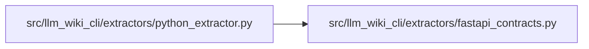

# fastapi_contracts Module

**Path:** `src/llm_wiki_cli/extractors/fastapi_contracts.py`

## Description

Syntax-only FastAPI declaration extraction.

This module deliberately depends only on :mod:`ast`.  It never imports FastAPI,
Pydantic, or the target application.  The raw declarations it emits are later
resolved into application-level HTTP contracts by
``llm_wiki_cli.services.api_contracts``.

The public integration seam is :func:`extract_fastapi_declarations`.  Python
inventory producers may store a non-empty result at
``file_entry["frameworks"]["fastapi"]``.

## Imports

| Source | Symbols |
|--------|---------|
| `__future__` | `annotations` |
| `ast` | `ast` |
| `collections.abc` | `Mapping` |
| `typing` | `Any` |

## Local dependency map

<!-- Auto-generated local dependency summary. Do not edit by hand. -->

### Internal neighbors

| Direction | Module |
|---|---|
| Inbound | [python_extractor](../modules/python_extractor.md) |

## Classes

| Class | Line | Bases | Description |
|-------|------|-------|-------------|
| [_FastAPIScanner](../entities/FastAPIScanner.md) | 288 | `ast.NodeVisitor` | — |

## Functions

| Function | Signature | Decorators | Description |
|----------|-----------|------------|-------------|
| `_simple_ref` | `(node: ast.AST \| None) -> str` | — | — |
| `_display_expr` | `(node: ast.AST \| None) -> str` | — | Return bounded, readable syntax without falling back to ``ast.dump``. |
| `_import_aliases` | `(tree: ast.AST) -> dict[str, str]` | — | — |
| `_canonical_ref` | `(node: ast.AST \| None, aliases: Mapping[str, str]) -> str` | — | — |
| `_scope_parents` | `(scope: str) -> list[str]` | — | — |
| `_literal_record` | `(value: Any) -> dict[str, Any]` | — | — |
| `_unknown_record` | `() -> dict[str, str]` | — | — |
| `_reference_record` | `(value: str) -> dict[str, str]` | — | — |
| `_expression_record` | `(node: ast.AST \| None, constants: Mapping[tuple[str, str], dict[str, Any]], scope: str) -> dict[str, Any]` | — | — |
| `_call_payload` | `(node: ast.Call, constants: Mapping[tuple[str, str], dict[str, Any]], scope: str) -> dict[str, Any]` | — | — |
| `_annotation_parts` | `(node: ast.AST \| None) -> tuple[str, list[ast.expr]]` | — | — |
| `_marker_payload` | `(node: ast.AST \| None, aliases: Mapping[str, str], constants: Mapping[tuple[str, str], dict[str, Any]], scope: str) -> dict[str, Any] \| None` | — | — |
| `_parameter_payloads` | `(node: ast.FunctionDef \| ast.AsyncFunctionDef, aliases: Mapping[str, str], constants: Mapping[tuple[str, str], dict[str, Any]], scope: str) -> list[dict[str, Any]]` | — | — |
| `extract_fastapi_declarations` | `(source: str, *, filepath: str = '') -> dict[str, Any]` | — | Extract raw FastAPI declarations from Python source. |
| `attach_fastapi_declarations` | `(file_entry: dict[str, Any], source: str, *, filepath: str = '') -> dict[str, Any]` | — | Attach non-empty FastAPI metadata to an existing Python inventory entry. |
