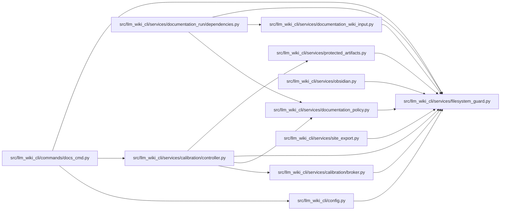

# filesystem_guard Module

**Path:** `src/llm_wiki_cli/services/filesystem_guard.py`

## Description

Small cross-platform guards for security-sensitive workspace writes.

POSIX callers should prefer descriptor-relative operations.  Windows does not
expose ``openat`` through the Python standard library, so pathname writers pin
every directory in the destination chain with native handles opened without
``FILE_SHARE_DELETE``.  A pinned chain cannot be renamed or replaced by a
junction while the guarded write is in progress.  That rename guarantee
requires ordinary ``FILE_LIST_DIRECTORY`` access; if Windows denies it, the
guard fails closed instead of falling back to an attribute-only handle.

## Imports

| Source | Symbols |
|--------|---------|
| `__future__` | `annotations` |
| `contextlib` | `contextmanager` |
| `ctypes` | `ctypes`, `wintypes`, `wintypes`, `wintypes`, `wintypes`, `wintypes`, `wintypes`, `wintypes`, `wintypes`, `wintypes`, `wintypes`, `wintypes`, `wintypes`, `wintypes`, `wintypes`, `wintypes` |
| `dataclasses` | `dataclass` |
| `msvcrt` | `msvcrt`, `msvcrt`, `msvcrt` |
| `os` | `os` |
| `pathlib` | `Path` |
| `stat` | `stat` |
| `typing` | `BinaryIO`, `Iterator`, `Sequence` |
| `uuid` | `uuid` |

## Local dependency map

<!-- Auto-generated local dependency summary. Do not edit by hand. -->

### Internal neighbors

| Direction | Module |
|---|---|
| Inbound | [docs_cmd](../modules/docs_cmd.md) |
| Inbound | [config](../modules/config.md) |
| Inbound | [broker](../modules/broker.md) |
| Inbound | [controller](../modules/controller.md) |
| Inbound | [documentation_policy](../modules/documentation_policy.md) |
| Inbound | [documentation_run_dependencies](../modules/documentation_run_dependencies.md) |
| Inbound | [documentation_wiki_input](../modules/documentation_wiki_input.md) |
| Inbound | [obsidian](../modules/obsidian.md) |
| Inbound | [protected_artifacts](../modules/protected_artifacts.md) |
| Inbound | [site_export](../modules/site_export.md) |

## Classes

| Class | Line | Bases | Description |
|-------|------|-------|-------------|
| [WindowsDirectoryGuardError](../entities/WindowsDirectoryGuardError.md) | 39 | `OSError` | Raised when a Windows directory chain cannot be pinned safely. |
| [_WindowsDirectoryGuardUnavailableError](../entities/WindowsDirectoryGuardUnavailableError.md) | 43 | `WindowsDirectoryGuardError` | Raised when Windows denies access required to pin a directory. |
| [WindowsFileGuardError](../entities/WindowsFileGuardError.md) | 47 | `OSError` | Raised when a Windows input file cannot be opened without redirection. |
| [WindowsSecurityGuardError](../entities/WindowsSecurityGuardError.md) | 51 | `OSError` | Raised when a Windows object lacks the required restrictive DACL. |
| [WindowsDurabilityError](../entities/WindowsDurabilityError.md) | 55 | `OSError` | Raised when Windows cannot confirm durable filesystem metadata. |
| [WindowsIdentityUnavailableError](../entities/WindowsIdentityUnavailableError.md) | 59 | `OSError` | Raised when Windows cannot expose a stable filesystem object identity. |
| [WindowsObjectIdentity](../entities/WindowsObjectIdentity.md) | 64 | — | Immutable Windows device and file identifier exposed by a real stat call. |
| [_WindowsPathHandleMetadata](../entities/WindowsPathHandleMetadata.md) | 78 | — | Metadata with consistent semantics across Windows path and handle stats. |

## Functions

| Function | Signature | Decorators | Description |
|----------|-----------|------------|-------------|
| `fresh_no_follow_stat` | `(path: str \| Path) -> os.stat_result` | — | Return uncached metadata for one path without following its leaf. |
| `windows_object_identity` | `(result: os.stat_result, *, context: str) -> WindowsObjectIdentity` | — | Extract identity from ``os.stat``/``os.fstat`` Windows metadata. |
| `windows_object_identity_from_values` | `(*, device: int, file_id: int, context: str) -> WindowsObjectIdentity` | — | Build a Windows identity, failing closed when either component is absent. |
| `_windows_path_handle_metadata` | `(result: os.stat_result) -> _WindowsPathHandleMetadata` | — | Return metadata safe to compare between Windows path and handle stats. |
| `guard_windows_directory_chain` | `(root: Path, relative_components: Sequence[str], *, create_missing: bool = False, require_restrictive_dacl: bool = False) -> Iterator[Path]` | `@contextmanager` | Pin ``root`` and each child directory without delete sharing. |
| `_open_windows_directory_guard` | `(path: Path, *, require_restrictive_dacl: bool = False) -> int` | — | — |
| `open_windows_readonly_file` | `(path: Path, *, require_restrictive_dacl: bool = False) -> Iterator[tuple[BinaryIO, os.stat_result]]` | `@contextmanager` | Open one regular Windows file without following a reparse point. |
| `_open_windows_readonly_file_handle` | `(path: Path, *, require_restrictive_dacl: bool = False) -> int` | — | — |
| `create_private_windows_directory` | `(path: Path) -> None` | — | Create one private directory through a write-through atomic rename. |
| `open_windows_private_write_file` | `(path: Path) -> int` | — | Create one private write-through file and return an owning CRT fd. |
| `open_windows_guarded_lock_file` | `(path: Path) -> tuple[int, bool]` | — | Open/create a non-reparse lock leaf and return ``(fd, created)``. |
| `replace_windows_file_write_through` | `(source: Path, target: Path) -> None` | — | Atomically replace ``target`` and request write-through metadata. |
| `move_windows_path_write_through` | `(source: Path, target: Path, *, replace_existing: bool) -> None` | — | Move one file or directory and persist its namespace update. |
| `verify_windows_restrictive_dacl` | `(path: Path) -> None` | — | Fail closed unless ``path`` has the protected-store Windows DACL. |
| `windows_current_user_sid` | `() -> str` | — | Return the current process-token user SID as canonical text. |
| `windows_path_owner_sid` | `(path: str \| Path) -> str` | — | Return the owner SID of one Windows path without following its leaf. |
| `_windows_handle_owner_sid` | `(handle: int, *, context: str) -> str` | — | — |
| `_open_windows_file_metadata_guard` | `(path: Path) -> int` | — | — |
| `_assert_windows_regular_file_handle` | `(handle: int, path: Path) -> None` | — | — |
| `_windows_handle_information` | `(handle: int, path: Path) -> ctypes.Structure` | — | — |
| `_private_windows_security_attributes` | `(*, directory: bool) -> Iterator[ctypes.Structure]` | `@contextmanager` | — |
| `_current_windows_user_sid` | `() -> str` | — | — |
| `_windows_sid_string` | `(sid: ctypes.c_void_p) -> str` | — | — |
| `_verify_windows_handle_restrictive_dacl` | `(handle: int, *, context: str) -> None` | — | — |
| `_close_windows_handle` | `(handle: int) -> None` | — | — |
| `_windows_api_path` | `(path: Path) -> str` | — | — |
| `atomic_write_private_bytes` | `(path: Path, data: bytes) -> Path` | — | Atomically write one private file without following destination paths. |
| `_atomic_write_private_bytes_posix` | `(target: Path, data: bytes) -> None` | — | — |
| `_atomic_write_private_bytes_windows` | `(target: Path, data: bytes) -> None` | — | — |
