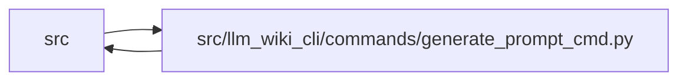

# generate_prompt_cmd Module

**Path:** `src/llm_wiki_cli/commands/generate_prompt_cmd.py`

## Description

Builds a source-selected wiki-maintenance prompt for an IDE agent or manual
handoff. It combines the current diff, bounded repository context, agent and
template configuration, and wiki Git policy; removes credential-like values;
and either prints the result or writes it through the private-file boundary.
Application-owned handoff text prevents templates from authorizing repository
mutations.

## Imports

| Source | Symbols |
|--------|---------|
| `..config` | `DEFAULT_WIKI_DIR`, `validate_path`, `validate_source_root` |
| `..services.documentation_query_builder` | `validate_live_query_source_selection` |
| `..services.extraction_service` | `filter_source_diff` |
| `..services.metrics` | `record_event`, `resolve_agent` |
| `..services.paths` | `shell_quote` |
| `..services.plugins` | `PluginError`, `render_prompt_template` |
| `..services.redaction` | `redact_credentials` |
| `..services.secure_file` | `write_private_text` |
| `..services.source_selection` | `resolve_source_selection` |
| `..services.source_snapshot` | `SourceSnapshot`, `build_source_snapshot`, `capture_source_selection_inputs` |
| `..services.team` | `TeamConfigError`, `team_prompt_template_default` |
| `..services.wiki_git_policy` | `WikiGitDisposition`, `WikiGitPolicy`, `classify_wiki_git_policy` |
| `__future__` | `annotations` |
| `pathlib` | `Path` |
| `re` | `re` |
| `subprocess` | `subprocess` |
| `sys` | `sys` |

## Local dependency map

<!-- Auto-generated local dependency summary. Do not edit by hand. -->

> Module-level dependencies exceed the generated-diagram limits, so the diagram and table below group them by top-level package. Counts report the number of module neighbors in each package.

### Internal neighbors

| Direction | Module |
|---|---|
| Inbound | `src` (2) |
| Outbound | `src` (12) |

> All 14 module neighbor(s) are summarized by package because the module-level view exceeds the 12-node limit.

## Functions

| Function | Signature | Decorators | Description |
|----------|-----------|------------|-------------|
| `_git_diff` | `(src_dir: str = '.') -> str` | — | — |
| `_prompt_git_diff` | `(src_dir: str) -> str` | — | — |
| `_changed_paths` | `(diff_text: str) -> list[str]` | — | — |
| `_is_dependency_path` | `(path: str) -> bool` | — | — |
| `detect_change_type` | `(diff_text: str) -> str` | — | — |
| `_change_type_guidance` | `(change_type: str) -> str` | — | — |
| `resolve_change_type` | `(change_type: str, diff_text: str) -> str` | — | — |
| `_rich_prompt_context` | `(*, diff_text: str, ast_json: str \| None, graph_json: str \| None, cli_agent: bool) -> tuple[str, str]` | — | — |
| `_source_selection_args` | `(source_selection: str \| Path \| None) -> str` | — | — |
| `_external_source_args` | `(allow_external_src: bool) -> str` | — | — |
| `_diff_recipe` | `(source_selection: str \| Path \| None, *, src_dir: str = '.', allow_external_src: bool = False) -> str` | — | — |
| `_diff_guidance` | `(source_selection: str \| Path \| None) -> str` | — | — |
| `_selected_prompt_diff` | `(diff_text: str, *, src_dir: str, wiki_dir: str, source_selection: str \| Path \| None, source_snapshot: SourceSnapshot \| None = None) -> str` | — | — |
| `_resolved_prompt_selection_and_diff` | `(diff_text: str, *, src_dir: str, wiki_dir: str, source_selection: str \| Path \| None, source_snapshot: SourceSnapshot \| None) -> tuple[str \| Path \| None, str]` | — | — |
| `_validated_prompt_snapshot` | `(*, src_dir: str, wiki_dir: str, source_selection: str \| Path \| None, source_snapshot: SourceSnapshot \| None = None) -> SourceSnapshot` | — | — |
| `_validated_prompt_selection_and_diff` | `(*, src_dir: str, wiki_dir: str, source_selection: str \| Path \| None, source_snapshot: SourceSnapshot \| None, diff_text: str \| None) -> tuple[str \| Path \| None, str]` | — | — |
| `_template_values` | `(*, wiki_dir: str, src_dir: str, change_type: str, rich_context: str, rich_context_block: str, diff_text: str, ast_json: str \| None, graph_json: str \| None, cli_agent: bool, policy: WikiGitPolicy, source_selection: str \| Path \| None, allow_external_src: bool) -> dict[str, str]` | — | — |
| `_render_default_prompt` | `(*, wiki_dir: str, src_dir: str, change_type: str, rich_context_block: str, cli_agent: bool, source_selection: str \| Path \| None = None, allow_external_src: bool = False) -> str` | — | — |
| `_render_repository_handoff` | `(policy: WikiGitPolicy, wiki_dir: str) -> str` | — | — |
| `_render_prompt_body` | `(*, template: str \| None, values: dict[str, str], wiki_dir: str, src_dir: str, change_type: str, rich_context_block: str, cli_agent: bool, source_selection: str \| Path \| None, allow_external_src: bool) -> str` | — | — |
| `_build_prompt` | `(wiki_dir: str, src_dir: str, *, change_type: str = 'auto', template: str \| None = None, diff_text: str \| None = None, ast_json: str \| None = None, graph_json: str \| None = None, cli_agent: bool = False, policy: WikiGitPolicy \| None = None, source_selection: str \| Path \| None = None, source_snapshot: SourceSnapshot \| None = None, allow_external_src: bool = False) -> str` | — | — |
| `_redact_prompt_artifact` | `(prompt: str) -> str` | — | — |
| `run` | `(args) -> None` | — | — |
