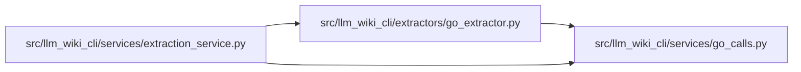

# go_calls Module

**Path:** `src/llm_wiki_cli/services/go_calls.py`

## Description

Resolve captured Go call bindings only within evidenced package scopes.

## Imports

| Source | Symbols |
|--------|---------|
| `__future__` | `annotations` |
| `pathlib` | `PurePosixPath` |

## Local dependency map

<!-- Auto-generated local dependency summary. Do not edit by hand. -->

### Internal neighbors

| Direction | Module |
|---|---|
| Inbound | [go_extractor](../modules/go_extractor.md) |
| Inbound | [extraction_service](../modules/extraction_service.md) |

## Functions

| Function | Signature | Decorators | Description |
|----------|-----------|------------|-------------|
| `attach_go_receiver_methods` | `(inventory: dict) -> None` | — | Project per-file facts after cache/chunk merging, never into cached facts. |
| `resolve_go_call` | `(call: dict, filepath: str, resolver) -> tuple` | — | — |
