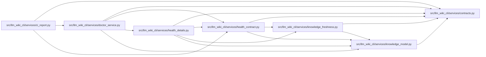

# health_contract Module

**Path:** `src/llm_wiki_cli/services/health_contract.py`

## Description

Closed detailed-health contract shared by doctor and CI report readers.

The primary partition counts concepts, independently of lint diagnostics. A
comparison attempt is not necessarily compatible. Confirmed missing sources
are separate from successful content comparisons because absence is checked
before producer compatibility. Unknown/unavailable measurements use null.

## Imports

| Source | Symbols |
|--------|---------|
| `.contracts` | `HEALTH_DETAILS_SCHEMA_VERSION` |
| `.knowledge_freshness` | `FRESHNESS_REASON_STATES`, `KNOWN_FRESHNESS_REASON_CODES`, `REASON_FRESHNESS_NOT_MODELED`, `REASON_LIVE_EVALUATION_NOT_PERFORMED`, `comparable_producer_components` |
| `.knowledge_model` | `ComputedFreshness`, `ProducerComponent` |
| `__future__` | `annotations` |
| `collections` | `Counter` |
| `collections.abc` | `Mapping` |
| `re` | `re` |
| `typing` | `Any`, `NoReturn` |

## Local dependency map

<!-- Auto-generated local dependency summary. Do not edit by hand. -->

### Internal neighbors

| Direction | Module |
|---|---|
| Inbound | [ci_report](../modules/ci_report.md) |
| Inbound | [doctor_service](../modules/doctor_service.md) |
| Inbound | [health_details](../modules/health_details.md) |
| Outbound | [services_contracts](../modules/services_contracts.md) |
| Outbound | [knowledge_freshness](../modules/knowledge_freshness.md) |
| Outbound | [knowledge_model](../modules/knowledge_model.md) |

## Classes

| Class | Line | Bases | Description |
|-------|------|-------|-------------|
| [HealthDetailsError](../entities/HealthDetailsError.md) | 38 | `ValueError` | Detailed health data is incomplete, unsupported or inconsistent. |

## Functions

| Function | Signature | Decorators | Description |
|----------|-----------|------------|-------------|
| `_fail` | `(field: str, message: str) -> NoReturn` | — | — |
| `_object` | `(value: object, field: str, keys: set[str] \| frozenset[str]) -> Mapping[str, Any]` | — | — |
| `_text` | `(value: object, field: str) -> str` | — | — |
| `_count` | `(value: object, field: str) -> int` | — | — |
| `_hash` | `(value: object, field: str, *, nullable: bool = False) -> None` | — | — |
| `_strings` | `(value: object, field: str, limit: int, *, ordered: bool = True) -> list[str]` | — | — |
| `_component` | `(value: object, field: str) -> str` | — | — |
| `_producer` | `(value: object, field: str) -> None` | — | — |
| `_compatible_global_basis` | `(recorded: Mapping[str, Any], live: Mapping[str, Any]) -> bool` | — | — |
| `validate_health_details` | `(value: object, *, wiki_dir: str, src_dir: str, freshness: Mapping[str, Any], availability: str) -> Mapping[str, Any]` | — | Validate detailed evidence and reconcile it with the legacy projection. |
