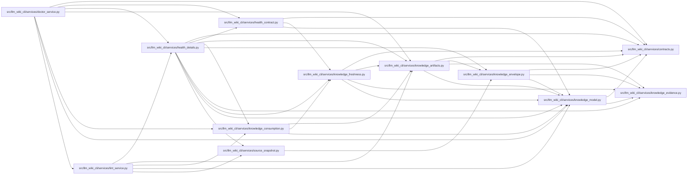

# health_details Module

**Path:** `src/llm_wiki_cli/services/health_details.py`

## Description

Capture detailed health once from an operation's already evaluated inputs.

This module performs no I/O or source extraction. Serialized capture prevents
later changes to a caller's view, source files or installed version from
rewriting the evidence subsequently rendered by doctor or CI.

## Imports

| Source | Symbols |
|--------|---------|
| `.contracts` | `HEALTH_DETAILS_SCHEMA_VERSION` |
| `.health_contract` | `COMPARABLE_STATES`, `EXAMPLE_LIMIT`, `FRESHNESS_STATES`, `HealthDetailsError` |
| `.knowledge_artifacts` | `require_validated_artifacts` |
| `.knowledge_consumption` | `KnowledgeReadView` |
| `.knowledge_envelope` | `hash_source_snapshot` |
| `.knowledge_evidence` | `canonical_json_text`, `hash_json` |
| `.knowledge_freshness` | `structural_freshness_modeled` |
| `.knowledge_model` | `ProducerComponent`, `ProducerRecord` |
| `.source_snapshot` | `SourceSnapshot` |
| `__future__` | `annotations` |
| `bisect` | `insort` |
| `collections` | `Counter` |
| `dataclasses` | `dataclass` |
| `json` | `json` |
| `typing` | `Any` |

## Local dependency map

<!-- Auto-generated local dependency summary. Do not edit by hand. -->

### Internal neighbors

| Direction | Module |
|---|---|
| Inbound | [doctor_service](../modules/doctor_service.md) |
| Inbound | [lint_service](../modules/lint_service.md) |
| Outbound | [services_contracts](../modules/services_contracts.md) |
| Outbound | [health_contract](../modules/health_contract.md) |
| Outbound | [knowledge_artifacts](../modules/knowledge_artifacts.md) |
| Outbound | [knowledge_consumption](../modules/knowledge_consumption.md) |
| Outbound | [knowledge_envelope](../modules/knowledge_envelope.md) |
| Outbound | [knowledge_evidence](../modules/knowledge_evidence.md) |
| Outbound | [knowledge_freshness](../modules/knowledge_freshness.md) |
| Outbound | [knowledge_model](../modules/knowledge_model.md) |
| Outbound | [source_snapshot](../modules/source_snapshot.md) |

## Classes

| Class | Line | Bases | Description |
|-------|------|-------|-------------|
| [CapturedHealthDetails](../entities/CapturedHealthDetails.md) | 33 | — | An immutable capture with independently owned output dictionaries. |

## Functions

| Function | Signature | Decorators | Description |
|----------|-----------|------------|-------------|
| `_component` | `(component: ProducerComponent) -> dict[str, Any]` | — | — |
| `_producer` | `(producer: ProducerRecord, schema: str, options_hash: str) -> dict[str, Any]` | — | — |
| `capture_health_details` | `(view: KnowledgeReadView \| None, *, wiki_dir: str, src_dir: str, source_snapshot: SourceSnapshot \| None = None, evaluation_failed: bool = False) -> CapturedHealthDetails` | — | Capture inventory, exact comparison basis and bounded primary examples. |
