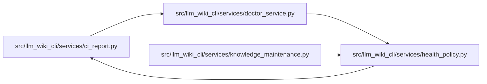

# health_policy Module

**Path:** `src/llm_wiki_cli/services/health_policy.py`

## Description

Pure release-health decisions derived from one validated CI evaluation.

## Imports

| Source | Symbols |
|--------|---------|
| `.ci_report` | `validate_doctor_payload`, `validate_ci_check_payload` |
| `__future__` | `annotations` |
| `collections.abc` | `Mapping` |
| `copy` | `copy` |
| `enum` | `Enum` |
| `hashlib` | `hashlib` |
| `json` | `json` |
| `re` | `re` |
| `typing` | `Any` |

## Local dependency map

<!-- Auto-generated local dependency summary. Do not edit by hand. -->

### Internal neighbors

| Direction | Module |
|---|---|
| Inbound | [doctor_service](../modules/doctor_service.md) |
| Inbound | [knowledge_maintenance](../modules/knowledge_maintenance.md) |
| Outbound | [ci_report](../modules/ci_report.md) |

## Classes

| Class | Kind | Line | Bases / Target | Description |
|-------|------|------|----------------|-------------|
| [DoctorStatus](../entities/DoctorStatus.md) | Enum | 14 | `str`, `Enum` | Closed overall health vocabulary for the doctor contract. |
| [MaintenanceError](../entities/MaintenanceError.md) | Class | 94 | `ValueError` | Maintenance evidence is absent, inconsistent or not bound to this candidate. |

## Functions

| Function | Signature | Decorators | Description |
|----------|-----------|------------|-------------|
| `classify_health_sections` | `(*, strict: bool, source_selection_mismatch: bool, availability: Mapping[str, object], freshness: Mapping[str, object], snapshot: Mapping[str, object], governance: Mapping[str, object], drift: Mapping[str, object], verification: Mapping[str, object]) -> tuple[DoctorStatus, tuple[str, ...], tuple[str, ...]]` | — | — |
| `strict_json` | `(raw: bytes) -> dict[str, Any]` | — | — |
| `digest` | `(raw: bytes) -> str` | — | — |
| `_binding` | `(value: object) -> Mapping[str, Any]` | — | — |
| `strict_health_projection` | `(health: Mapping[str, Any], *, selection_mismatch: bool = False, validate_full_report: bool = True) -> dict[str, Any]` | — | Reclassify validated sections using the standalone doctor's classifier. |
| `_admission_shape` | `(report: Mapping[str, Any]) -> None` | — | Stdlib admission invariants for already producer-validated, hosted bytes. |
| `derive_policy` | `(report_bytes: bytes, preflight_bytes: bytes, *, binding: Mapping[str, Any], validate_full_report: bool = True) -> dict[str, Any]` | — | Return an auditable result; input reports never change integrity outcomes. |
| `verify_policy` | `(receipt: object, report_bytes: bytes, preflight_bytes: bytes, *, binding: Mapping[str, Any], validate_full_report: bool = True) -> Mapping[str, Any]` | — | Recompute the complete receipt, rejecting copied verdicts and stale digests. |
