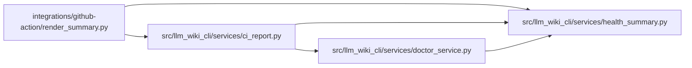

# health_summary Module

**Path:** `src/llm_wiki_cli/services/health_summary.py`

## Description

Pure presentation helpers for detailed local and CI health reports.

## Imports

| Source | Symbols |
|--------|---------|
| `__future__` | `annotations` |
| `collections.abc` | `Mapping`, `Sequence` |
| `unicodedata` | `unicodedata` |

## Local dependency map

<!-- Auto-generated local dependency summary. Do not edit by hand. -->

### Internal neighbors

| Direction | Module |
|---|---|
| Inbound | [render_summary](../modules/render_summary.md) |
| Inbound | [ci_report](../modules/ci_report.md) |
| Inbound | [doctor_service](../modules/doctor_service.md) |

## Functions

| Function | Signature | Decorators | Description |
|----------|-----------|------------|-------------|
| `summary_cell` | `(value: object, limit: int = 240) -> str` | — | Escape inline-code/table content and explicitly disclose UTF-8 clipping. |
| `health_policy` | `(strict: bool) -> str` | — | Describe classification independently of an Action's failure threshold. |
| `optional_status` | `(state: str, *, absent: str) -> str` | — | Disclose optional absence without changing present evidence states. |
| `freshness_counts` | `(counts: Mapping[str, int] \| None) -> str` | — | Describe existing state counters without inventing model eligibility. |
| `reason_list` | `(reasons: Sequence[str], limit: int = 5) -> str` | — | List a bounded prefix of reported reasons, without estimating counts. |
| `_versions` | `(recorded, live, kind: str, limit: int = 3) -> str` | — | — |
| `detailed_health_rows` | `(report: Mapping) -> list[tuple[str, str]]` | — | Describe validated evidence; legacy reports cannot gain inferred detail. |
