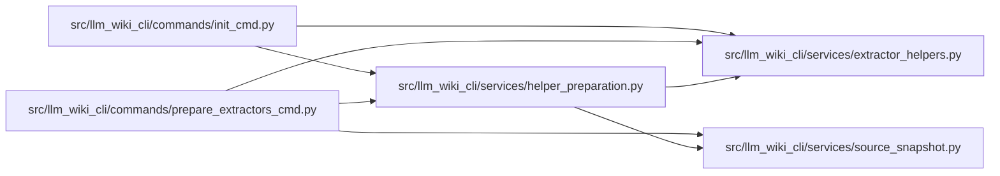

# helper_preparation Module

**Path:** `src/llm_wiki_cli/services/helper_preparation.py`

## Description

Plans and prepares bundled extractor helpers during an explicitly requested
setup operation. Language detection uses the same source snapshot as
`prepare-extractors`, including the configured selection and exclusions.
Python-only selections need no helper cache.

`ensure_source_helpers` reuses helpers whose manifests match their source,
platform, and artifact identities. Missing or stale helpers are prepared in
the resolved cache. Individual cache-write failures become failed results so
other selected helpers can still complete; initialization checks the full
result list before creating its scaffold or agent configuration. Valid helper
reuse does not require the build toolchain, although TypeScript analysis still
needs Node.js at runtime. Read-only analysis never invokes this setup service.

## Imports

| Source | Symbols |
|--------|---------|
| `.` | `extractor_helpers` |
| `.source_snapshot` | `build_source_snapshot` |
| `__future__` | `annotations` |
| `pathlib` | `Path` |

## Local dependency map

<!-- Auto-generated local dependency summary. Do not edit by hand. -->

### Internal neighbors

| Direction | Module |
|---|---|
| Inbound | [init_cmd](../modules/init_cmd.md) |
| Inbound | [prepare_extractors_cmd](../modules/prepare_extractors_cmd.md) |
| Outbound | [extractor_helpers](../modules/extractor_helpers.md) |
| Outbound | [source_snapshot](../modules/source_snapshot.md) |

## Functions

| Function | Signature | Decorators | Description |
|----------|-----------|------------|-------------|
| `selected_helper_languages` | `(src_dir: str \| Path, *, source_selection: str \| Path \| None = None) -> list[str]` | — | — |
| `ensure_source_helpers` | `(src_dir: str \| Path, *, cache_dir: str \| None = None, source_selection: str \| Path \| None = None) -> list[helpers.HelperPrepareResult]` | — | Prepare missing/stale helpers, reusing valid artifacts without build tools. |
