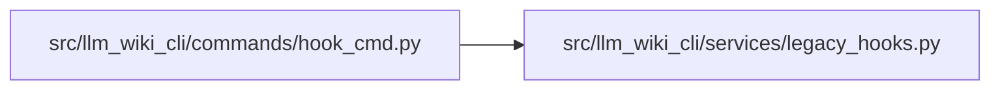

# hook_cmd Module

**Path:** `src/llm_wiki_cli/commands/hook_cmd.py`

## Description

Compatibility imports for legacy hook recognition; installation is retired.

## Imports

| Source | Symbols |
|--------|---------|
| `..services.legacy_hooks` | `HOOK_SIGNATURE`, `_build_ide_post_commit`, `_build_post_commit`, `_build_validation_pre_commit`, `_legacy_auto_sync_post_commit`, `_legacy_ide_post_commit`, `is_managed_hook_content` |
| `__future__` | `annotations` |
| `sys` | `sys` |

## Local dependency map

<!-- Auto-generated local dependency summary. Do not edit by hand. -->

### Internal neighbors

| Direction | Module |
|---|---|
| Outbound | [legacy_hooks](../modules/legacy_hooks.md) |

## Functions

| Function | Signature | Decorators | Description |
|----------|-----------|------------|-------------|
| `run` | `(args) -> None` | — | Reject calls from integrations that still import the old command module. |
