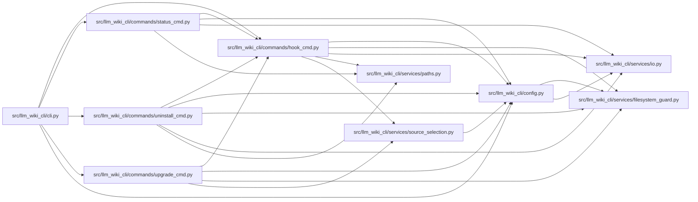

# hook_cmd Module

**Path:** `src/llm_wiki_cli/commands/hook_cmd.py`

## Description

_Auto-generated from `src/llm_wiki_cli/commands/hook_cmd.py`._

## Imports

| Source | Symbols |
|--------|---------|
| `..config` | `AGENT_CHOICES`, `AgentConfigState`, `DEFAULT_WIKI_DIR`, `get_agent_config_path`, `inspect_config`, `require_committed_config`, `require_safe_config_path`, `validate_path`, `write_config` |
| `..services.filesystem_guard` | `atomic_write_executable_bytes`, `ensure_guarded_directory`, `unlink_guarded_bytes` |
| `..services.io` | `first_unsafe_path_component` |
| `..services.paths` | `shell_quote` |
| `..services.source_selection` | `SourceSelectionError`, `resolve_source_selection` |
| `__future__` | `annotations` |
| `hashlib` | `hashlib` |
| `pathlib` | `Path` |
| `shlex` | `shlex` |
| `sys` | `sys` |

## Local dependency map

<!-- Auto-generated local dependency summary. Do not edit by hand. -->

### Internal neighbors

| Direction | Module |
|---|---|
| Inbound | [cli](../modules/cli.md) |
| Inbound | [status_cmd](../modules/status_cmd.md) |
| Inbound | [uninstall_cmd](../modules/uninstall_cmd.md) |
| Inbound | [upgrade_cmd](../modules/upgrade_cmd.md) |
| Outbound | [config](../modules/config.md) |
| Outbound | [filesystem_guard](../modules/filesystem_guard.md) |
| Outbound | [io](../modules/io.md) |
| Outbound | [paths](../modules/paths.md) |
| Outbound | [source_selection](../modules/source_selection.md) |

## Functions

| Function | Signature | Decorators | Description |
|----------|-----------|------------|-------------|
| `_read_agent_config` | `(wiki_dir: str) -> str \| None` | — | Read the agent name persisted by `llm-wiki init`. |
| `_build_post_commit` | `(agent: str, wiki_dir: str, source_selection: str \| Path \| None = None) -> str` | — | Build the managed post-commit hook. |
| `_build_ide_post_commit` | `(wiki_dir: str, *, source_selection: str \| Path \| None = None) -> str` | — | — |
| `_build_validation_pre_commit` | `(wiki_dir: str, *, source_selection: str \| Path \| None = None) -> str` | — | — |
| `_source_selection_args` | `(source_selection: str \| Path \| None) -> str` | — | — |
| `require_safe_hook_arguments` | `(wiki_dir: str \| Path, source_selection: str \| Path \| None = None) -> None` | — | Reject control characters that cannot round-trip through hook scripts. |
| `_hook_parameters_are_within_project` | `(wiki_dir: str, source_selection: str \| None = None) -> bool` | — | — |
| `_current_post_commit_parameters` | `(content: str) -> tuple[str, str \| None] \| None` | — | — |
| `_current_pre_commit_parameters` | `(content: str) -> tuple[str, str \| None] \| None` | — | — |
| `_legacy_ide_post_commit` | `(wiki_dir: str) -> str` | — | — |
| `_legacy_auto_sync_post_commit` | `(agent: str, wiki_dir: str) -> str` | — | — |
| `_legacy_auto_sync_parameters` | `(content: str) -> tuple[str, str] \| None` | — | — |
| `_is_legacy_trigger_invocation` | `(line: str) -> bool` | — | — |
| `_is_legacy_prompt_invocation` | `(line: str, content: str) -> bool` | — | — |
| `_legacy_skeleton_digest` | `(name: str, content: str) -> str \| None` | — | — |
| `is_managed_hook_content` | `(name: str, content: str) -> bool` | — | Return whether ``content`` exactly matches a recognized managed hook. |
| `require_safe_hook_paths` | `() -> None` | — | Reject redirected, non-regular, or unreadable managed hook paths. |
| `require_hook_installable` | `(hooks_dir: Path, name: str, *, force: bool) -> bytes \| None` | — | Reject a custom hook collision before any lifecycle mutation. |
| `_install_hook` | `(hooks_dir: Path, name: str, content: str, *, force: bool = False, expected_existing: bytes \| None \| object = _EXPECTED_HOOK_UNSET) -> None` | — | Write a hook file and make it executable. |
| `run` | `(args)` | — | — |
