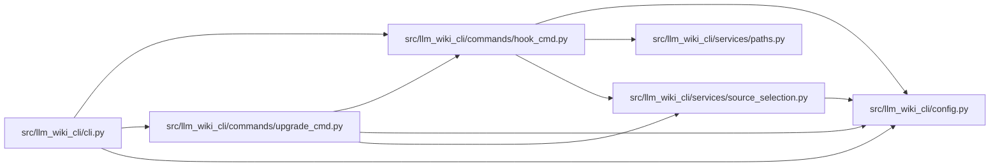

# hook_cmd Module

**Path:** `src/llm_wiki_cli/commands/hook_cmd.py`

## Description

_Auto-generated from `src/llm_wiki_cli/commands/hook_cmd.py`._

## Imports

| Source | Symbols |
|--------|---------|
| `..config` | `DEFAULT_WIKI_DIR`, `get_agent_config_path`, `read_config`, `validate_path`, `write_config` |
| `..services.paths` | `shell_quote` |
| `..services.source_selection` | `SourceSelectionError`, `resolve_source_selection` |
| `__future__` | `annotations` |
| `os` | `os` |
| `pathlib` | `Path` |
| `stat` | `stat` |
| `sys` | `sys` |

## Local dependency map

<!-- Auto-generated local dependency summary. Do not edit by hand. -->

### Internal neighbors

| Direction | Module |
|---|---|
| Inbound | [cli](../modules/cli.md) |
| Inbound | [upgrade_cmd](../modules/upgrade_cmd.md) |
| Outbound | [config](../modules/config.md) |
| Outbound | [paths](../modules/paths.md) |
| Outbound | [source_selection](../modules/source_selection.md) |

## Functions

| Function | Signature | Decorators | Description |
|----------|-----------|------------|-------------|
| `_read_agent_config` | `(wiki_dir: str) -> str \| None` | — | Read the agent name persisted by `llm-wiki init`. |
| `_build_post_commit` | `(agent: str, wiki_dir: str, source_selection: str \| Path \| None = None) -> str` | — | Build the managed post-commit hook. |
| `_build_ide_post_commit` | `(wiki_dir: str, *, source_selection: str \| Path \| None = None) -> str` | — | — |
| `_build_validation_pre_commit` | `(wiki_dir: str, *, source_selection: str \| Path \| None = None) -> str` | — | — |
| `_source_selection_args` | `(source_selection: str \| Path \| None) -> str` | — | — |
| `_install_hook` | `(hooks_dir: Path, name: str, content: str, *, force: bool = False) -> None` | — | Write a hook file and make it executable. |
| `run` | `(args)` | — | — |
