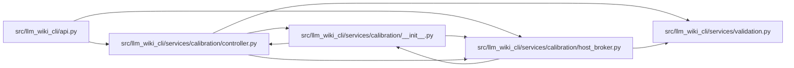

# host_broker Module

**Path:** `src/llm_wiki_cli/services/calibration/host_broker.py`

## Description

Supported host-authentication context for external calibration brokers.

The package deliberately ships no authenticator, credential, provider adapter,
or dynamic plugin loader. An embedding host may scope an authenticator to
lifecycle API calls only after it has established broker identity with an
OS-protected mechanism. Submitted JSON can never select or satisfy the
authenticator, and the stock CLI remains fail-closed outside that context.

## Imports

| Source | Symbols |
|--------|---------|
| `.` | `_restore_legacy_definition_modules` |
| `..validation` | `require_bounded_text`, `require_sha256` |
| `__future__` | `annotations` |
| `contextlib` | `contextmanager` |
| `contextvars` | `ContextVar` |
| `dataclasses` | `asdict`, `dataclass` |
| `functools` | `wraps` |
| `typing` | `Any`, `Iterator`, `Literal`, `Mapping`, `Protocol`, `runtime_checkable` |
| `warnings` | `warnings` |

## Local dependency map

<!-- Auto-generated local dependency summary. Do not edit by hand. -->

### Internal neighbors

| Direction | Module |
|---|---|
| Inbound | [api](../modules/api.md) |
| Inbound | [calibration___init__](../modules/calibration___init__.md) |
| Inbound | [controller](../modules/controller.md) |
| Outbound | [calibration___init__](../modules/calibration___init__.md) |
| Outbound | [validation](../modules/validation.md) |

## Classes

| Class | Line | Bases | Description |
|-------|------|-------|-------------|
| [HostBrokerAuthenticationError](../entities/HostBrokerAuthenticationError.md) | 23 | `ValueError` | Raised when external broker authentication is unavailable or invalid. |
| [HostBrokerAuthenticationUnavailable](../entities/HostBrokerAuthenticationUnavailable.md) | 27 | `HostBrokerAuthenticationError` | Raised when no supported host-authenticator context is active. |
| [HostBrokerAuthenticationProof](../entities/HostBrokerAuthenticationProof.md) | 32 | — | Secret-free proof returned by a separately authenticated host broker. |
| [HostBrokerAuthenticator](../entities/HostBrokerAuthenticator.md) | 141 | `Protocol` | Supported protocol implemented after protected host authentication. |

## Functions

| Function | Signature | Decorators | Description |
|----------|-----------|------------|-------------|
| `use_calibration_host_broker_authenticator` | `(authenticator: HostBrokerAuthenticator) -> Iterator[None]` | `@contextmanager` | Scope one already-authenticated host broker to lifecycle API calls. |
| `use_p0_calibration_host_broker_authenticator` | `(*args: Any, **kwargs: Any) -> Any` | `@wraps(use_calibration_host_broker_authenticator)` | Compatibility wrapper for the former public API name. |
| `require_process_host_broker_authenticator` | `() -> HostBrokerAuthenticator` | — | Return the context-scoped host authenticator or fail closed. |
| `require_attestation_authentication` | `(*, cohort_id: str, authority_grant: Mapping[str, Any], execution_manifest: Mapping[str, Any], attestation: Mapping[str, Any], attestation_hash: str) -> HostBrokerAuthenticationProof` | — | Obtain a structured host proof for an external attestation. |
| `require_receipt_authentication` | `(*, cohort_id: str, execution_manifest: Mapping[str, Any], attestation: Mapping[str, Any], receipt: Mapping[str, Any], receipt_hash: str, result: Mapping[str, Any], result_hash: str) -> HostBrokerAuthenticationProof` | — | Obtain a structured host proof for an external dispatch receipt. |
| `_require_bounded_text` | `(value: Any, label: str) -> str` | — | — |
| `_require_hash` | `(value: Any, label: str) -> str` | — | — |
