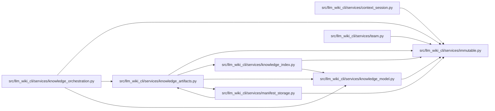

# immutable Module

**Path:** `src/llm_wiki_cli/services/immutable.py`

## Description

Detached immutable model graphs that retain ordinary JSON container shapes.

## Imports

| Source | Symbols |
|--------|---------|
| `__future__` | `annotations` |
| `collections.abc` | `Mapping` |
| `copy` | `deepcopy` |
| `dataclasses` | `fields`, `is_dataclass`, `replace` |
| `typing` | `TypeVar`, `cast` |

## Local dependency map

<!-- Auto-generated local dependency summary. Do not edit by hand. -->

### Internal neighbors

| Direction | Module |
|---|---|
| Inbound | [context_session](../modules/context_session.md) |
| Inbound | [knowledge_artifacts](../modules/knowledge_artifacts.md) |
| Inbound | [knowledge_index](../modules/knowledge_index.md) |
| Inbound | [knowledge_model](../modules/knowledge_model.md) |
| Inbound | [knowledge_orchestration](../modules/knowledge_orchestration.md) |
| Inbound | [manifest_storage](../modules/manifest_storage.md) |
| Inbound | [team](../modules/team.md) |

## Classes

| Class | Line | Bases | Description |
|-------|------|-------|-------------|
| [FrozenDict](../entities/FrozenDict.md) | 17 | `dict` | — |
| [FrozenList](../entities/FrozenList.md) | 28 | `list` | — |

## Functions

| Function | Signature | Decorators | Description |
|----------|-----------|------------|-------------|
| `_immutable` | `(*args, **kwargs)` | — | — |
| `freeze` | `(value: _T) -> _T` | — | Detach parsed, acyclic model data and freeze every mutable descendant. |
