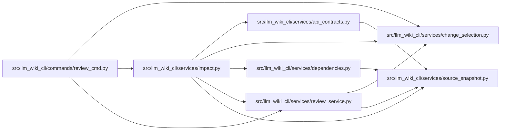

# impact Module

**Path:** `src/llm_wiki_cli/services/impact.py`

## Description

Builds deterministic advisory impact from selected paths and captured candidate
source/wiki coverage. Reports direct page mappings, static dependency edges,
API operation hints, and explicit unknown coverage for deleted sources without
retained provenance. Equivalent change inputs share the same coverage analysis.

GitHub output is limited to fifty annotations and the Markdown summary to
64 KiB, with omissions recorded. Integrity and API compatibility verdicts remain
separate checks.

## Imports

| Source | Symbols |
|--------|---------|
| `.api_contracts` | `build_static_api_contracts` |
| `.change_selection` | `_git`, `patch_paths`, `source_relative_paths` |
| `.dependencies` | `build_dependency_graph` |
| `.review_service` | `build_analysis`, `_is_dependency_path` |
| `.source_snapshot` | `source_snapshot_matches_current_files` |
| `__future__` | `annotations` |
| `dataclasses` | `asdict` |
| `hashlib` | `hashlib` |
| `html` | `html` |
| `json` | `json` |

## Local dependency map

<!-- Auto-generated local dependency summary. Do not edit by hand. -->

### Internal neighbors

| Direction | Module |
|---|---|
| Inbound | [review_cmd](../modules/review_cmd.md) |
| Outbound | [api_contracts](../modules/api_contracts.md) |
| Outbound | [change_selection](../modules/change_selection.md) |
| Outbound | [services_dependencies](../modules/services_dependencies.md) |
| Outbound | [review_service](../modules/review_service.md) |
| Outbound | [source_snapshot](../modules/source_snapshot.md) |

## Functions

| Function | Signature | Decorators | Description |
|----------|-----------|------------|-------------|
| `build_impact` | `(diff_text: str = '', *, src_dir = '.', wiki_dir = 'docs/llm_wiki', changes = None, source_selection = None, helper_cache_dir = None) -> dict` | — | — |
| `_cell` | `(value, limit = 512)` | — | — |
| `render_summary` | `(impact: dict) -> str` | — | — |
| `_escape_command` | `(value: str, *, property = False) -> str` | — | — |
| `render_github` | `(impact: dict) -> str` | — | — |
