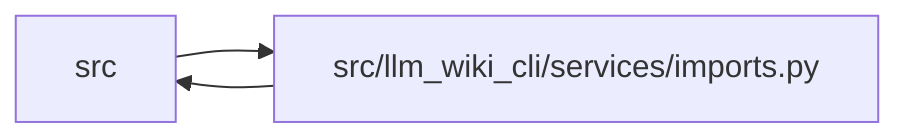

# imports Module

**Path:** `src/llm_wiki_cli/services/imports.py`

## Description

_Auto-generated from `src/llm_wiki_cli/services/imports.py`._

## Imports

| Source | Symbols |
|--------|---------|
| `..config` | `is_agent_worktree_path` |
| `.python_imports` | `PythonModuleIndex`, `is_python_source` |
| `.source_snapshot` | `SourceSnapshot` |
| `.validation` | `path_is_under`, `path_is_under_scope` |
| `__future__` | `annotations` |
| `collections` | `defaultdict` |
| `collections.abc` | `Mapping` |
| `dataclasses` | `dataclass` |
| `json` | `json` |
| `os` | `os` |
| `pathlib` | `Path`, `PurePosixPath` |
| `posixpath` | `posixpath` |
| `typing` | `TYPE_CHECKING` |

## Local dependency map

<!-- Auto-generated local dependency summary. Do not edit by hand. -->

> Module-level dependencies exceed the generated-diagram limits, so the diagram and table below group them by top-level package. Counts report the number of module neighbors in each package.

### Internal neighbors

| Direction | Module |
|---|---|
| Inbound | `src` (8) |
| Outbound | `src` (4) |

> All 12 module neighbor(s) are summarized by package because the module-level view exceeds the 12-node limit.

## Classes

| Class | Line | Bases | Description |
|-------|------|-------|-------------|
| [_TsPathAliasRule](../entities/TsPathAliasRule.md) | 24 | — | One ``compilerOptions.paths`` mapping scoped to its tsconfig directory. |
| [_GoModuleScope](../entities/GoModuleScope.md) | 35 | — | One ``go.mod`` module declaration scoped to its directory. |
| [ModulePathResolver](../entities/ModulePathResolver.md) | 43 | — | Indexed module import resolver for a fixed inventory. |

## Functions

| Function | Signature | Decorators | Description |
|----------|-----------|------------|-------------|
| `_suffix_candidates` | `(path_no_suffix: str) -> set[str]` | — | — |
| `_normalize_module` | `(module: str) -> str` | — | — |
| `_is_python_from_import` | `(module: str, name: str, import_type: str \| None) -> bool` | — | Return whether an import record can name a Python child module. |
| `_python_from_import_child` | `(module: str, name: str) -> str` | — | Join the two parts of ``from <module> import <name>`` as a module. |
| `_candidate_stems` | `(module: str, importer_filepath: str) -> set[str]` | — | — |
| `_is_go_file` | `(filepath: str, data: object) -> bool` | — | — |
| `_language_family` | `(data: object) -> str` | — | — |
| `_is_haskell_entry` | `(data: object) -> bool` | — | — |
| `_is_typescript_entry` | `(data: object) -> bool` | — | — |
| `_is_typescript_index` | `(filepath: str, data: object) -> bool` | — | — |
| `_normalize_haskell_module` | `(module: object) -> str` | — | — |
| `_package_dir` | `(filepath: str) -> str` | — | — |
| `_relative_package_dir` | `(module: str, importer_filepath: str) -> str` | — | — |
| `_read_go_module_scopes` | `(project_root: str \| Path \| None, source_snapshot: SourceSnapshot \| None = None) -> tuple[_GoModuleScope, ...]` | — | — |
| `_go_module_dir_is_agent_worktree` | `(project_root: Path, root_path: Path, dirname: str) -> bool` | — | — |
| `_read_go_module_path` | `(path: Path) -> str` | — | — |
| `_go_package_dir_for_module` | `(module: str, scope: _GoModuleScope) -> str` | — | — |
| `_path_under` | `(path: str, prefix: str) -> bool` | — | — |
| `_path_under_scope` | `(path: str, scope_root: str) -> bool` | — | — |
| `_read_ts_path_aliases` | `(project_root: str \| Path \| None, source_snapshot: SourceSnapshot \| None = None) -> tuple[_TsPathAliasRule, ...]` | — | — |
| `_snapshot_marker_paths` | `(project_root: Path, source_snapshot: SourceSnapshot, filename: str) -> list[Path]` | — | — |
| `_parse_tsconfig_aliases` | `(project_root: Path, tsconfig: Path) -> list[_TsPathAliasRule]` | — | — |
| `_project_relative_dir` | `(project_root: Path, directory: Path) -> str` | — | — |
| `_join_posix` | `(*parts: str) -> str` | — | — |
| `_nearest_ts_alias_root` | `(rules: tuple[_TsPathAliasRule, ...], importer_filepath: str) -> str \| None` | — | — |
| `_match_ts_alias_rule` | `(rule: _TsPathAliasRule, spec: str) -> str \| None` | — | — |
| `_ts_alias_target_stems` | `(target: str, star: str) -> set[str]` | — | — |
| `_strip_ts_source_suffix` | `(path: str) -> str` | — | — |
| `build_module_path_resolver` | `(inventory: dict, project_root: str \| Path \| None = None, *, source_snapshot: SourceSnapshot \| None = None) -> ModulePathResolver` | — | Build an indexed import resolver for repeated lookups. |
