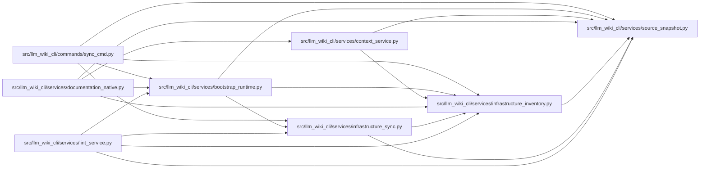

# infrastructure_inventory Module

**Path:** `src/llm_wiki_cli/services/infrastructure_inventory.py`

## Description

Inventory helpers for non-Docker infrastructure YAML files.

## Imports

| Source | Symbols |
|--------|---------|
| `.source_snapshot` | `SourceSnapshot`, `build_source_snapshot` |
| `__future__` | `annotations` |
| `pathlib` | `Path` |
| `typing` | `Iterable` |

## Local dependency map

<!-- Auto-generated local dependency summary. Do not edit by hand. -->

### Internal neighbors

| Direction | Module |
|---|---|
| Inbound | [sync_cmd](../modules/sync_cmd.md) |
| Inbound | [bootstrap_runtime](../modules/bootstrap_runtime.md) |
| Inbound | [context_service](../modules/context_service.md) |
| Inbound | [documentation_native](../modules/documentation_native.md) |
| Inbound | [infrastructure_sync](../modules/infrastructure_sync.md) |
| Inbound | [lint_service](../modules/lint_service.md) |
| Outbound | [source_snapshot](../modules/source_snapshot.md) |

## Functions

| Function | Signature | Decorators | Description |
|----------|-----------|------------|-------------|
| `infrastructure_page_name` | `(source_path: str) -> str` | — | Return the canonical infrastructure page stem for *source_path*. |
| `infrastructure_display_label` | `(source_path: str, info: dict) -> str` | — | Return a human-friendly index label for an infrastructure entry. |
| `get_yaml_infrastructure_inventory` | `(src_dir: str \| Path, *, source_snapshot: SourceSnapshot \| None = None) -> dict[str, dict]` | — | Discover targeted infrastructure and runtime/config YAML files. |
| `parse_runtime_config_yaml` | `(rel_path: str, text: str) -> dict \| None` | — | Parse recognized runtime/config YAML families into documentation models. |
| `parse_prometheus_config` | `(text: str) -> dict` | — | Parse Prometheus scrape configuration into a compact model. |
| `parse_prometheus_rules` | `(text: str) -> dict` | — | Parse Prometheus recording/alerting rule groups. |
| `parse_grafana_provisioning` | `(text: str, rel_path: str) -> dict` | — | Parse Grafana provisioning datasource or dashboard files. |
| `parse_promtail_config` | `(text: str) -> dict` | — | Parse Promtail client and scrape configuration. |
| `parse_loki_config` | `(text: str) -> dict` | — | Parse Loki local runtime configuration. |
| `parse_envoy_config` | `(text: str) -> dict` | — | Parse Envoy listener, cluster, and admin port summaries. |
| `parse_buf_config` | `(text: str, rel_path: str) -> dict` | — | Parse Buf module or generation configuration. |
| `parse_model_service_config` | `(text: str, rel_path: str) -> dict` | — | Parse service-local model runtime settings. |
| `parse_github_actions_workflow` | `(text: str) -> dict` | — | Parse a GitHub Actions workflow into a compact documentation model. |
| `parse_kubernetes_manifest` | `(text: str) -> dict` | — | Parse one Kubernetes YAML file into resource summaries. |
| `_is_github_actions_path` | `(rel_path: str) -> bool` | — | — |
| `_is_kubernetes_path` | `(rel_path: str) -> bool` | — | — |
| `_is_prometheus_config` | `(rel_path: str, lines: list[tuple[int, str]]) -> bool` | — | — |
| `_is_prometheus_rules` | `(rel_path: str, lines: list[tuple[int, str]]) -> bool` | — | — |
| `_is_grafana_provisioning` | `(rel_path: str) -> bool` | — | — |
| `_is_promtail_config` | `(rel_path: str, lines: list[tuple[int, str]]) -> bool` | — | — |
| `_is_loki_config` | `(rel_path: str, lines: list[tuple[int, str]]) -> bool` | — | — |
| `_is_envoy_config` | `(rel_path: str, lines: list[tuple[int, str]]) -> bool` | — | — |
| `_is_buf_config` | `(rel_path: str) -> bool` | — | — |
| `_is_model_service_config` | `(rel_path: str, lines: list[tuple[int, str]]) -> bool` | — | — |
| `_has_key` | `(lines: Iterable[tuple[int, str]], key: str) -> bool` | — | — |
| `_has_top_level_key` | `(lines: Iterable[tuple[int, str]], key: str) -> bool` | — | — |
| `_section_ranges` | `(lines: list[tuple[int, str]], section_key: str) -> Iterable[tuple[int, int, int]]` | — | — |
| `_unique_values` | `(values: Iterable[str]) -> list[str]` | — | — |
| `_collect_list_values` | `(lines: list[tuple[int, str]], section_key: str) -> list[str]` | — | — |
| `_collect_named_items` | `(lines: list[tuple[int, str]], section_key: str) -> list[str]` | — | — |
| `_collect_field_values` | `(lines: list[tuple[int, str]], section_key: str, field_key: str) -> list[str]` | — | — |
| `_collect_values_after_key` | `(lines: list[tuple[int, str]], section_key: str, field_key: str) -> list[str]` | — | — |
| `_first_value_for_key` | `(lines: Iterable[tuple[int, str]], key: str) -> str` | — | — |
| `_yaml_lines` | `(text: str) -> list[tuple[int, str]]` | — | — |
| `_mapping_key` | `(stripped: str) -> bool` | — | — |
| `_split_key_value` | `(stripped: str) -> tuple[str, str]` | — | — |
| `_scalar_after_colon` | `(stripped: str) -> str` | — | — |
| `_parse_scalar` | `(value: str) -> str` | — | — |
| `_strip_inline_comment` | `(value: str) -> str` | — | — |
| `_parse_string_list` | `(value: str) -> list[str]` | — | — |
| `_parse_github_triggers` | `(lines: list[tuple[int, str]], start_index: int) -> list[str]` | — | — |
| `_new_actions_step` | `() -> dict[str, str]` | — | — |
| `_parse_actions_step_line` | `(lines: list[tuple[int, str]], index: int, current_job: dict, current_step: dict \| None) -> tuple[dict \| None, int]` | — | — |
| `_assign_step_value` | `(step: dict[str, str], key: str, value: str, lines: list[tuple[int, str]], index: int) -> int` | — | — |
| `_collect_block_scalar` | `(lines: list[tuple[int, str]], start_index: int) -> tuple[str, int]` | — | — |
| `_split_yaml_documents` | `(text: str) -> list[str]` | — | — |
| `_parse_kubernetes_document` | `(text: str) -> dict \| None` | — | — |
| `_top_level_value` | `(lines: Iterable[tuple[int, str]], key: str) -> str` | — | — |
| `_fill_kubernetes_metadata` | `(lines: list[tuple[int, str]], resource: dict) -> None` | — | — |
| `_fill_kubernetes_spec` | `(lines: list[tuple[int, str]], resource: dict) -> None` | — | — |
| `_collect_mapping` | `(lines: list[tuple[int, str]], start_index: int) -> dict[str, str]` | — | — |
| `_collect_containers` | `(lines: list[tuple[int, str]], start_index: int) -> list[dict]` | — | — |
| `_collect_service_ports` | `(lines: list[tuple[int, str]], start_index: int) -> list[dict]` | — | — |
| `_assign_service_port_value` | `(port: dict[str, str], key: str, value: str) -> None` | — | — |
