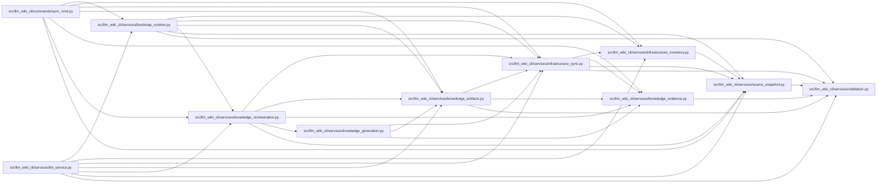

# infrastructure_sync Module

**Path:** `src/llm_wiki_cli/services/infrastructure_sync.py`

## Description

Deterministic infrastructure discovery and incremental sync planning.

Infrastructure observations are intentionally separate from the AST inventory.
The persisted state records repository-relative source/page mappings and binds
each rendered observation to both the exact source bytes and the normalized
parser result.  It contains no timestamps, absolute paths, or source literals.

## Imports

| Source | Symbols |
|--------|---------|
| `.infrastructure_inventory` | `infrastructure_page_name` |
| `.knowledge_evidence` | `ConceptObservationBasis`, `build_infrastructure_observation_basis`, `hash_json`, `is_valid_sha256` |
| `.source_snapshot` | `SourceSnapshot` |
| `.validation` | `is_portable_relative_path` |
| `__future__` | `annotations` |
| `copy` | `deepcopy` |
| `dataclasses` | `dataclass`, `field` |
| `pathlib` | `PurePosixPath` |
| `typing` | `Mapping` |

## Local dependency map

<!-- Auto-generated local dependency summary. Do not edit by hand. -->

### Internal neighbors

| Direction | Module |
|---|---|
| Inbound | [sync_cmd](../modules/sync_cmd.md) |
| Inbound | [bootstrap_runtime](../modules/bootstrap_runtime.md) |
| Inbound | [knowledge_artifacts](../modules/knowledge_artifacts.md) |
| Inbound | [knowledge_generation](../modules/knowledge_generation.md) |
| Inbound | [knowledge_orchestration](../modules/knowledge_orchestration.md) |
| Inbound | [lint_service](../modules/lint_service.md) |
| Outbound | [infrastructure_inventory](../modules/infrastructure_inventory.md) |
| Outbound | [knowledge_evidence](../modules/knowledge_evidence.md) |
| Outbound | [source_snapshot](../modules/source_snapshot.md) |
| Outbound | [validation](../modules/validation.md) |

## Classes

| Class | Line | Bases | Description |
|-------|------|-------|-------------|
| [InfrastructureSyncError](../entities/InfrastructureSyncError.md) | 33 | `ValueError` | Persisted infrastructure state is unsafe or internally inconsistent. |
| [InfrastructureSyncPlan](../entities/InfrastructureSyncPlan.md) | 543 | — | One immutable infrastructure regeneration plan. |

## Functions

| Function | Signature | Decorators | Description |
|----------|-----------|------------|-------------|
| `build_infrastructure_page_map` | `(source_paths: Mapping[str, object] \| tuple[str, ...] \| list[str] \| set[str]) -> dict[str, str]` | — | Return collision-safe page paths without changing legacy unique names. |
| `_source_hash` | `(snapshot: SourceSnapshot, source_path: str) -> str` | — | — |
| `_observation_hash` | `(info: Mapping[str, object]) -> str` | — | — |
| `_source_record` | `(snapshot: SourceSnapshot, source_path: str, info: Mapping[str, object], *, page_path: str) -> dict[str, object]` | — | — |
| `_prior_infrastructure_state` | `(generation_inputs: Mapping[str, object] \| None) -> dict[str, object]` | — | — |
| `_valid_repository_path` | `(value: str) -> bool` | — | — |
| `_valid_page_path` | `(value: object) -> bool` | — | — |
| `_record_mapping` | `(value: object, *, field_name: str) -> dict[str, dict[str, object]]` | — | — |
| `validate_infrastructure_generation_input` | `(generation_inputs: Mapping[str, object] \| None) -> None` | — | Reject an unsafe persisted v1 infrastructure mapping. |
| `infrastructure_evidence_by_page` | `(generation_inputs: Mapping[str, object] \| None) -> dict[str, ConceptObservationBasis]` | — | Project persisted current/removal records into native concept evidence. |
| `current_infrastructure_bases` | `(snapshot: SourceSnapshot, inventory: Mapping[str, Mapping[str, object]]) -> dict[str, ConceptObservationBasis]` | — | Build live bases keyed by source path from an evaluated inventory. |
| `_yaml_candidates` | `(snapshot: SourceSnapshot) -> tuple[str, ...]` | — | — |
| `_candidate_roots` | `(snapshot: SourceSnapshot, inventory: Mapping[str, Mapping[str, object]]) -> tuple[str, ...]` | — | — |
| `_unsupported_yaml_records` | `(snapshot: SourceSnapshot, inventory: Mapping[str, Mapping[str, object]]) -> tuple[dict[str, object], ...]` | — | — |
| `_move_key` | `(record: Mapping[str, object]) -> tuple[object, ...]` | — | — |
| `_detect_moves` | `(prior_sources: Mapping[str, Mapping[str, object]], current_sources: Mapping[str, Mapping[str, object]], removed: set[str], added: set[str]) -> dict[str, str]` | — | — |
| `_tombstone` | `(record: Mapping[str, object], *, reason: str, moved_to: str \| None = None) -> dict[str, object]` | — | — |
| `_discovery_status` | `(*, current_count: int, unsupported_count: int, candidate_count: int) -> str` | — | — |
| `_selected_prior_tombstones` | `(snapshot: SourceSnapshot, raw_tombstones: Mapping[str, Mapping[str, object]]) -> tuple[dict[str, dict[str, object]], dict[str, dict[str, object]]]` | — | Split tombstones at the policy boundary without retaining move leaks. |
| `_pruned_prior_discovery` | `(prior_state: Mapping[str, object], snapshot: SourceSnapshot, *, raw_source_count: int, selected_source_count: int) -> dict[str, object] \| None` | — | Return prior discovery metadata with out-of-policy paths removed. |
| `_deselection_only_state` | `(prior_state: Mapping[str, object], snapshot: SourceSnapshot, *, raw_prior_sources: Mapping[str, Mapping[str, object]], prior_sources: Mapping[str, Mapping[str, object]], tombstones: Mapping[str, Mapping[str, object]]) -> dict[str, object]` | — | Prune persisted records without advancing live infrastructure changes. |
| `build_infrastructure_sync_plan` | `(snapshot: SourceSnapshot, inventory: Mapping[str, Mapping[str, object]], *, generation_inputs: Mapping[str, object] \| None = None) -> InfrastructureSyncPlan` | — | Compare current infrastructure observations with persisted native state. |
| `with_infrastructure_generation_input` | `(generation_inputs: Mapping[str, object], plan: InfrastructureSyncPlan) -> dict[str, object]` | — | Return generation inputs carrying the plan's deterministic next state. |
| `with_infrastructure_deselection_generation_input` | `(generation_inputs: Mapping[str, object], plan: InfrastructureSyncPlan) -> dict[str, object]` | — | Persist only policy pruning, without advancing live infrastructure state. |
