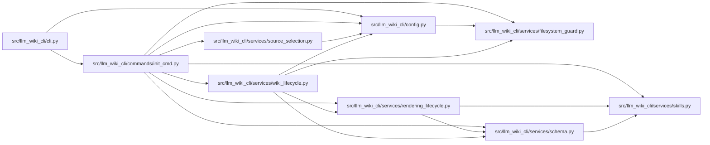

# init_cmd Module

**Path:** `src/llm_wiki_cli/commands/init_cmd.py`

## Description

_Auto-generated from `src/llm_wiki_cli/commands/init_cmd.py`._

## Imports

| Source | Symbols |
|--------|---------|
| `..config` | `AgentConfigState`, `CLI_AGENTS`, `DEFAULT_WIKI_DIR`, `config_requires_manual_recovery`, `get_agent_config_path`, `inspect_config`, `require_committed_config`, `require_config_inspection_unchanged`, `require_safe_config_path`, `validate_path`, `write_config` |
| `..services.filesystem_guard` | `atomic_write_guarded_bytes`, `ensure_guarded_directory`, `unlink_guarded_bytes` |
| `..services.rendering_lifecycle` | `reference_recovery_command`, `select_render_profile` |
| `..services.schema` | `CONSTRAINT_START`, `SCHEMA_FILENAMES`, `ManagedSchemaBlockError`, `ManagedSchemaBlockState`, `ManagedSchemaPathError`, `SchemaRenderProfile`, `build_schema_content`, `classify_managed_schema_block`, `decode_managed_document_bytes`, `encode_managed_document_text`, `replace_schema_block_content`, `require_managed_schema_profile`, `require_replaceable_managed_schema`, `require_safe_schema_path` |
| `..services.skills` | `REFERENCE_SKILL_ID`, `ReferenceSkillState`, `_provision_reference_skill_guarded`, `list_bundled_skills`, `skills_install_dir`, `verify_reference_skill` |
| `..services.source_selection` | `SourceSelectionError`, `resolve_source_selection` |
| `..services.wiki_lifecycle` | `WikiScaffoldPathError`, `provision_wiki_scaffold`, `require_safe_wiki_scaffold` |
| `__future__` | `annotations` |
| `pathlib` | `Path` |
| `shutil` | `shutil` |
| `sys` | `sys` |

## Local dependency map

<!-- Auto-generated local dependency summary. Do not edit by hand. -->

### Internal neighbors

| Direction | Module |
|---|---|
| Inbound | [cli](../modules/cli.md) |
| Outbound | [config](../modules/config.md) |
| Outbound | [filesystem_guard](../modules/filesystem_guard.md) |
| Outbound | [rendering_lifecycle](../modules/rendering_lifecycle.md) |
| Outbound | [services_schema](../modules/services_schema.md) |
| Outbound | [skills](../modules/skills.md) |
| Outbound | [source_selection](../modules/source_selection.md) |
| Outbound | [wiki_lifecycle](../modules/wiki_lifecycle.md) |

## Functions

| Function | Signature | Decorators | Description |
|----------|-----------|------------|-------------|
| `_managed_schema_agents` | `() -> tuple[str, ...]` | — | Return agents with one safely readable managed schema in the checkout. |
| `run` | `(args)` | — | — |
