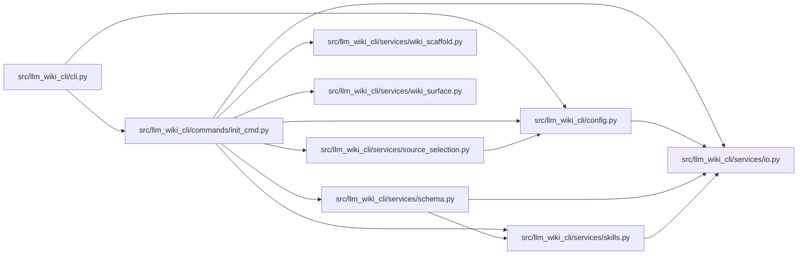

# init_cmd Module

**Path:** `src/llm_wiki_cli/commands/init_cmd.py`

## Description

_Auto-generated from `src/llm_wiki_cli/commands/init_cmd.py`._

## Imports

| Source | Symbols |
|--------|---------|
| `..config` | `CLI_AGENTS`, `DEFAULT_WIKI_DIR`, `read_config`, `validate_path`, `write_config` |
| `..services.io` | `read_md`, `write_md` |
| `..services.schema` | `CONSTRAINT_START`, `SCHEMA_FILENAMES`, `build_schema_content`, `replace_schema_block` |
| `..services.skills` | `REFERENCE_SKILL_ID`, `SkillsError`, `install_reference_skill`, `list_bundled_skills` |
| `..services.source_selection` | `SourceSelectionError`, `resolve_source_selection` |
| `..services.wiki_scaffold` | `INITIAL_WIKI_INDEX_MARKDOWN`, `INITIAL_WIKI_LOG_MARKDOWN` |
| `..services.wiki_surface` | `iter_directory_kinds` |
| `__future__` | `annotations` |
| `pathlib` | `Path` |
| `shutil` | `shutil` |
| `sys` | `sys` |

## Local dependency map

<!-- Auto-generated local dependency summary. Do not edit by hand. -->

### Internal neighbors

| Direction | Module |
|---|---|
| Inbound | [cli](../modules/cli.md) |
| Outbound | [config](../modules/config.md) |
| Outbound | [io](../modules/io.md) |
| Outbound | [services_schema](../modules/services_schema.md) |
| Outbound | [skills](../modules/skills.md) |
| Outbound | [source_selection](../modules/source_selection.md) |
| Outbound | [wiki_scaffold](../modules/wiki_scaffold.md) |
| Outbound | [wiki_surface](../modules/wiki_surface.md) |

## Functions

| Function | Signature | Decorators | Description |
|----------|-----------|------------|-------------|
| `run` | `(args)` | — | — |
