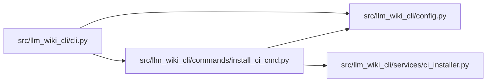

# install_ci_cmd Module

**Path:** `src/llm_wiki_cli/commands/install_ci_cmd.py`

## Description

CLI adapter for installing the portable LLM Wiki integrity workflow.

## Imports

| Source | Symbols |
|--------|---------|
| `..config` | `DEFAULT_WIKI_DIR` |
| `..services.ci_installer` | `InstallCiError`, `install_ci_workflow` |
| `__future__` | `annotations` |
| `sys` | `sys` |

## Local dependency map

<!-- Auto-generated local dependency summary. Do not edit by hand. -->

### Internal neighbors

| Direction | Module |
|---|---|
| Inbound | [cli](../modules/cli.md) |
| Outbound | [config](../modules/config.md) |
| Outbound | [ci_installer](../modules/ci_installer.md) |

## Functions

| Function | Signature | Decorators | Description |
|----------|-----------|------------|-------------|
| `run` | `(args) -> None` | — | — |
