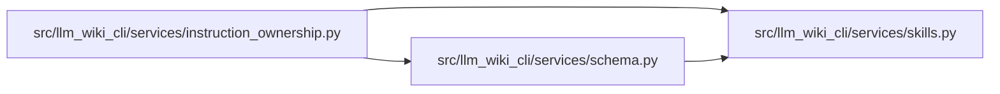

# instruction_ownership Module

**Path:** `src/llm_wiki_cli/services/instruction_ownership.py`

## Description

Machine-checkable ownership and routing for generated agent instructions.

This inventory is a fail-closed removal gate.  Detailed generated prose may be
moved only after its canonical destination is both present in the distribution
payload and explicitly reachable in the rendered target/profile being changed.

## Imports

| Source | Symbols |
|--------|---------|
| `.schema` | `SCHEMA_FILENAMES`, `SchemaRenderProfile` |
| `.skills` | `skills_install_dir` |
| `__future__` | `annotations` |
| `dataclasses` | `dataclass` |
| `enum` | `Enum` |
| `fnmatch` | `fnmatch` |
| `pathlib` | `Path`, `PurePosixPath` |
| `posixpath` | `posixpath` |
| `re` | `re` |
| `tomli` | `tomllib` |
| `tomllib` | `tomllib` |

## Local dependency map

<!-- Auto-generated local dependency summary. Do not edit by hand. -->

### Internal neighbors

| Direction | Module |
|---|---|
| Outbound | [services_schema](../modules/services_schema.md) |
| Outbound | [skills](../modules/skills.md) |

### External packages

| Language | Used packages | Undeclared packages |
|---|---:|---:|
| python | 1 | 0 |

## Classes

| Class | Kind | Line | Bases / Target | Description |
|-------|------|------|----------------|-------------|
| [InstructionOwner](../entities/InstructionOwner.md) | Enum | 29 | `str`, `Enum` | Canonical owner classes for generated instruction content. |
| [SectionCondition](../entities/SectionCondition.md) | Enum | 40 | `str`, `Enum` | Configuration switch controlling a current generated section. |
| [InstructionOrigin](../entities/InstructionOrigin.md) | Enum | 48 | `str`, `Enum` | Renderer fragment that currently carries a correctness rule. |
| [InstructionRouteKind](../entities/InstructionRouteKind.md) | Enum | 55 | `str`, `Enum` | How a rendered instruction reaches one packaged destination. |
| [InboundRouteKind](../entities/InboundRouteKind.md) | Enum | 63 | `str`, `Enum` | Supported source-level route shapes into managed references. |
| [InstructionDestination](../entities/InstructionDestination.md) | Class | 78 | — | Package-relative destination for content leaving generated prose. |
| [InstructionRoute](../entities/InstructionRoute.md) | Class | 87 | — | Route that must occur in a particular rendered section. |
| [GeneratedSectionCoverage](../entities/GeneratedSectionCoverage.md) | Class | 99 | — | Single-owner record for one current generated section. |
| [CorrectnessClauseCoverage](../entities/CorrectnessClauseCoverage.md) | Class | 113 | — | Current correctness rule protected by a canonical ownership decision. |
| [RepositoryHygieneCoverage](../entities/RepositoryHygieneCoverage.md) | Class | 130 | — | Always-inline ownership reservation for repository safeguards. |
| [ManagedReferenceInboundRoute](../entities/ManagedReferenceInboundRoute.md) | Class | 142 | — | One active source route into a managed reference topic. |
| [MarkdownLink](../entities/MarkdownLink.md) | Class | 155 | — | One parsed local Markdown link. |
| [MarkdownHeading](../entities/MarkdownHeading.md) | Class | 164 | — | One parsed Markdown heading and its actual local anchor. |
| [DiscoveredInboundRoute](../entities/DiscoveredInboundRoute.md) | Class | 172 | — | Source-derived route identity used to audit the declared inventory. |

## Functions

| Function | Signature | Decorators | Description |
|----------|-----------|------------|-------------|
| `_topic` | `(name: str) -> InstructionDestination` | — | — |
| `_skill` | `(skill_id: str) -> InstructionDestination` | — | — |
| `_installed_route` | `(source_heading: str, destination: InstructionDestination, *, profiles: tuple[SchemaRenderProfile, ...] = _ALL_PROFILES) -> InstructionRoute` | — | — |
| `_workflow_route` | `(source_heading: str, skill_id: str, *, profiles: tuple[SchemaRenderProfile, ...] = _ALL_PROFILES) -> InstructionRoute` | — | — |
| `_topic_route` | `(source_heading: str, topic: str, *, profiles: tuple[SchemaRenderProfile, ...] = _ALL_PROFILES) -> InstructionRoute` | — | — |
| `_profiled_topic_routes` | `(expanded_heading: str, compact_heading: str, topic: str) -> tuple[InstructionRoute, ...]` | — | — |
| `_profiled_workflow_routes` | `(expanded_heading: str, compact_heading: str, skill_id: str) -> tuple[InstructionRoute, ...]` | — | — |
| `_correctness_route` | `(_source_heading: str, destination: InstructionDestination) -> InstructionRoute` | — | — |
| `_managed_topic_route` | `(source_path: str, source_text: str, topic: str, *, kind: InboundRouteKind = InboundRouteKind.INSTALLED_FILE_ROUTE, markdown_target: str \| None = None) -> ManagedReferenceInboundRoute` | — | — |
| `normalize_instruction_text` | `(value: str) -> str` | — | Collapse formatting whitespace for stable sentence-level checks. |
| `markdown_anchor` | `(heading: str) -> str` | — | Return the GitHub-style base anchor for a Markdown heading. |
| `markdown_headings` | `(content: str) -> tuple[MarkdownHeading, ...]` | — | Parse headings and their duplicate-aware local anchors. |
| `markdown_links` | `(content: str) -> tuple[MarkdownLink, ...]` | — | Parse ordinary local Markdown links without treating images as routes. |
| `_destination_heading_lookup` | `(package_root: Path, destination_path: str) -> tuple[MarkdownHeading \| None, dict[str, str]]` | — | — |
| `_resolved_package_link` | `(source_path: str, target_path: str) -> str` | — | — |
| `_active_reference_sources` | `(package_root: Path) -> tuple[Path, ...]` | — | — |
| `discover_managed_reference_inbound_routes` | `(package_root: Path) -> tuple[DiscoveredInboundRoute, ...]` | — | Discover direct topic and forbidden compatibility routes from syntax. |
| `_package_data_patterns` | `(project_root: Path) -> tuple[str, ...]` | — | — |
| `destination_is_packaged` | `(project_root: Path, destination: InstructionDestination) -> bool` | — | Return whether package metadata includes the instruction destination. |
| `destination_exists` | `(project_root: Path, package_root: Path, destination: InstructionDestination) -> bool` | — | Require an included package-data file and its declared heading/anchor. |
| `_section_text` | `(content: str, heading: str) -> str \| None` | — | — |
| `route_exists` | `(rendered_content: str \| None, route: InstructionRoute, *, agent: str, profile: SchemaRenderProfile) -> bool` | — | Require the route in the relevant rendered target/profile section. |
| `removal_prerequisites_ready` | `(project_root: Path, package_root: Path, coverage: GeneratedSectionCoverage, *, agent: str, profile: SchemaRenderProfile, rendered_content: str \| None) -> bool` | — | Fail closed until every destination is packaged and rendered-routable. |
| `correctness_destination_ready` | `(project_root: Path, package_root: Path, clause: CorrectnessClauseCoverage, *, agent: str, profile: SchemaRenderProfile, rendered_content: str \| None) -> bool` | — | Require packaged detail and a rendered route; inline rules never retire. |
| `inbound_route_resolves` | `(project_root: Path, package_root: Path, route: ManagedReferenceInboundRoute) -> bool` | — | Validate one exact source route and its real destination heading anchor. |
