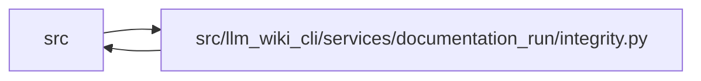

# integrity Module

**Path:** `src/llm_wiki_cli/services/documentation_run/integrity.py`

## Description

Documentation-run integrity services.

## Imports

| Source | Symbols |
|--------|---------|
| `..documentation_wiki_input` | `DocumentationWikiInputError`, `fingerprint_documentation_wiki_input` |
| `..inventory_cache` | `InventoryCacheOptions` |
| `..lint_service` | `build_report`, `report_to_dict` |
| `.contracts` | `*` |
| `.dependencies` | `*` |
| `.schema` | `*` |
| `.workspace` | `*` |
| `__future__` | `annotations` |

## Local dependency map

<!-- Auto-generated local dependency summary. Do not edit by hand. -->

> Module-level dependencies exceed the generated-diagram limits, so the diagram and table below group them by top-level package. Counts report the number of module neighbors in each package.

### Internal neighbors

| Direction | Module |
|---|---|
| Inbound | `src` (7) |
| Outbound | `src` (7) |

> All 14 module neighbor(s) are summarized by package because the module-level view exceeds the 12-node limit.

## Functions

| Function | Signature | Decorators | Description |
|----------|-----------|------------|-------------|
| `capture_generated_ownership` | `(wiki_root: str \| Path) -> dict[str, str]` | — | Fingerprint CLI-owned JSON files and generated Markdown sections. |
| `compare_generated_ownership` | `(baseline: Mapping[str, str], wiki_root: str \| Path) -> dict[str, list[str]]` | — | — |
| `_export_documentation_skills` | `(workspace_root: Path) -> list[dict[str, Any]]` | — | — |
| `_initial_readiness_ledger` | `(run_id: str, worklist: Mapping[str, Any]) -> dict[str, Any]` | — | — |
| `_capture_control_integrity_snapshot` | `(workspace_root: Path, run: DocumentationRun) -> dict[str, Any]` | — | Hash immutable supervisor-owned inputs used by a stage packet. |
| `_verify_stage_dispatch_integrity` | `(workspace_root: Path, run: DocumentationRun, *, stage: str, attempt: int) -> None` | — | Reconcile a stage result with the exact supervisor dispatch receipt. |
| `_hash_exported_skill` | `(workspace_root: Path, relative: str) -> str` | — | — |
| `_hash_skill_tree` | `(entries: Iterable[tuple[str, bytes]]) -> str` | — | Hash a skill tree by case-sensitive POSIX relative-name order. |
| `_assert_packet_stage` | `(run: DocumentationRun, stage: str) -> None` | — | — |
| `_stage_contract` | `(stage: str) -> dict[str, Any]` | — | — |
| `_verify_initial_integrity_anchors` | `(workspace_root: Path, run: DocumentationRun) -> None` | — | Bind mutable baseline files to hashes persisted in the run contract. |
| `_tree_hash_from_file_hashes` | `(file_hashes: Mapping[str, Any]) -> str` | — | — |
| `_adopted_input_wiki_tree_hash` | `(input_root: str \| Path) -> str` | — | Recompute an adopted input hash through the public importer contract. |
| `_verify_read_only_inputs` | `(workspace_root: Path, run: DocumentationRun) -> list[dict[str, Any]]` | — | — |
| `_run_wiki_validation_pair` | `(workspace_root: Path, run: DocumentationRun, *, phase: str) -> bool` | — | Run lifecycle-owned lint and strict CI checks without loading plugins. |
| `_wiki_only_structural_issues` | `(wiki_root: Path) -> list[dict[str, Any]]` | — | — |
| `_changed_paths` | `(before: TreeBaseline, after: TreeBaseline) -> list[str]` | — | — |
| `_validate_stage_changed_paths` | `(stage: str, changed_paths: Iterable[str], *, current_tree: TreeBaseline, worklist: Mapping[str, Any], runtime_capture_paths: Iterable[str] = ()) -> None` | — | Enforce the machine-readable wiki write boundary for one agent stage. |
| `_is_supported_runtime_capture_asset` | `(path: str) -> bool` | — | — |
| `_block_run_for_integrity` | `(workspace_root: Path, run: DocumentationRun, message: str, *, integrity: bool = True) -> None` | — | — |
| `_generated_sections` | `(text: str) -> list[tuple[str, str]]` | — | — |
