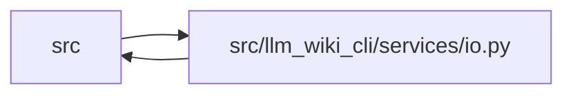

# io Module

**Path:** `src/llm_wiki_cli/services/io.py`

## Description

Encoding-safe and atomic I/O helpers for wiki artifacts.

All wiki reads go through :func:`read_md` so that files containing
non-UTF-8 bytes (e.g. Windows cp1252 punctuation like ``0x97`` en-dash)
don't crash the tool.  All writes go through :func:`write_md` to
normalize output to UTF-8 with Unix line-endings.

Structured artifact writers use :func:`write_json_atomic` for deterministic
UTF-8 JSON staged in a unique same-directory temporary file.

## Imports

| Source | Symbols |
|--------|---------|
| `.knowledge_evidence` | `formatted_json_bytes` |
| `__future__` | `annotations` |
| `collections.abc` | `Callable`, `Set` |
| `os` | `os` |
| `pathlib` | `Path` |
| `stat` | `stat` |
| `tempfile` | `tempfile` |
| `typing` | `Any` |

## Local dependency map

<!-- Auto-generated local dependency summary. Do not edit by hand. -->

> Module-level dependencies exceed the generated-diagram limits, so the diagram and table below group them by top-level package. Counts report the number of module neighbors in each package.

### Internal neighbors

| Direction | Module |
|---|---|
| Inbound | `src` (25) |
| Outbound | `src` (1) |

> All 26 module neighbor(s) are summarized by package because the module-level view exceeds the 12-node limit.

## Functions

| Function | Signature | Decorators | Description |
|----------|-----------|------------|-------------|
| `first_unsafe_path_component` | `(path: str \| Path, *, trusted_symlink_uids: Set[int] \| None = None, trusted_symlink_owner: Callable[[Path], bool] \| None = None) -> Path \| None` | — | Return the first traversal, symlink, or reparse component of a path. |
| `read_md` | `(path: Path) -> str` | — | Read a markdown file, tolerating non-UTF-8 encodings. |
| `write_md` | `(path: Path, text: str) -> None` | — | Write *text* to *path* as UTF-8 with Unix line-endings. |
| `_write_utf8_text` | `(path: Path, text: str) -> None` | — | Atomically write UTF-8 text with Unix line endings. |
| `write_bytes_atomic` | `(path: str \| Path, content: bytes) -> Path` | — | Atomically replace *path* with exact bytes staged in the same directory. |
| `write_json_atomic` | `(path: str \| Path, payload: Any) -> Path` | — | Atomically write deterministic UTF-8 JSON and return its target path. |
| `write_text_output` | `(path: str \| Path, text: str) -> Path` | — | Write an explicit CLI/API output artifact as UTF-8 text. |
