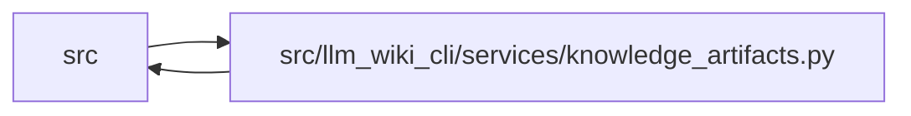

# knowledge_artifacts Module

**Path:** `src/llm_wiki_cli/services/knowledge_artifacts.py`

## Description

Validates native projections and plans a manifest-last artifact commit. Indexed readers retain audit statistics while releasing decoder intermediates. Writers preserve adopted knowledge and manifest formats, can reuse verified compressed members from a prior capture, and can stage storage objects in a caller-owned spool without waiving validation or live commit checks.

## Imports

| Source | Symbols |
|--------|---------|
| `.contracts` | `KNOWLEDGE_SCHEMA_VERSION`, `SECTION_OWNERSHIP_EXTENSION_KEY`, `TYPED_GRAPH_EXTENSION_KEY` |
| `.filesystem_guard` | `atomic_write_guarded_bytes`, `ensure_guarded_directory` |
| `.immutable` | `freeze` |
| `.infrastructure_sync` | `INFRASTRUCTURE_GENERATION_INPUT_KEY`, `INFRASTRUCTURE_SYNC_SCHEMA_VERSION`, `InfrastructureSyncError`, `infrastructure_evidence_by_page` |
| `.io` | `write_bytes_atomic` |
| `.knowledge_envelope` | `EvaluatedEnvelope`, `INVENTORY_HASH_EXTENSION` |
| `.knowledge_evidence` | `formatted_json_bytes`, `is_valid_sha256`, `sha256_bytes` |
| `.knowledge_governance` | `governance_hash_from_knowledge`, `governance_lock` |
| `.knowledge_graph` | `KnowledgeGraphError`, `typed_graph_from_knowledge_extensions` |
| `.knowledge_index` | `_validated_index_serialization`, `validate_knowledge_index`, `_model_to_payload` |
| `.knowledge_model` | `ConceptKind`, `EvidenceBasis`, `EvidenceState`, `KnowledgeIndex`, `Origin` |
| `.knowledge_packs` | `PACKED_SCHEMAS`, `PACKED_FORMATS`, `build_storage`, `open_knowledge_store`, `physical_objects`, `packed_format`, `parse_packed_root` |
| `.knowledge_reuse` | `validate_reuse_artifact_parity` |
| `.knowledge_storage` | `STORE_SCHEMA`, `MAX_EXPANDED_BYTES`, `GIT_FAILURE_BYTES`, `KnowledgeStorageError`, `logical_digest` |
| `.knowledge_storage_io` | `StorageReadSession`, `StorageReadSession`, `read_guarded`, `read_guarded`, `read_guarded`, `_absolute_path` |
| `.manifest_storage` | `build_manifest_store`, `current_manifest_format` |
| `.progress` | `observed_phase` |
| `.section_ownership` | `SectionOwnershipError`, `validate_section_ownership` |
| `.storage_spool` | `SpooledArtifactWrite`, `spool_write` |
| `.sync_manifest` | `MANIFEST_FILENAME`, `SyncManifest`, `SyncManifestError` |
| `.validation` | `is_portable_relative_path`, `require_exact_fields`, `require_nonnegative_int` |
| `.wiki_surface` | `PageKind`, `WikiSurfaceError`, `canonical_path`, `iter_page_kinds`, `mcp_uri` |
| `.wiki_surface_index` | `SURFACE_INDEX_FILENAME`, `WIKI_SURFACE_INDEX_SCHEMA_VERSION` |
| `__future__` | `annotations` |
| `collections` | `Counter` |
| `collections.abc` | `Callable`, `Mapping` |
| `dataclasses` | `dataclass`, `field` |
| `enum` | `Enum` |
| `json` | `json` |
| `pathlib` | `Path` |
| `re` | `re` |
| `typing` | `Any` |

## Local dependency map

<!-- Auto-generated local dependency summary. Do not edit by hand. -->

> Module-level dependencies exceed the generated-diagram limits, so the diagram and table below group them by top-level package. Counts report the number of module neighbors in each package.

### Internal neighbors

| Direction | Module |
|---|---|
| Inbound | `src` (24) |
| Outbound | `src` (23) |

> All 44 module neighbor(s) are summarized by package because the module-level view exceeds the 12-node limit.

## Classes

| Class | Kind | Line | Bases / Target | Description |
|-------|------|------|----------------|-------------|
| [KnowledgeArtifactError](../entities/KnowledgeArtifactError.md) | Class | 79 | `ValueError` | Field-specific failure while planning a generated artifact commit. |
| [ArtifactWriteState](../entities/ArtifactWriteState.md) | Enum | 89 | `str`, `Enum` | User-facing state for one planned artifact replacement. |
| [CommitStage](../entities/CommitStage.md) | Enum | 97 | `str`, `Enum` | Fault-injection points reached after each successful atomic replacement. |
| [PlannedArtifactWrite](../entities/PlannedArtifactWrite.md) | Class | 107 | — | One exact-byte action in a knowledge artifact commit. |
| [ValidatedKnowledgeArtifacts](../entities/ValidatedKnowledgeArtifacts.md) | Class | 120 | — | Validated canonical projections and their exact-byte commitments. |
| [_ArtifactValidation](../entities/ArtifactValidation.md) | Class | 137 | — | — |
| [KnowledgeCommitPlan](../entities/KnowledgeCommitPlan.md) | Class | 194 | — | A fully validated, immutable three-artifact commit plan. |
| [KnowledgeCommitResult](../entities/KnowledgeCommitResult.md) | Class | 219 | — | Outcome of a real or dry-run commit. |

## Functions

| Function | Signature | Decorators | Description |
|----------|-----------|------------|-------------|
| `require_validated_artifacts` | `(value: object) -> ValidatedKnowledgeArtifacts` | — | Require the immutable values issued by the complete artifact validator. |
| `validated_artifact_bytes` | `(value: ValidatedKnowledgeArtifacts) -> tuple[bytes, bytes]` | — | Read captured canonical bytes without serializing or reparsing models. |
| `validate_surface_index_bytes` | `(surface_index_bytes: bytes) -> Mapping[str, Any]` | — | Parse and strictly validate canonical surface-index v1 bytes. |
| `validate_knowledge_artifacts` | `(*, surface_index_bytes: bytes, knowledge_index_bytes: bytes, manifest: SyncManifest, object_reader: Callable[[str, int], bytes] \| None = None, wiki_dir: str \| Path \| None = None) -> ValidatedKnowledgeArtifacts` | `@observed_phase('knowledge_validation')` | Validate canonical projections, cross-artifact parity, and manifest basis. |
| `build_knowledge_commit_plan` | `(wiki_dir: str \| Path, *, surface_index_bytes: bytes, knowledge_index_bytes: bytes \| None = None, manifest: SyncManifest, knowledge_format: str \| None = None, knowledge_index: KnowledgeIndex \| None = None, manifest_format: str \| None = None, prior: ValidatedKnowledgeArtifacts \| None = None, spool = None) -> KnowledgeCommitPlan` | — | Validate and plan one manifest-last knowledge artifact commit. |
| `commit_knowledge_artifacts` | `(plan: KnowledgeCommitPlan, *, dry_run: bool = False, fault_injector: FaultInjector \| None = None) -> KnowledgeCommitResult` | `@observed_phase('artifact_commit')` | Apply *plan* in projection/projection/manifest order. |
| `_planned_write` | `(path: Path, relative_path: str, content: bytes, *, force_replace: bool = False, guarded: bool = False, spool = None) -> PlannedArtifactWrite \| SpooledArtifactWrite` | — | — |
| `current_knowledge_format` | `(wiki_dir: str \| Path) -> str` | — | Preserve an adopted format; unknown versions never silently downgrade. |
| `_commit_sharded` | `(plan: KnowledgeCommitPlan, fault: FaultInjector \| None) -> None` | — | — |
| `_apply_write` | `(artifact: PlannedArtifactWrite \| SpooledArtifactWrite, stage: CommitStage, fault_injector: FaultInjector \| None) -> None` | — | — |
| `_verify_persisted` | `(artifact: PlannedArtifactWrite \| SpooledArtifactWrite) -> None` | — | — |
| `_decode_json_object` | `(content: bytes, field: str) -> Mapping[str, Any]` | — | — |
| `_unique_json_object` | `(pairs: list[tuple[str, Any]], field: str) -> dict[str, Any]` | — | — |
| `_reject_json_constant` | `(value: str, field: str) -> None` | — | — |
| `_is_future_schema_version` | `(value: object, current: str, pattern: re.Pattern[str]) -> bool` | — | — |
| `_validate_surface_payload` | `(payload: Mapping[str, Any]) -> None` | — | — |
| `_validate_utf8_json` | `(value: object, field: str) -> None` | — | — |
| `_validate_surface_knowledge_parity` | `(surface: Mapping[str, Any], knowledge: KnowledgeIndex) -> None` | — | — |
| `_surface_page_index` | `(surface: Mapping[str, Any]) -> dict[str, tuple[int, Mapping[str, Any]]]` | — | — |
| `_validate_manifest_knowledge_parity` | `(manifest: SyncManifest, surface: Mapping[str, Any], knowledge: KnowledgeIndex) -> None` | — | — |
| `_basis_payload` | `(value: EvidenceBasis \| None) -> dict[str, Any] \| None` | — | — |
| `_validate_surface_assets` | `(surface: Mapping[str, Any], valid_page_paths: set[str]) -> None` | — | — |
| `_validate_surface_counts` | `(surface: Mapping[str, Any], surface_by_path: Mapping[str, tuple[int, Mapping[str, Any]]]) -> None` | — | — |
| `_validate_surface_asset_counts` | `(value: object, assets_value: object) -> None` | — | — |
| `_validate_surface_dependency_pages` | `(surface: Mapping[str, Any]) -> None` | — | — |
| `_validate_asset_path_list` | `(value: object, field: str) -> None` | — | — |
| `_validate_surface_flows` | `(surface: Mapping[str, Any], surface_by_path: Mapping[str, tuple[int, Mapping[str, Any]]]) -> None` | — | — |
| `_validate_optional_surface_flow_fields` | `(flow: Mapping[str, Any], field: str) -> None` | — | — |
| `_validate_surface_flow_routes` | `(value: object, field: str) -> None` | — | — |
| `_validate_surface_flow_evidence` | `(value: object, field: str) -> None` | — | — |
| `_validate_surface_flow_records` | `(value: object, field: str, schema: Mapping[str, type]) -> None` | — | — |
| `_validate_surface_keys` | `(value: Mapping[str, Any], field: str, required: set[str], optional: set[str]) -> None` | — | — |
| `_validate_exact_surface_keys` | `(value: Mapping[str, Any], field: str, expected: set[str]) -> None` | — | — |
| `_nonnegative_integer` | `(value: object, field: str) -> int` | — | — |
| `_is_safe_relative_path` | `(value: object) -> bool` | — | — |