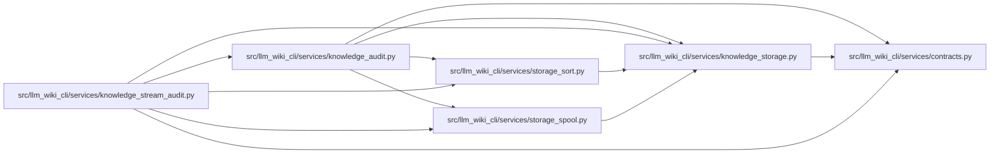

# knowledge_audit Module

**Path:** `src/llm_wiki_cli/services/knowledge_audit.py`

## Description

Derives record identities, owners, shared values and lookup aliases independently from logical facts. Exact membership comparison rejects missing, extra and duplicate routed observations without invoking the physical storage writer. A spill-backed comparison supports the complete storage audit while keeping global comparison work bounded.

## Imports

| Source | Symbols |
|--------|---------|
| `.contracts` | `SECTION_OWNERSHIP_EXTENSION_KEY`, `TYPED_GRAPH_EXTENSION_KEY` |
| `.knowledge_storage` | `COLLECTIONS`, `KnowledgeStorageError`, `_Encoder`, `_concept_aliases`, `_node_aliases`, `_owner`, `canonical_bytes`, `digest`, `_text`, `_LOOKUP_GROUP_TARGET` |
| `.storage_sort` | `SortedRuns`, `SortedRuns` |
| `.storage_spool` | `ByteSpool`, `JsonSpool` |
| `__future__` | `annotations` |
| `collections` | `Counter`, `defaultdict` |
| `hashlib` | `hashlib` |
| `itertools` | `groupby`, `zip_longest` |
| `typing` | `Any` |

## Local dependency map

<!-- Auto-generated local dependency summary. Do not edit by hand. -->

### Internal neighbors

| Direction | Module |
|---|---|
| Inbound | [knowledge_stream_audit](../modules/knowledge_stream_audit.md) |
| Outbound | [services_contracts](../modules/services_contracts.md) |
| Outbound | [knowledge_storage](../modules/knowledge_storage.md) |
| Outbound | [storage_sort](../modules/storage_sort.md) |
| Outbound | [storage_spool](../modules/storage_spool.md) |

## Functions

| Function | Signature | Decorators | Description |
|----------|-----------|------------|-------------|
| `expected_records` | `(payload, basis, *, spills = None)` | — | Derive record identities, owners and aliases from logical facts. |
| `audit_logical_records` | `(reader, payload: dict[str, Any]) -> None` | — | Compare complete independent record sets without encoding a second store. |
| `audit_spilled_records` | `(reader, payload, stack) -> None` | — | Complete exact membership comparison with bounded private merge runs. |
