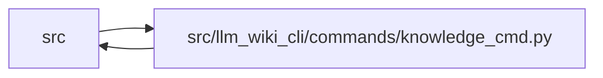

# knowledge_cmd Module

**Path:** `src/llm_wiki_cli/commands/knowledge_cmd.py`

## Description

Explicit durable-knowledge governance and verification commands.

The governance ledger is the non-rebuildable authority.  Mutations are
prepared from a validated artifact snapshot and committed while holding the
governance lock.  Their disposable projection is refreshed in the same
operation except for an explicitly staged move whose target will exist only
after the next sync.  Verification is separate and never runs while metadata
is merely being loaded.

## Imports

| Source | Symbols |
|--------|---------|
| `..services.io` | `first_unsafe_path_component` |
| `..services.knowledge_artifacts` | `KNOWLEDGE_INDEX_FILENAME`, `KnowledgeCommitPlan`, `ValidatedKnowledgeArtifacts`, `build_knowledge_commit_plan`, `commit_knowledge_artifacts`, `validate_knowledge_artifacts` |
| `..services.knowledge_consumption` | `build_knowledge_read_view` |
| `..services.knowledge_governance` | `ACTOR_KINDS`, `ALIAS_LOCATOR`, `ALIAS_NATURAL_KEY`, `GOVERNANCE_EXTENSION_KEY`, `GOVERNANCE_FILENAME`, `MAX_EVENT_LIMIT`, `GovernanceActor`, `GovernanceError`, `GovernanceLedger`, `GovernanceLoadResult`, `LifecycleEvent`, `ReviewEvent`, `add_alias`, `add_review_event`, `apply_governance_projection`, `concept_references_from_knowledge`, `current_review_evidence`, `evaluate_review_event`, `governance_bundle_id_from_knowledge`, `governance_lock`, `load_governance`, `move_concept`, `reconcile_concepts`, `review_scope_hash`, `save_governance`, `set_lifecycle`, `strip_governance_projection`, `validate_governance_ledger` |
| `..services.knowledge_index` | `serialize_knowledge_index` |
| `..services.knowledge_loader` | `KnowledgeMismatchPolicy`, `KnowledgeStateLoadError`, `load_knowledge_state` |
| `..services.knowledge_model` | `KnowledgeIndex`, `KnowledgeLoadState`, `Lifecycle` |
| `..services.knowledge_observability` | `knowledge_freshness_disclosure` |
| `..services.sync_manifest` | `MANIFEST_FILENAME`, `SyncManifest` |
| `..services.verification_contracts` | `VerificationResult`, `build_artifact_verification_context`, `verify`, `verify_and_write_receipt` |
| `..services.wiki_surface_index` | `SURFACE_INDEX_FILENAME` |
| `__future__` | `annotations` |
| `collections.abc` | `Callable`, `Mapping` |
| `dataclasses` | `dataclass` |
| `json` | `json` |
| `pathlib` | `Path` |
| `typing` | `cast` |

## Local dependency map

<!-- Auto-generated local dependency summary. Do not edit by hand. -->

> Module-level dependencies exceed the generated-diagram limits, so the diagram and table below group them by top-level package. Counts report the number of module neighbors in each package.

### Internal neighbors

| Direction | Module |
|---|---|
| Inbound | `src` (1) |
| Outbound | `src` (11) |

> All 12 module neighbor(s) are summarized by package because the module-level view exceeds the 12-node limit.

## Classes

| Class | Line | Bases | Description |
|-------|------|-------|-------------|
| [_ArtifactSnapshot](../entities/ArtifactSnapshot.md) | 91 | — | — |

## Functions

| Function | Signature | Decorators | Description |
|----------|-----------|------------|-------------|
| `_wiki_root` | `(value: str \| Path) -> Path` | — | — |
| `_read_bytes` | `(path: Path, field: str) -> bytes` | — | — |
| `_validated_artifact_snapshot` | `(wiki_dir: Path, *, allow_governance_recovery: bool) -> _ArtifactSnapshot` | — | Load a coherent current artifact snapshot. |
| `_committed_artifact_snapshot` | `(wiki_dir: Path) -> _ArtifactSnapshot` | — | Read artifacts committed by their manifest without checking live Markdown. |
| `_assert_snapshot_unchanged` | `(wiki_dir: Path, snapshot: _ArtifactSnapshot) -> None` | — | — |
| `_load_required_ledger` | `(wiki_dir: Path)` | — | — |
| `_assert_bundle_continuity` | `(snapshot: _ArtifactSnapshot, ledger: GovernanceLedger) -> None` | — | — |
| `_projected_commit_plan` | `(wiki_dir: Path, snapshot: _ArtifactSnapshot, ledger: GovernanceLedger)` | — | — |
| `_mutation_preview_payload` | `(action: str, ledger: GovernanceLedger, *, changed: bool, dry_run: bool, projection: str = 'current') -> dict[str, object]` | — | — |
| `_print_payload` | `(payload: Mapping[str, object]) -> None` | — | — |
| `_prepare_existing_mutation` | `(wiki_dir: Path, mutation: LedgerMutation) -> tuple[_ArtifactSnapshot, GovernanceLoadResult, GovernanceLedger, KnowledgeCommitPlan]` | — | — |
| `_run_existing_mutation` | `(wiki_dir: Path, *, action: str, dry_run: bool, mutation: LedgerMutation) -> None` | — | — |
| `_init_ledger` | `(wiki_dir: Path, *, bundle_id: str \| None) -> tuple[_ArtifactSnapshot, GovernanceLedger, str \| None, GovernanceLedger]` | — | — |
| `_run_init` | `(args) -> None` | — | — |
| `_lifecycle_mutation` | `(*, uid: str, state: str, actor_kind: str, actor_id: str, authored_at: str, successor_uid: str \| None, reason: str) -> LedgerMutation` | — | — |
| `_run_lifecycle` | `(args, *, state_override: str \| None = None, action_override: str \| None = None) -> None` | — | — |
| `_run_move` | `(args) -> None` | — | — |
| `_run_alias` | `(args) -> None` | — | — |
| `_concept_for_uid` | `(ledger: GovernanceLedger, knowledge: KnowledgeIndex, uid: str)` | — | — |
| `_run_review` | `(args) -> None` | — | — |
| `_status_payload` | `(ledger: GovernanceLedger, knowledge: KnowledgeIndex, *, event_limit: int) -> dict[str, object]` | — | — |
| `_run_status` | `(args) -> None` | — | — |
| `_scope_locator_for_uid` | `(knowledge: KnowledgeIndex, uid: str \| None) -> str \| None` | — | — |
| `_run_verify` | `(args) -> None` | — | — |
| `run` | `(args) -> None` | — | — |
