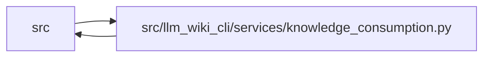

# knowledge_consumption Module

**Path:** `src/llm_wiki_cli/services/knowledge_consumption.py`

## Description

One read-only knowledge session shared by native consumers.

The session loads and validates projection state once, then optionally computes
freshness once from an already collected :class:`LiveKnowledgeEvaluation`.
It never extracts source, walks a repository, repairs artifacts, or writes
state.  Callers should create one view per native operation and pass that view
to every downstream consumer participating in the operation.

## Imports

| Source | Symbols |
|--------|---------|
| `.knowledge_freshness` | `KnowledgeFreshnessReport`, `LiveKnowledgeEvaluation`, `evaluate_knowledge_freshness` |
| `.knowledge_loader` | `KnowledgeLoadIssue`, `KnowledgeLoadResult`, `KnowledgeMismatchPolicy`, `KnowledgeStateLoadError`, `load_knowledge_state` |
| `.knowledge_model` | `ComputedFreshness`, `EvidenceState`, `KnowledgeIndex`, `KnowledgeLoadState` |
| `.knowledge_verification` | `attach_machine_verification_read_view` |
| `.sync_manifest` | `SyncManifest` |
| `__future__` | `annotations` |
| `collections` | `Counter` |
| `collections.abc` | `Mapping`, `Sequence` |
| `dataclasses` | `dataclass`, `field` |
| `enum` | `Enum` |
| `pathlib` | `Path` |
| `re` | `re` |
| `types` | `MappingProxyType` |
| `typing` | `Any` |

## Local dependency map

<!-- Auto-generated local dependency summary. Do not edit by hand. -->

> Module-level dependencies exceed the generated-diagram limits, so the diagram and table below group them by top-level package. Counts report the number of module neighbors in each package.

### Internal neighbors

| Direction | Module |
|---|---|
| Inbound | `src` (17) |
| Outbound | `src` (5) |

> All 21 module neighbor(s) are summarized by package because the module-level view exceeds the 12-node limit.

## Classes

| Class | Kind | Line | Bases / Target | Description |
|-------|------|------|----------------|-------------|
| [KnowledgeAvailability](../entities/KnowledgeAvailability.md) | Enum | 42 | `str`, `Enum` | Knowledge capability available to every native read consumer. |
| [KnowledgeReadMode](../entities/KnowledgeReadMode.md) | Enum | 51 | `str`, `Enum` | Whether a read session evaluates live concept freshness. |
| [KnowledgeReadReason](../entities/KnowledgeReadReason.md) | Enum | 59 | `str`, `Enum` | Stable cross-consumer reasons for knowledge availability. |
| [MachineVerificationAvailability](../entities/MachineVerificationAvailability.md) | Enum | 74 | `str`, `Enum` | Whether the read session evaluated a disposable machine receipt. |
| [MachineVerificationReadView](../entities/MachineVerificationReadView.md) | Class | 112 | — | One receipt evaluation shared by all consumers in a read operation. |
| [KnowledgeReadCounts](../entities/KnowledgeReadCounts.md) | Class | 266 | — | Aggregate counts derived only from a ready knowledge projection. |
| [KnowledgeReadView](../entities/KnowledgeReadView.md) | Class | 288 | — | Validated, immutable-by-contract state for one native read operation. |

## Functions

| Function | Signature | Decorators | Description |
|----------|-----------|------------|-------------|
| `_machine_invalidation_reasons` | `(value: object) -> tuple[str, ...]` | — | — |
| `_machine_verification_checks` | `(value: object) -> Mapping[str, Mapping[str, Any]]` | — | — |
| `_machine_verification_check` | `(checker_id: str, value: object) -> Mapping[str, Any]` | — | — |
| `_machine_diagnostics` | `(checker_id: str, value: object) -> tuple[Mapping[str, str], ...]` | — | — |
| `_machine_diagnostic_coverage` | `(checker_id: str, value: object, *, emitted: int) -> Mapping[str, int \| bool]` | — | — |
| `build_knowledge_read_view` | `(load_result: KnowledgeLoadResult, *, live_evaluation: LiveKnowledgeEvaluation \| None = None, snapshot_only: bool = False, mode: KnowledgeReadMode \| str \| None = None) -> KnowledgeReadView` | — | Build one shared view from an already completed artifact load. |
| `load_knowledge_read_view` | `(wiki_dir: str \| Path, *, live_evaluation: LiveKnowledgeEvaluation \| None = None, snapshot_only: bool = False, mode: KnowledgeReadMode \| str \| None = None, markdown_pages: Mapping[str, str \| bytes] \| None = None, include_machine_verification: bool = False) -> KnowledgeReadView` | — | Load exactly once and return a read-only native-consumer session. |
| `_read_mode` | `(*, snapshot_only: bool, mode: KnowledgeReadMode \| str \| None) -> KnowledgeReadMode` | — | — |
| `_validate_load_result` | `(result: KnowledgeLoadResult) -> None` | — | — |
| `_unsupported_reason` | `(issues: tuple[KnowledgeLoadIssue, ...]) -> KnowledgeReadReason \| None` | — | — |
| `_knowledge_counts` | `(knowledge: KnowledgeIndex, freshness: KnowledgeFreshnessReport \| None) -> KnowledgeReadCounts` | — | — |
