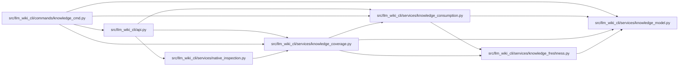

# knowledge_coverage Module

**Path:** `src/llm_wiki_cli/services/knowledge_coverage.py`

## Description

Bounded native coverage diagnostics, separate from frozen context payloads.

## Imports

| Source | Symbols |
|--------|---------|
| `.knowledge_consumption` | `KnowledgeReadView` |
| `.knowledge_freshness` | `KNOWN_FRESHNESS_REASON_CODES`, `structural_freshness_modeled` |
| `.knowledge_model` | `ComputedFreshness`, `ConceptKind` |
| `collections` | `Counter` |
| `collections.abc` | `Mapping` |
| `json` | `json` |
| `typing` | `Any` |

## Local dependency map

<!-- Auto-generated local dependency summary. Do not edit by hand. -->

### Internal neighbors

| Direction | Module |
|---|---|
| Inbound | [api](../modules/api.md) |
| Inbound | [knowledge_cmd](../modules/knowledge_cmd.md) |
| Inbound | [native_inspection](../modules/native_inspection.md) |
| Outbound | [knowledge_consumption](../modules/knowledge_consumption.md) |
| Outbound | [knowledge_freshness](../modules/knowledge_freshness.md) |
| Outbound | [knowledge_model](../modules/knowledge_model.md) |

## Functions

| Function | Signature | Decorators | Description |
|----------|-----------|------------|-------------|
| `build_knowledge_coverage` | `(view: KnowledgeReadView) -> dict[str, Any]` | — | Count eligibility before evidence outcomes; never publish input identities. |
| `render_knowledge_coverage` | `(payload: Mapping[str, Any]) -> str` | — | — |
