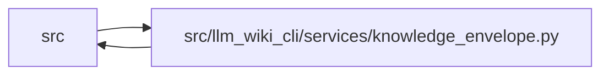

# knowledge_envelope Module

**Path:** `src/llm_wiki_cli/services/knowledge_envelope.py`

## Description

Deterministic bundle, snapshot, and producer envelope construction.

The pure builder in this module consumes already captured content digests,
inventory values, canonical Markdown text, exact surface-index bytes, effective
generation options, and producer metadata.  It never scans or reads the source
tree.  Local Git inspection is available as an explicit, separate collection
step whose result is inert input to the builder.

## Imports

| Source | Symbols |
|--------|---------|
| `.contracts` | `GOVERNANCE_HASH_EXTENSION_KEY`, `KNOWLEDGE_SCHEMA_VERSION` |
| `.knowledge_evidence` | `canonical_json_bytes`, `formatted_json_text`, `is_valid_sha256`, `sha256_bytes` |
| `.knowledge_model` | `EVALUATED_REVISION_PATTERN`, `LIMITATION_CODE_PATTERN`, `REPOSITORY_IDENTITY_PATTERN`, `REPOSITORY_IDENTITY_SOURCE_EXTENSION`, `BundleRecord`, `KnowledgeIndex`, `KnowledgeModelError`, `ProducerComponent`, `ProducerRecord`, `RepositoryIdentitySource`, `RepositoryRecord`, `SnapshotRecord`, `WorkingTreeState`, `knowledge_index_to_payload` |
| `.validation` | `require_repository_relative_path` |
| `__future__` | `annotations` |
| `collections.abc` | `Iterable`, `Mapping`, `Sequence` |
| `dataclasses` | `dataclass`, `field`, `replace` |
| `enum` | `Enum` |
| `math` | `math` |
| `os` | `os` |
| `pathlib` | `Path` |
| `re` | `re` |
| `subprocess` | `subprocess` |
| `typing` | `Any`, `Callable` |
| `urllib.parse` | `unquote`, `urlsplit` |

## Local dependency map

<!-- Auto-generated local dependency summary. Do not edit by hand. -->

> Module-level dependencies exceed the generated-diagram limits, so the diagram and table below group them by top-level package. Counts report the number of module neighbors in each package.

### Internal neighbors

| Direction | Module |
|---|---|
| Inbound | `src` (13) |
| Outbound | `src` (4) |

> All 17 module neighbor(s) are summarized by package because the module-level view exceeds the 12-node limit.

## Classes

| Class | Kind | Line | Bases / Target | Description |
|-------|------|------|----------------|-------------|
| [_GitCommandResult](../entities/GitCommandResult.md) | Class | 76 | — | — |
| [KnowledgeEnvelopeError](../entities/KnowledgeEnvelopeError.md) | Class | 86 | `ValueError` | Field-specific validation failure while constructing an envelope. |
| [ConsumedInputKind](../entities/ConsumedInputKind.md) | Enum | 95 | `str`, `Enum` | Known classes of repository/configuration input consumed by a run. |
| [ConsumedInput](../entities/ConsumedInput.md) | Class | 121 | — | One already captured repository-relative content commitment. |
| [ProducerComponentInput](../entities/ProducerComponentInput.md) | Class | 215 | — | Safe, already selected producer metadata. |
| [RepositoryEvidence](../entities/RepositoryEvidence.md) | Class | 231 | — | Already collected local VCS evidence; raw remotes are never serialized. |
| [EnvelopeInputs](../entities/EnvelopeInputs.md) | Class | 243 | — | Complete in-memory inputs for one evaluated envelope. |
| [EvaluatedEnvelope](../entities/EvaluatedEnvelope.md) | Class | 263 | — | Version-tagged evaluated basis committed through manifest v5. |

## Functions

| Function | Signature | Decorators | Description |
|----------|-----------|------------|-------------|
| `consumed_inputs_from_captured_hashes` | `(content_hashes: Mapping[str, str], candidate_kinds: Mapping[str, ConsumedInputKind \| str \| Iterable[ConsumedInputKind \| str]]) -> tuple[ConsumedInput, ...]` | — | Adapt already captured exact hashes into canonical consumed inputs. |
| `collect_git_repository_evidence` | `(root: str \| Path, *, included_worktree_paths: Iterable[str \| Path] \| None = None, excluded_worktree_paths: Iterable[str \| Path] = (), excluded_worktree_globs: Iterable[str] = (), worktree_path_filter: Callable[[Path], bool] \| None = None) -> RepositoryEvidence` | — | Collect local-only Git evidence without scanning source content. |
| `_filtered_worktree_status_is_dirty` | `(status: str, *, top_level: Path, path_filter: Callable[[Path], bool]) -> bool \| None` | — | Interpret NUL-delimited porcelain status through an effective boundary. |
| `_worktree_pathspecs` | `(checkout: Path, *, included_paths: Iterable[str \| Path] \| None, excluded_paths: Iterable[str \| Path], excluded_globs: Iterable[str] = ()) -> tuple[str, ...] \| None` | — | Return literal top-level Git pathspecs, or ``None`` if unevaluable. |
| `_excluded_worktree_pathspecs` | `(checkout: Path, excluded_paths: Iterable[str \| Path]) -> tuple[str, ...] \| None` | — | Compatibility wrapper for the former exclusion-only helper. |
| `build_repository_record` | `(*, configured_public_identity: str \| None = None, evidence: RepositoryEvidence \| None = None) -> RepositoryRecord` | — | Apply configured/VCS/unknown identity precedence to collected evidence. |
| `select_repository_identity` | `(*, configured_public_identity: str \| None, vcs_remotes: Mapping[str, str \| None], upstream_remote: str \| None) -> tuple[str, RepositoryIdentitySource]` | — | Select one portable identity without persisting raw remote evidence. |
| `validate_configured_public_identity` | `(value: object) -> str` | — | Validate one explicitly configured public repository identity. |
| `normalize_vcs_remote` | `(value: object) -> str \| None` | — | Return a safe portable identity for one HTTPS/SSH/SCP remote. |
| `hash_source_snapshot` | `(inputs: Iterable[ConsumedInput]) -> str` | — | Hash the exact selected input set in canonical kind/path order. |
| `hash_inventory` | `(inventory: Mapping[str, Any]) -> str` | — | Hash the canonical normalized extracted inventory. |
| `hash_markdown_snapshot` | `(pages: Mapping[str, str \| bytes]) -> str` | — | Hash active canonical Markdown paths and LF-normalized UTF-8 content. |
| `hash_generation_options` | `(values: Mapping[str, Any], *, defaults: Mapping[str, Any], allowlist: Iterable[str]) -> str` | — | Hash effective allowlisted behavior options, including defaults. |
| `hash_component_configuration` | `(configuration: Mapping[str, Any]) -> str` | — | Hash one complete safe component configuration allowlist. |
| `hash_aggregate_inputs` | `(inputs: Sequence[Any] \| Iterable[Any]) -> str` | — | Hash ordered aggregate evidence while retaining order and multiplicity. |
| `build_evaluated_envelope` | `(inputs: EnvelopeInputs) -> EvaluatedEnvelope` | — | Build and typed-validate a complete envelope without performing I/O. |
| `build_producer_record` | `(*, tool: ProducerComponentInput, extractors: Iterable[ProducerComponentInput] = (), plugins: Iterable[ProducerComponentInput] = (), extensions: Mapping[str, Any] \| None = None) -> ProducerRecord` | — | Build canonical producer evidence from safe selected metadata. |
| `plugin_producer_inputs` | `(components: Iterable[Mapping[str, Any]], *, plugin_configurations: Mapping[str, Mapping[str, Any] \| None] \| None = None, plugin_limitations: Mapping[str, Iterable[str]] \| None = None) -> tuple[ProducerComponentInput, ...]` | — | Project installed component records into safe per-plugin producer input. |
| `evaluated_envelope_to_payload` | `(envelope: EvaluatedEnvelope) -> dict[str, Any]` | — | Return a deterministic JSON-compatible evaluated-envelope payload. |
| `serialize_evaluated_envelope` | `(envelope: EvaluatedEnvelope) -> str` | — | Serialize with sorted keys, UTF-8 semantics, LF, and one final newline. |
| `hash_evaluated_envelope` | `(envelope: EvaluatedEnvelope) -> str` | — | Hash the exact canonical evaluated-envelope bytes. |
| `_run_git` | `(root: Path, *args: str, preserve_empty: bool = False) -> str \| None` | — | — |
| `_run_git_result` | `(root: Path, *args: str, preserve_output: bool = False) -> _GitCommandResult` | — | — |
| `_parse_local_remote_config` | `(result: _GitCommandResult) -> tuple[dict[str, str \| None], bool]` | — | — |
| `_local_config_values` | `(root: Path, key: str) -> tuple[bool, tuple[str, ...]]` | — | — |
| `_is_full_git_oid` | `(value: object) -> bool` | — | — |
| `_evaluated_revision` | `(value: str \| None) -> str` | — | — |
| `_working_tree` | `(value: object) -> WorkingTreeState` | — | — |
| `_remote_mapping` | `(value: Mapping[str, str \| None]) -> dict[str, str \| None]` | — | — |
| `_normalize_scheme_remote` | `(value: str) -> tuple[str, str] \| None` | — | — |
| `_normalize_scp_remote` | `(value: str) -> tuple[str, str] \| None` | — | — |
| `_normalized_remote_identity` | `(host: str, raw_path: str) -> str \| None` | — | — |
| `_repository_relative_path` | `(value: object, field_name: str) -> str` | — | — |
| `_canonical_consumed_input_kind` | `(value: ConsumedInputKind \| str \| Iterable[ConsumedInputKind \| str], field_name: str) -> ConsumedInputKind \| str` | — | — |
| `_validate_inventory_source_parity` | `(inventory: Mapping[str, Any], source_inputs: Iterable[ConsumedInput]) -> None` | — | — |
| `_normalized_markdown_bytes` | `(value: str \| bytes, field_name: str) -> bytes` | — | — |
| `_hash_structured` | `(domain: str, payload: Mapping[str, Any], field_name: str) -> str` | — | — |
| `_validate_json_tree` | `(value: object, field_name: str) -> None` | — | Reject non-JSON, non-finite, non-string-keyed, and cyclic values. |
| `_normalized_allowlist` | `(value: Iterable[str]) -> tuple[str, ...]` | — | — |
| `_reject_unknown_option_keys` | `(value: Mapping[str, Any], allowlist: tuple[str, ...], field_name: str) -> None` | — | — |
| `_reject_machine_local_paths` | `(value: object, field_name: str) -> None` | — | — |
| `_is_machine_local_path_string` | `(value: str) -> bool` | — | — |
| `_extensions_copy` | `(value: Mapping[str, Any], field_name: str) -> dict[str, Any]` | — | — |
| `_build_component` | `(value: ProducerComponentInput, field_name: str, *, analyzer: bool) -> ProducerComponent` | — | — |
| `_validated_limitations` | `(value: Iterable[str], field_name: str) -> tuple[str, ...]` | — | — |
| `_safe_plugin_component_metadata` | `(component: Mapping[str, Any], field_name: str) -> dict[str, Any]` | — | — |
| `_plugin_metadata_mapping` | `(value: Mapping[str, Any] \| None, field_name: str) -> Mapping[str, Any]` | — | — |
| `_validated_bundle_payload` | `(bundle: BundleRecord) -> dict[str, Any]` | — | — |
