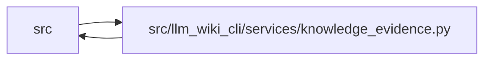

# knowledge_evidence Module

**Path:** `src/llm_wiki_cli/services/knowledge_evidence.py`

## Description

Deterministic encoding, hashing, and concept-observation boundaries.

The module and entity builders operate only on an already evaluated inventory
and source-content hash. They do not scan source, invoke extractors, compute
live freshness, or write artifacts.

## Imports

| Source | Symbols |
|--------|---------|
| `.validation` | `require_bool`, `require_list`, `require_mapping`, `require_mapping_list`, `require_member`, `require_nonempty_text`, `require_positive_int`, `require_repository_relative_path`, `require_sha256`, `require_string`, `require_string_list` |
| `__future__` | `annotations` |
| `collections.abc` | `Mapping` |
| `dataclasses` | `dataclass` |
| `hashlib` | `hashlib` |
| `json` | `json` |
| `math` | `math` |
| `pathlib` | `Path` |
| `re` | `re` |
| `typing` | `Any` |

## Local dependency map

<!-- Auto-generated local dependency summary. Do not edit by hand. -->

> Module-level dependencies exceed the generated-diagram limits, so the diagram and table below group them by top-level package. Counts report the number of module neighbors in each package.

### Internal neighbors

| Direction | Module |
|---|---|
| Inbound | `src` (25) |
| Outbound | `src` (1) |

> All 26 module neighbor(s) are summarized by package because the module-level view exceeds the 12-node limit.

## Classes

| Class | Line | Bases | Description |
|-------|------|-------|-------------|
| [ConceptObservationBasis](../entities/ConceptObservationBasis.md) | 83 | — | One source-backed concept observation basis or explicit unknown result. |
| [_InventoryNormalizationError](../entities/InventoryNormalizationError.md) | 143 | `Exception` | — |

## Functions

| Function | Signature | Decorators | Description |
|----------|-----------|------------|-------------|
| `is_valid_sha256` | `(value: object) -> bool` | — | Return whether *value* is a canonical ``sha256:<lowercase-hex>`` string. |
| `canonical_json_text` | `(value: Any) -> str` | — | Encode *value* as compact canonical JSON for hashing and ordering. |
| `canonical_json_bytes` | `(value: Any) -> bytes` | — | Return the UTF-8 bytes of :func:`canonical_json_text`. |
| `formatted_json_text` | `(value: Any) -> str` | — | Encode deterministic human-readable JSON with one trailing newline. |
| `formatted_json_bytes` | `(value: Any) -> bytes` | — | Return UTF-8 deterministic JSON bytes with one trailing newline. |
| `sha256_bytes` | `(value: bytes) -> str` | — | Return the canonical SHA-256 wire value for *value*. |
| `hash_json` | `(value: Any) -> str` | — | Hash the canonical JSON encoding of *value*. |
| `normalize_module_observation` | `(file_data: Mapping[str, Any]) -> dict[str, Any] \| None` | — | Return the canonical structural module observation. |
| `normalize_entity_observation` | `(file_data: Mapping[str, Any], entity_name: str, occurrence: int = 1) -> dict[str, Any] \| None` | — | Return the structural observation for one same-name entity occurrence. |
| `module_observation_hash` | `(file_data: Mapping[str, Any], *, inventory_complete: bool) -> str \| None` | — | Hash a normalized module observation, or return ``None`` if unavailable. |
| `entity_observation_hash` | `(file_data: Mapping[str, Any], entity_name: str, occurrence: int = 1, *, inventory_complete: bool) -> str \| None` | — | Hash one normalized entity observation, or return ``None``. |
| `build_module_observation_basis` | `(*, source_path: str, file_data: Mapping[str, Any] \| None, source_content_hash: str, extractor_ref: str, inventory_complete: bool) -> ConceptObservationBasis` | — | Build a known module basis or an explicit unknown basis. |
| `build_entity_observation_basis` | `(*, source_path: str, file_data: Mapping[str, Any] \| None, entity_name: str, occurrence: int, source_content_hash: str, extractor_ref: str, inventory_complete: bool) -> ConceptObservationBasis` | — | Build a known entity basis or an explicit unknown basis. |
| `build_infrastructure_observation_basis` | `(*, source_path: str, source_content_hash: str, observation_hash: str, extractor_ref: str) -> ConceptObservationBasis` | — | Build a known basis from one already normalized infrastructure record. |
| `_normalize_module_observation` | `(file_data: Mapping[str, Any] \| None) -> dict[str, Any]` | — | — |
| `_normalize_entity_observation` | `(file_data: Mapping[str, Any] \| None, entity_name: str, occurrence: int) -> dict[str, Any]` | — | — |
| `_inventory_language` | `(file_data: Mapping[str, Any] \| None) -> str` | — | — |
| `_record_array` | `(file_data: Mapping[str, Any], field: str, *, required: bool) -> list[Mapping[str, Any]]` | — | — |
| `_json_array` | `(file_data: Mapping[str, Any], field: str) -> list[Any]` | — | — |
| `_record_name` | `(record: Mapping[str, Any]) -> str` | — | — |
| `_validate_module_entity_record` | `(record: Mapping[str, Any]) -> None` | — | — |
| `_validate_entity_record` | `(record: Mapping[str, Any]) -> None` | — | — |
| `_validate_callable_record` | `(record: Mapping[str, Any]) -> None` | — | — |
| `_validate_import_record` | `(record: Mapping[str, Any]) -> None` | — | — |
| `_validate_constant_record` | `(record: Mapping[str, Any]) -> None` | — | — |
| `_validate_module_call_record` | `(record: Mapping[str, Any]) -> None` | — | — |
| `_validate_optional_strings` | `(record: Mapping[str, Any], fields: tuple[str, ...]) -> None` | — | — |
| `_validate_optional_booleans` | `(record: Mapping[str, Any], fields: tuple[str, ...]) -> None` | — | — |
| `_validate_string_array` | `(value: list[Any]) -> None` | — | — |
| `_validate_optional_string_array` | `(record: Mapping[str, Any], field: str) -> None` | — | — |
| `_validate_optional_json_array` | `(record: Mapping[str, Any], field: str) -> None` | — | — |
| `_optional_record_array` | `(record: Mapping[str, Any], field: str) -> list[Mapping[str, Any]]` | — | — |
| `_validate_optional_record_array` | `(record: Mapping[str, Any], field: str) -> None` | — | — |
| `_validate_optional_mapping` | `(record: Mapping[str, Any], field: str) -> Mapping[str, Any] \| None` | — | — |
| `_copy_selected_fields` | `(record: Mapping[str, Any], fields: tuple[str, ...], excluded_keys: frozenset[str]) -> dict[str, Any]` | — | — |
| `_structural_copy` | `(value: Any, excluded_keys: frozenset[str], active: set[int] \| None = None) -> Any` | — | — |
| `_hash_normalized_observation` | `(normalized: dict[str, Any] \| None) -> str \| None` | — | — |
| `_unknown_basis` | `(scope: str, source_path: str, source_content_hash: str, extractor_ref: str, reason: str) -> ConceptObservationBasis` | — | — |
| `_validate_basis_inputs` | `(source_path: object, source_content_hash: object, extractor_ref: object, inventory_complete: object) -> None` | — | — |
| `_validate_inventory_complete` | `(inventory_complete: object) -> None` | — | — |
| `_validate_scope` | `(scope: object) -> None` | — | — |
| `_validate_source_path` | `(source_path: object) -> None` | — | — |
| `_validate_extractor_ref` | `(extractor_ref: object) -> None` | — | — |
| `_validate_hash` | `(value: object, field: str) -> None` | — | — |
| `_validate_entity_coordinate` | `(entity_name: object, occurrence: object) -> None` | — | — |
| `without_line_metadata` | `(value: Any) -> Any` | — | Return inventory data with line-only metadata removed. |
| `semantic_hash_for_file` | `(file_data: dict[str, Any]) -> str` | — | Fingerprint extracted file semantics while ignoring line shifts. |
| `hash_file` | `(path: Path) -> str` | — | Hash raw file bytes, returning ``""`` when the file cannot be read. |
