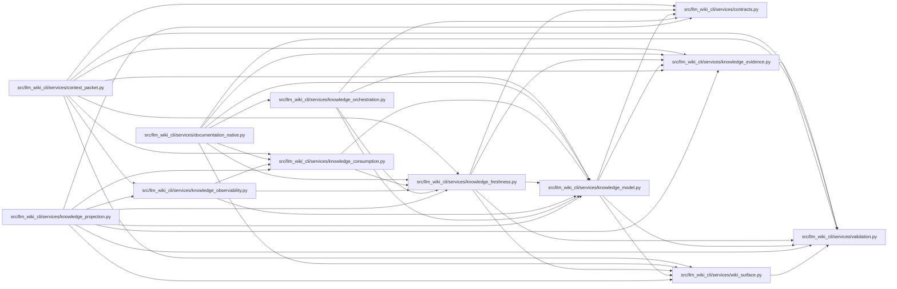

# knowledge_freshness Module

**Path:** `src/llm_wiki_cli/services/knowledge_freshness.py`

## Description

Pure live freshness comparison for generated knowledge concepts.

The persisted knowledge index records observations and their reproducibility
basis.  This module compares those records with already evaluated live inputs;
it never reads source files, invokes extraction, writes artifacts, or persists
the resulting freshness state.

## Imports

| Source | Symbols |
|--------|---------|
| `.contracts` | `GOVERNANCE_HASH_EXTENSION_KEY`, `KNOWLEDGE_SCHEMA_VERSION` |
| `.knowledge_evidence` | `UNKNOWN_ENTITY_NOT_FOUND`, `ConceptObservationBasis`, `hash_json`, `is_valid_sha256` |
| `.knowledge_model` | `BundleRecord`, `ComputedFreshness`, `ConceptRecord`, `EvidenceBasis`, `EvidenceState`, `KnowledgeIndex`, `KnowledgeModelError`, `ObservationScope`, `ProducerComponent`, `ProducerRecord`, `SnapshotRecord`, `knowledge_index_to_payload`, `parse_knowledge_index` |
| `.validation` | `require_repository_relative_path` |
| `.wiki_surface` | `PageKind` |
| `__future__` | `annotations` |
| `collections` | `Counter` |
| `collections.abc` | `Mapping`, `Set` |
| `dataclasses` | `dataclass`, `field` |
| `types` | `MappingProxyType` |

## Local dependency map

<!-- Auto-generated local dependency summary. Do not edit by hand. -->

### Internal neighbors

| Direction | Module |
|---|---|
| Inbound | [context_packet](../modules/context_packet.md) |
| Inbound | [documentation_native](../modules/documentation_native.md) |
| Inbound | [knowledge_consumption](../modules/knowledge_consumption.md) |
| Inbound | [knowledge_observability](../modules/knowledge_observability.md) |
| Inbound | [knowledge_orchestration](../modules/knowledge_orchestration.md) |
| Inbound | [knowledge_projection](../modules/knowledge_projection.md) |
| Outbound | [services_contracts](../modules/services_contracts.md) |
| Outbound | [knowledge_evidence](../modules/knowledge_evidence.md) |
| Outbound | [knowledge_model](../modules/knowledge_model.md) |
| Outbound | [validation](../modules/validation.md) |
| Outbound | [wiki_surface](../modules/wiki_surface.md) |

## Classes

| Class | Line | Bases | Description |
|-------|------|-------|-------------|
| [KnowledgeFreshnessError](../entities/KnowledgeFreshnessError.md) | 149 | `ValueError` | Field-specific failure at the pure live-comparison boundary. |
| [LiveKnowledgeEvaluation](../entities/LiveKnowledgeEvaluation.md) | 159 | — | Already evaluated live inputs required for freshness comparison. |
| [ConceptFreshnessBasis](../entities/ConceptFreshnessBasis.md) | 177 | — | Normalized recorded or live concept basis returned to consumers. |
| [ConceptFreshnessResult](../entities/ConceptFreshnessResult.md) | 190 | — | One consumer-computed freshness outcome. |
| [KnowledgeFreshnessReport](../entities/KnowledgeFreshnessReport.md) | 203 | — | Freshness results for every recorded concept and aggregate counts. |
| [_ValidatedLiveEvaluation](../entities/ValidatedLiveEvaluation.md) | 211 | — | — |

## Functions

| Function | Signature | Decorators | Description |
|----------|-----------|------------|-------------|
| `evaluate_knowledge_freshness` | `(knowledge: KnowledgeIndex \| object, live: LiveKnowledgeEvaluation \| None = None) -> KnowledgeFreshnessReport` | — | Evaluate every concept exactly once from supplied in-memory values. |
| `_validate_live_evaluation` | `(recorded: KnowledgeIndex, live: LiveKnowledgeEvaluation) -> _ValidatedLiveEvaluation` | — | — |
| `_validate_live_producer` | `(recorded: KnowledgeIndex, live: LiveKnowledgeEvaluation) -> None` | — | — |
| `_evaluate_concept` | `(knowledge: KnowledgeIndex, concept: ConceptRecord, live: _ValidatedLiveEvaluation \| None) -> ConceptFreshnessResult` | — | — |
| `_reliable_recorded_basis` | `(concept: ConceptRecord) -> EvidenceBasis \| None` | — | — |
| `_basis_incompatibility_reason` | `(recorded: KnowledgeIndex, recorded_basis: EvidenceBasis, live: _ValidatedLiveEvaluation) -> str \| None` | — | — |
| `_component_change_reason` | `(recorded: ProducerComponent, live: ProducerComponent, *, prefix: str) -> str \| None` | — | — |
| `_recorded_basis_details` | `(knowledge: KnowledgeIndex, basis: EvidenceBasis \| None) -> ConceptFreshnessBasis \| None` | — | — |
| `_live_basis_details` | `(live: _ValidatedLiveEvaluation, basis: ConceptObservationBasis) -> ConceptFreshnessBasis` | — | — |
| `_analysis_basis_hash` | `(schema_version: str, producer: ProducerRecord, generation_options_hash: str, extractor_ref: str) -> str \| None` | — | — |
| `_component_basis_payload` | `(component: ProducerComponent) -> dict[str, object]` | — | — |
| `_components_by_id` | `(components: tuple[ProducerComponent, ...]) -> dict[str, ProducerComponent]` | — | — |
| `_configuration_unknown` | `(component: ProducerComponent) -> bool` | — | — |
| `_configuration_marked_unknown` | `(component: ProducerComponent) -> bool` | — | — |
| `_version_unknown` | `(component: ProducerComponent) -> bool` | — | — |
| `_result` | `(locator: str, state: ComputedFreshness, reason_code: str, recorded_basis: ConceptFreshnessBasis \| None, live_basis: ConceptFreshnessBasis \| None, *, compared: bool) -> ConceptFreshnessResult` | — | — |
| `_validate_source_path` | `(value: object, field_name: str) -> None` | — | — |
