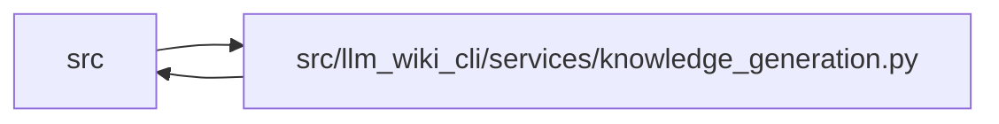

# knowledge_generation Module

**Path:** `src/llm_wiki_cli/services/knowledge_generation.py`

## Description

Shared in-memory generation planner for native knowledge artifacts.

Bootstrap, sync, migration, and repair all need to construct the same three
artifact commit from one evaluated run.  This module joins envelope evaluation,
surface indexing, knowledge indexing, and commit planning without discovering
pages, rereading source files, invoking extractors, or writing output.  The only
filesystem reads are the target-state comparisons performed by
:func:`build_knowledge_commit_plan`.

## Imports

| Source | Symbols |
|--------|---------|
| `.contracts` | `SECTION_OWNERSHIP_EXTENSION_KEY`, `TYPED_GRAPH_EXTENSION_KEY` |
| `.infrastructure_sync` | `InfrastructureSyncError`, `infrastructure_evidence_by_page` |
| `.knowledge_artifacts` | `KnowledgeArtifactError`, `KnowledgeCommitPlan`, `build_knowledge_commit_plan`, `validate_surface_index_bytes` |
| `.knowledge_envelope` | `ConsumedInput`, `EnvelopeInputs`, `KnowledgeEnvelopeError`, `ProducerComponentInput`, `RepositoryEvidence`, `build_evaluated_envelope`, `build_repository_record` |
| `.knowledge_evidence` | `ConceptObservationBasis`, `build_entity_observation_basis`, `build_module_observation_basis`, `is_valid_sha256` |
| `.knowledge_governance` | `GovernanceLedger`, `apply_governance_projection` |
| `.knowledge_graph` | `DEFAULT_EVIDENCE_LIMIT`, `GraphConcept`, `KnowledgeGraphError`, `KnowledgeGraphInputs`, `materialize_typed_graph` |
| `.knowledge_index` | `KnowledgeIndexBuildError`, `KnowledgeIndexInputs`, `build_knowledge_index`, `serialize_knowledge_index` |
| `.knowledge_links` | `KnowledgeLinkError`, `collect_link_observations` |
| `.knowledge_model` | `ProducerRecord`, `concept_kind_for_page_kind` |
| `.section_ownership` | `observe_page_sections`, `section_ownership_extension` |
| `.sync_manifest` | `EVIDENCE_NOT_RECORDED`, `MANIFEST_REPAIR_UNAVAILABLE`, `PRODUCER_BASIS_INCOMPATIBLE`, `TOMBSTONE_UNKNOWN_PROVENANCE`, `ManifestEvidenceBaseline`, `ManifestTombstone`, `SyncManifest`, `SyncManifestError` |
| `.wiki_surface` | `PageKind`, `WikiSurfacePage` |
| `__future__` | `annotations` |
| `collections.abc` | `Mapping`, `Sequence`, `Set` |
| `dataclasses` | `dataclass`, `field` |
| `json` | `json` |
| `pathlib` | `Path` |
| `typing` | `Any` |

## Local dependency map

<!-- Auto-generated local dependency summary. Do not edit by hand. -->

> Module-level dependencies exceed the generated-diagram limits, so the diagram and table below group them by top-level package. Counts report the number of module neighbors in each package.

### Internal neighbors

| Direction | Module |
|---|---|
| Inbound | `src` (1) |
| Outbound | `src` (13) |

> All 14 module neighbor(s) are summarized by package because the module-level view exceeds the 12-node limit.

## Classes

| Class | Line | Bases | Description |
|-------|------|-------|-------------|
| [KnowledgeGenerationError](../entities/KnowledgeGenerationError.md) | 85 | `ValueError` | Field-specific failure at the shared generation-planning boundary. |
| [KnowledgeGenerationInputs](../entities/KnowledgeGenerationInputs.md) | 95 | — | Complete already-evaluated inputs for one generated artifact set. |

## Functions

| Function | Signature | Decorators | Description |
|----------|-----------|------------|-------------|
| `build_knowledge_generation_plan` | `(inputs: KnowledgeGenerationInputs) -> KnowledgeCommitPlan` | — | Construct one validated atomic commit plan from evaluated inputs. |
| `_build_knowledge_generation_plan` | `(inputs: KnowledgeGenerationInputs) -> KnowledgeCommitPlan` | — | — |
| `_application_knowledge_extensions` | `(inputs: KnowledgeGenerationInputs, *, inventory: Mapping[str, Mapping[str, Any]], module_page_map: Mapping[str, str], occurrence_page_map: Mapping[tuple[str, str, int], str]) -> dict[str, Any]` | — | Build reserved extensions from the exact final evaluated snapshot. |
| `_graph_concepts` | `(pages: Sequence[WikiSurfacePage], *, module_page_map: Mapping[str, str], occurrence_page_map: Mapping[tuple[str, str, int], str]) -> tuple[GraphConcept, ...]` | — | Project final surface coordinates into graph ownership coordinates. |
| `_preserve_unchanged_unknown_baselines` | `(baselines: Mapping[str, ConceptObservationBasis], previous: SyncManifest \| None, source_hashes: Mapping[str, str], regenerated_page_paths: frozenset[str]) -> dict[str, ConceptObservationBasis \| ManifestEvidenceBaseline]` | — | Keep unrecoverable provenance unknown until its source is regenerated. |
| `_validated_evidence_page_paths` | `(value: AbstractSet[str], current_baselines: Mapping[str, ConceptObservationBasis], field_name: str) -> frozenset[str]` | — | — |
| `_mark_untrusted_evidence` | `(current_baselines: Mapping[str, ConceptObservationBasis], selected_baselines: Mapping[str, ConceptObservationBasis \| ManifestEvidenceBaseline], untrusted_page_paths: AbstractSet[str], previous: SyncManifest \| None, source_hashes: Mapping[str, str], *, unknown_reason: str) -> tuple[dict[str, ConceptObservationBasis \| ManifestEvidenceBaseline], frozenset[str]]` | — | Avoid claiming fresh evidence for Markdown a command did not rewrite. |
| `_defer_sources_for_regeneration` | `(manifest: SyncManifest, source_paths: frozenset[str], *, unknown_reason: str) -> SyncManifest` | — | Retain page coordinates but make skipped source evidence explicitly pending. |
| `_reconcile_active_structural_evidence` | `(manifest: SyncManifest, *, active_page_paths: frozenset[str], previous: SyncManifest \| None, force_unknown: bool, unknown_reason: str) -> SyncManifest` | — | Restrict operational evidence to active Markdown structural pages. |
| `_validated_previous_producer` | `(value: ProducerRecord \| None) -> ProducerRecord \| None` | — | — |
| `_downgrade_incompatible_tombstones` | `(manifest: SyncManifest, *, current_producer: ProducerRecord, previous_producer: ProducerRecord \| None) -> SyncManifest` | — | Do not bind historical evidence to a changed same-ID producer. |
| `_prior_explicit_unknown_reason` | `(previous: SyncManifest \| None, page_path: str) -> str \| None` | — | — |
| `_validated_inventory` | `(value: object) -> dict[str, Mapping[str, Any]]` | — | — |
| `_validated_source_hashes` | `(inventory: Mapping[str, object], value: object) -> dict[str, str]` | — | — |
| `_validated_consumed_inputs` | `(inventory: Mapping[str, object], source_hashes: Mapping[str, str], value: object) -> tuple[ConsumedInput, ...]` | — | — |
| `_validated_page_maps` | `(inventory: Mapping[str, Mapping[str, Any]], module_value: object, occurrence_value: object) -> tuple[dict[str, str], dict[tuple[str, str], str], dict[tuple[str, str, int], str]]` | — | — |
| `_raise_page_map_parity` | `(field: str, expected: set[Any], actual: set[Any]) -> None` | — | — |
| `_exact_source_mapping` | `(inventory: Mapping[str, object], value: object, field: str, value_type: type) -> dict[str, Any]` | — | — |
| `_build_evidence_baselines` | `(inventory: Mapping[str, Mapping[str, Any]], source_hashes: Mapping[str, str], module_page_map: Mapping[str, str], occurrence_page_map: Mapping[tuple[str, str, int], str], extractor_refs: Mapping[str, str], completeness: Mapping[str, bool]) -> dict[str, ConceptObservationBasis]` | — | — |
| `_surface_index_bytes` | `(exact_bytes: object, payload: object) -> bytes` | — | — |
| `_next_manifest_mapping` | `(supplied: Mapping[str, Any] \| None, previous: Mapping[str, Any]) -> Mapping[str, Any]` | — | — |
| `_structural_page_paths` | `(pages: Sequence[WikiSurfacePage]) -> tuple[str, ...]` | — | — |
