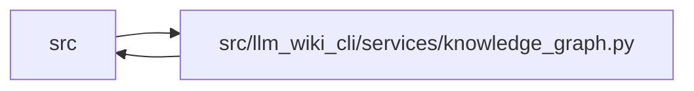

# knowledge_graph Module

**Path:** `src/llm_wiki_cli/services/knowledge_graph.py`

## Description

Pure typed-graph contract and materializer.

The typed graph is an independently versioned, namespaced extension of the
``llm-wiki-knowledge/v1`` read model.  Keeping it behind that extension
preserves the frozen v1 ``derived_from``/``links_to`` relationship contract
while allowing structural analyzers to publish richer endpoints, evidence,
and coverage.

This module is intentionally pure over caller-supplied values.  It performs no
file reads or writes, source discovery, Markdown parsing, helper execution,
subprocess work, network access, or LLM calls.

## Imports

| Source | Symbols |
|--------|---------|
| `.contracts` | `TYPED_GRAPH_EXTENSION_KEY`, `TYPED_GRAPH_SCHEMA_VERSION` |
| `.knowledge_evidence` | `canonical_json_text`, `sha256_bytes` |
| `.validation` | `require_choice`, `require_exact_fields`, `require_list`, `require_mapping`, `require_nonempty_text`, `require_nonnegative_int`, `require_positive_int`, `require_repository_relative_path`, `require_sha256` |
| `.wiki_media` | `contains_uri_authority_userinfo` |
| `.wiki_surface` | `WikiSurfaceError`, `validate_exact_page_coordinate` |
| `__future__` | `annotations` |
| `collections` | `defaultdict` |
| `collections.abc` | `Iterable`, `Mapping`, `Sequence` |
| `dataclasses` | `dataclass`, `field` |
| `json` | `json` |
| `math` | `math` |
| `re` | `re` |
| `typing` | `Any`, `cast` |
| `urllib.parse` | `urlsplit` |

## Local dependency map

<!-- Auto-generated local dependency summary. Do not edit by hand. -->

> Module-level dependencies exceed the generated-diagram limits, so the diagram and table below group them by top-level package. Counts report the number of module neighbors in each package.

### Internal neighbors

| Direction | Module |
|---|---|
| Inbound | `src` (9) |
| Outbound | `src` (5) |

> All 14 module neighbor(s) are summarized by package because the module-level view exceeds the 12-node limit.

## Classes

| Class | Line | Bases | Description |
|-------|------|-------|-------------|
| [KnowledgeGraphError](../entities/KnowledgeGraphError.md) | 109 | `ValueError` | Field-specific typed-graph contract or materialization failure. |
| [GraphConcept](../entities/GraphConcept.md) | 119 | — | One already-built concept coordinate used for endpoint lifting. |
| [KnowledgeGraphInputs](../entities/KnowledgeGraphInputs.md) | 131 | — | Complete evaluated inputs for one pure graph materialization. |
| [_EdgeAccumulator](../entities/EdgeAccumulator.md) | 147 | — | — |
| [_MaterializationState](../entities/MaterializationState.md) | 204 | — | — |

## Functions

| Function | Signature | Decorators | Description |
|----------|-----------|------------|-------------|
| `is_supported_relationship_kind` | `(value: object) -> bool` | — | Return whether *value* is a core or qualified relationship kind. |
| `concept_endpoint` | `(locator: str) -> dict[str, str]` | — | Return a typed concept endpoint after validating its exact locator. |
| `source_symbol_endpoint` | `(source_path: str, symbol: str) -> dict[str, str]` | — | Return a typed source-symbol endpoint. |
| `external_resource_endpoint` | `(resource: str, *, uri: str \| None = None) -> dict[str, str]` | — | Return a typed external-resource endpoint. |
| `unresolved_endpoint` | `(raw_target: str, *, candidates: Sequence[Mapping[str, Any]] = ()) -> dict[str, Any]` | — | Return an unresolved endpoint with optional non-authoritative candidates. |
| `relationship_edge_key` | `(identity: Mapping[str, Any]) -> str` | — | Return the domain-separated canonical key for one edge identity. |
| `materialize_typed_graph` | `(inputs: KnowledgeGraphInputs) -> dict[str, Any]` | — | Materialize a deterministic evidence-backed graph from evaluated inputs. |
| `validate_typed_graph` | `(payload: object, *, concept_kinds: Mapping[str, str] \| None = None) -> dict[str, Any]` | — | Validate and canonicalize one ``llm-wiki-typed-graph/v1`` payload. |
| `serialize_typed_graph` | `(payload: object, *, concept_kinds: Mapping[str, str] \| None = None) -> str` | — | Return deterministic JSON for a standalone typed graph. |
| `typed_graph_from_knowledge_extensions` | `(extensions: Mapping[str, Any], *, concept_kinds: Mapping[str, str] \| None = None) -> dict[str, Any] \| None` | — | Validate the reserved graph extension, returning ``None`` when absent. |
| `_materialization_state` | `(inputs: KnowledgeGraphInputs, concepts: tuple[GraphConcept, ...], input_hashes: dict[str, str]) -> _MaterializationState` | — | — |
| `_materialize_contains` | `(state: _MaterializationState) -> None` | — | — |
| `_materialize_imports` | `(state: _MaterializationState) -> None` | — | — |
| `_materialize_calls` | `(state: _MaterializationState) -> None` | — | — |
| `_materialize_entrypoints` | `(state: _MaterializationState) -> None` | — | — |
| `_aggregate_flow_coverage` | `(flows: Sequence[Mapping[str, Any]], *, limitations: Iterable[str]) -> dict[str, Any]` | — | — |
| `_materialize_data_effects` | `(state: _MaterializationState) -> None` | — | — |
| `_directional_data_effect_coverage` | `(data_flow: Mapping[str, Any]) -> dict[str, Any] \| None` | — | Return upstream reads/writes coverage when the detailed API supplied it. |
| `_materialize_external_dependencies` | `(state: _MaterializationState) -> None` | — | — |
| `_owner_concept` | `(state: _MaterializationState, source_path: str, symbol: str) -> GraphConcept \| None` | — | — |
| `_normalise_graph_concepts` | `(values: Sequence[GraphConcept]) -> tuple[GraphConcept, ...]` | — | — |
| `_graph_concept_payload` | `(value: GraphConcept) -> dict[str, Any]` | — | — |
| `_normalise_edge` | `(value: object, path: str, concept_kinds: Mapping[str, str] \| None) -> dict[str, Any]` | — | — |
| `_normalise_endpoint` | `(value: object, path: str) -> dict[str, Any]` | — | — |
| `_normalise_evidence` | `(value: object, path: str) -> dict[str, Any]` | — | — |
| `_normalise_evidence_sample` | `(value: object, path: str) -> dict[str, Any]` | — | — |
| `_normalise_location` | `(value: object, path: str) -> dict[str, Any]` | — | — |
| `_normalise_detector` | `(value: object, path: str) -> dict[str, str]` | — | — |
| `_normalise_coverage` | `(value: object, path: str, *, include_analyzer: bool = False) -> dict[str, Any]` | — | — |
| `_normalise_input_hashes` | `(value: object) -> dict[str, str]` | — | — |
| `_normalise_analyzer_limitations` | `(value: Mapping[str, Sequence[str]]) -> dict[str, list[str]]` | — | — |
| `_validate_graph_bindings` | `(input_hashes: Mapping[str, str], coverage: Sequence[Mapping[str, Any]], edges: Sequence[Mapping[str, Any]]) -> None` | — | — |
| `_validate_resolution_target` | `(target: Mapping[str, Any], resolution: str, path: str) -> None` | — | — |
| `_validate_core_direction` | `(kind: str, source: Mapping[str, Any], target: Mapping[str, Any], origin: str, resolution: str, evidence: Mapping[str, Any], path: str, concept_kinds: Mapping[str, str] \| None) -> None` | — | — |
| `_endpoint_concept_kind` | `(endpoint: Mapping[str, Any], concept_kinds: Mapping[str, str] \| None) -> str \| None` | — | — |
| `_concept_kind_allowed` | `(endpoint: Mapping[str, Any], actual_kind: str \| None, allowed: set[str], *, kinds_known: bool) -> bool` | — | — |
| `_validate_endpoint_concept_references` | `(endpoint: Mapping[str, Any], concept_kinds: Mapping[str, str] \| None, path: str) -> None` | — | — |
| `_require_direction` | `(condition: bool, path: str, message: str) -> None` | — | — |
| `_require_origin` | `(origin: str, allowed: set[str], path: str) -> None` | — | — |
| `_require_core_evidence` | `(evidence: Mapping[str, Any], *, sample_kind: str, required_fields: set[str], path: str) -> None` | — | — |
| `_observation_collection` | `(value: Mapping[str, Any] \| Sequence[Mapping[str, Any]], path: str) -> tuple[list[Any], Mapping[str, Any] \| None]` | — | — |
| `_observation_bundle_for_hash` | `(value: Mapping[str, Any] \| Sequence[Mapping[str, Any]], path: str) -> Any` | — | — |
| `_sorted_json_records` | `(values: Sequence[Mapping[str, Any]], path: str) -> list[Any]` | — | — |
| `_coverage_from_supplied` | `(supplied: Mapping[str, Any] \| None, *, fallback_observed: int, emitted: int, limitations: Sequence[str]) -> dict[str, Any]` | — | — |
| `_coverage` | `(observed: int, emitted: int, *, limit: int \| None, limitations: Iterable[str]) -> dict[str, Any]` | — | — |
| `_limitations` | `(inputs: KnowledgeGraphInputs, analyzer: str) -> tuple[str, ...]` | — | — |
| `_line_location` | `(source_path: str, value: object) -> dict[str, Any]` | — | — |
| `_external_import_resource` | `(module: str, name: str) -> str` | — | — |
| `_effect_resource` | `(effect: Mapping[str, Any]) -> str` | — | — |
| `_aggregate_input_hash` | `(input_hashes: Mapping[str, str]) -> str` | — | — |
| `_canonical_json` | `(value: object) -> str` | — | — |
| `_json_value` | `(value: object, path: str, *, depth: int = 0, allow_control_strings: bool = False) -> Any` | — | — |
| `_object` | `(value: object, path: str) -> dict[str, Any]` | — | — |
| `_array` | `(value: object, path: str) -> list[Any]` | — | — |
| `_only_fields` | `(value: Mapping[str, Any], path: str, allowed: set[str], *, required: set[str] \| frozenset[str] = frozenset()) -> None` | — | — |
| `_enum` | `(value: object, values: Sequence[str], path: str) -> str` | — | — |
| `_relationship_kind` | `(value: object, path: str) -> str` | — | — |
| `_open_name` | `(value: object, path: str) -> str` | — | — |
| `_name` | `(value: object, path: str) -> str` | — | — |
| `_relative_path` | `(value: object, path: str) -> str` | — | — |
| `_locator` | `(value: object, path: str) -> str` | — | — |
| `_external_uri` | `(value: object, path: str) -> str` | — | — |
| `_hash` | `(value: object, path: str) -> str` | — | — |
| `_limitation` | `(value: object, path: str) -> str` | — | — |
| `_nonnegative_int` | `(value: object, path: str) -> int` | — | — |
| `_positive_int` | `(value: object, path: str) -> int` | — | — |
