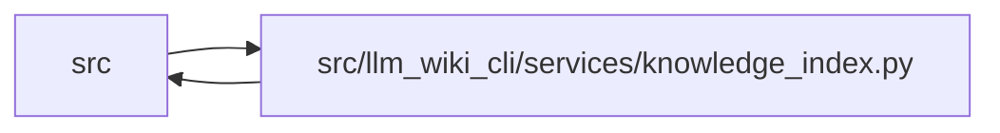

# knowledge_index Module

**Path:** `src/llm_wiki_cli/services/knowledge_index.py`

## Description

Pure construction and validation of the native knowledge index.

This service is the join point for already evaluated inputs.  It never reads a
wiki or source file, rebuilds an inventory, invokes a producer, evaluates live
freshness, or writes an artifact.  Callers are responsible for supplying the
exact canonical Markdown strings, surface-index bytes, manifest evidence, and
link observations from the generation run being committed.

## Imports

| Source | Symbols |
|--------|---------|
| `.contracts` | `KNOWLEDGE_SCHEMA_VERSION` |
| `.knowledge_envelope` | `INVENTORY_HASH_EXTENSION`, `EvaluatedEnvelope`, `KnowledgeEnvelopeError`, `evaluated_envelope_to_payload`, `hash_markdown_snapshot` |
| `.knowledge_evidence` | `ConceptObservationBasis`, `canonical_json_text`, `is_valid_sha256`, `sha256_bytes` |
| `.knowledge_governance` | `GOVERNANCE_EXTENSION_KEY` |
| `.knowledge_links` | `LinkObservation`, `LinkSyntax`, `is_valid_external_link_uri`, `is_valid_link_locator_target` |
| `.knowledge_model` | `Actor`, `ActorKind`, `BundleRecord`, `ConceptFacets`, `ConceptKind`, `ConceptRecord`, `DocumentRecord`, `EvidenceBasis`, `EvidenceState`, `KnowledgeIndex`, `KnowledgeModelError`, `Lifecycle`, `ObservationScope`, `Origin`, `RelationshipEvidence`, `RelationshipKind`, `RelationshipLocation`, `RelationshipRecord`, `RelationshipTarget`, `Resolution`, `SemanticFacet`, `StructuralFacet`, `TargetClass`, `Verification`, `concept_kind_for_page_kind`, `parse_knowledge_index`, `knowledge_index_to_payload`, `serialize_knowledge_index` |
| `.sync_manifest` | `ManifestEvidenceBaseline`, `ManifestPageSource`, `ManifestTombstone` |
| `.validation` | `contains_control_character`, `require_exact_fields`, `require_repository_relative_path` |
| `.wiki_media` | `MarkdownLinkTarget`, `contains_uri_authority_userinfo`, `is_assets_path`, `iter_markdown_link_targets`, `iter_mermaid_click_targets`, `local_link_path`, `mask_fenced_code_blocks`, `media_type_for_path`, `normalize_markdown_link_target` |
| `.wiki_surface` | `PageKind`, `SurfaceRole`, `WikiSurfaceError`, `WikiSurfacePage`, `iter_page_kinds`, `canonical_path`, `mcp_uri` |
| `.wiki_surface_index` | `WIKI_SURFACE_INDEX_SCHEMA_VERSION` |
| `__future__` | `annotations` |
| `collections.abc` | `Mapping`, `Sequence` |
| `dataclasses` | `dataclass`, `field` |
| `json` | `json` |
| `posixpath` | `posixpath` |
| `re` | `re` |
| `typing` | `Any` |
| `urllib.parse` | `urlsplit` |

## Local dependency map

<!-- Auto-generated local dependency summary. Do not edit by hand. -->

> Module-level dependencies exceed the generated-diagram limits, so the diagram and table below group them by top-level package. Counts report the number of module neighbors in each package.

### Internal neighbors

| Direction | Module |
|---|---|
| Inbound | `src` (3) |
| Outbound | `src` (11) |

> All 14 module neighbor(s) are summarized by package because the module-level view exceeds the 12-node limit.

## Classes

| Class | Line | Bases | Description |
|-------|------|-------|-------------|
| [KnowledgeIndexBuildError](../entities/KnowledgeIndexBuildError.md) | 129 | `ValueError` | Field-specific failure at the pure knowledge-index join boundary. |
| [KnowledgeIndexInputs](../entities/KnowledgeIndexInputs.md) | 144 | — | Already evaluated values required to construct one knowledge index. |
| [_SurfacePage](../entities/SurfacePage.md) | 162 | — | — |
| [_JoinedPage](../entities/JoinedPage.md) | 174 | — | — |
| [_BuildContext](../entities/BuildContext.md) | 196 | — | — |
| [_ExpectedLinkOutcome](../entities/ExpectedLinkOutcome.md) | 204 | — | — |
| [_InvalidSurfaceJson](../entities/InvalidSurfaceJson.md) | 211 | `ValueError` | — |

## Functions

| Function | Signature | Decorators | Description |
|----------|-----------|------------|-------------|
| `build_knowledge_index` | `(inputs: KnowledgeIndexInputs) -> KnowledgeIndex` | — | Build one deterministic v1 knowledge index without performing I/O. |
| `validate_knowledge_index` | `(value: KnowledgeIndex \| object, *, inputs: KnowledgeIndexInputs \| None = None) -> KnowledgeIndex` | — | Validate a model or decoded payload against the knowledge-index contract. |
| `knowledge_index_to_payload` | `(value: KnowledgeIndex \| object) -> dict[str, Any]` | — | Validate and return the canonical JSON-compatible builder payload. |
| `serialize_knowledge_index` | `(value: KnowledgeIndex \| object) -> str` | — | Validate and serialize deterministically with one trailing newline. |
| `_validate_and_join_inputs` | `(inputs: KnowledgeIndexInputs) -> _BuildContext` | — | — |
| `_validated_bundle` | `(envelope: object)` | — | — |
| `_validated_pages` | `(value: object) -> tuple[tuple[WikiSurfacePage, ...], dict[str, WikiSurfacePage]]` | — | — |
| `_expected_page_coordinates` | `(page: WikiSurfacePage, field_name: str) -> tuple[str, str]` | — | — |
| `_validated_content` | `(value: object, pages_by_path: Mapping[str, WikiSurfacePage]) -> dict[str, str]` | — | — |
| `_validate_snapshot_commitments` | `(expected_markdown_hash: str, expected_surface_hash: str, content_by_page: Mapping[str, str], surface_index_bytes: object) -> None` | — | — |
| `_surface_pages` | `(value: bytes) -> dict[str, _SurfacePage]` | — | — |
| `_unique_json_object` | `(items: list[tuple[str, Any]]) -> dict[str, Any]` | — | — |
| `_reject_json_constant` | `(value: str) -> None` | — | — |
| `_validate_surface_page` | `(surface: _SurfacePage, page: WikiSurfacePage) -> None` | — | — |
| `_typed_mapping` | `(value: object, field_name: str, value_type: type) -> dict[str, Any]` | — | — |
| `_validate_page_evidence` | `(joined: _JoinedPage, extractor_ids: set[str]) -> None` | — | — |
| `_reject_extra_state` | `(field_name: str, values: Mapping[str, Any], active_paths: set[str]) -> None` | — | — |
| `_validated_observations` | `(value: object, joined_by_path: Mapping[str, _JoinedPage]) -> tuple[LinkObservation, ...]` | — | — |
| `_validate_observation_source_syntax` | `(observation: LinkObservation, parsed_occurrences: Mapping[tuple[LinkSyntax, int, int], tuple[MarkdownLinkTarget, ...]], field_name: str) -> None` | — | — |
| `_index_source_link_occurrences` | `(content: str) -> Mapping[tuple[LinkSyntax, int, int], tuple[MarkdownLinkTarget, ...]]` | — | — |
| `_validate_observation_endpoint` | `(observation: LinkObservation, source: _JoinedPage, joined_by_path: Mapping[str, _JoinedPage], page_locator_by_path: Mapping[str, str], field_name: str) -> None` | — | — |
| `_expected_observation_outcome` | `(observation: LinkObservation, source_path: str, page_locator_by_path: Mapping[str, str]) -> _ExpectedLinkOutcome \| None` | — | — |
| `_contains_control_character` | `(value: str) -> bool` | — | — |
| `_observation_contains_authority_userinfo` | `(observation: LinkObservation) -> bool` | — | — |
| `_concept_for_page` | `(joined: _JoinedPage) -> ConceptRecord` | — | — |
| `_structural_facet` | `(joined: _JoinedPage, concept_kind: ConceptKind) -> StructuralFacet` | — | — |
| `_evidence_basis` | `(value: ConceptObservationBasis) -> EvidenceBasis` | — | — |
| `_derived_relationship` | `(joined: _JoinedPage) -> RelationshipRecord \| None` | — | — |
| `_link_relationship` | `(observation: LinkObservation, joined_by_path: Mapping[str, _JoinedPage]) -> RelationshipRecord` | — | — |
| `_validate_builder_model` | `(model: KnowledgeIndex) -> None` | — | — |
| `_require_structure_state` | `(structure: StructuralFacet, concept_path: str, *, origin: Origin, evidence: EvidenceState, allows_basis: bool) -> None` | — | — |
| `_validate_builder_link` | `(relationship: RelationshipRecord, source: ConceptRecord, page_locator_by_path: Mapping[str, str], path: str) -> None` | — | — |
| `_validate_builder_derived` | `(relationship: RelationshipRecord, source: ConceptRecord, path: str) -> None` | — | — |
| `_require_exact_keys` | `(field_name: str, expected: Mapping[str, Any], actual: Mapping[str, Any]) -> None` | — | — |
| `_relative_path` | `(value: object, field_name: str) -> str` | — | — |
| `_nonempty_string` | `(value: object, field_name: str) -> str` | — | — |
| `_contains_surrogate` | `(value: str) -> bool` | — | — |
| `_first_difference` | `(actual: Any, expected: Any, path: str = 'model') -> str` | — | — |
