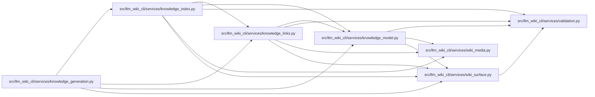

# knowledge_links Module

**Path:** `src/llm_wiki_cli/services/knowledge_links.py`

## Description

Lossless, deterministic observations of links in canonical Markdown.

The collector is pure over already discovered wiki pages, their supplied
Markdown content, and an already evaluated set of asset paths.  It performs no
filesystem reads or source scans.  Mapping observations to persisted
``links_to`` relationships, including page hashes, belongs to the knowledge
index builder.

## Imports

| Source | Symbols |
|--------|---------|
| `.knowledge_model` | `RelationshipLocation`, `Resolution`, `TargetClass` |
| `.validation` | `contains_control_character`, `require_repository_relative_path` |
| `.wiki_media` | `MarkdownLinkTarget`, `contains_uri_authority_userinfo`, `is_assets_path`, `iter_markdown_link_targets`, `iter_mermaid_click_targets`, `local_link_path`, `mask_fenced_code_blocks`, `media_type_for_path` |
| `.wiki_surface` | `PageKind`, `WikiSurfaceError`, `WikiSurfacePage`, `canonical_path`, `mcp_uri` |
| `__future__` | `annotations` |
| `collections.abc` | `Mapping`, `Sequence`, `Set` |
| `dataclasses` | `dataclass` |
| `enum` | `Enum` |
| `posixpath` | `posixpath` |
| `re` | `re` |
| `urllib.parse` | `SplitResult`, `unquote`, `urlsplit` |

## Local dependency map

<!-- Auto-generated local dependency summary. Do not edit by hand. -->

### Internal neighbors

| Direction | Module |
|---|---|
| Inbound | [knowledge_generation](../modules/knowledge_generation.md) |
| Inbound | [knowledge_index](../modules/knowledge_index.md) |
| Outbound | [knowledge_model](../modules/knowledge_model.md) |
| Outbound | [validation](../modules/validation.md) |
| Outbound | [wiki_media](../modules/wiki_media.md) |
| Outbound | [wiki_surface](../modules/wiki_surface.md) |

## Classes

| Class | Kind | Line | Bases / Target | Description |
|-------|------|------|----------------|-------------|
| [KnowledgeLinkError](../entities/KnowledgeLinkError.md) | Class | 53 | `ValueError` | Field-specific invalid input at the pure link-collection boundary. |
| [LinkSyntax](../entities/LinkSyntax.md) | Enum | 62 | `str`, `Enum` | Source syntax that produced one Markdown-owned observation. |
| [LinkObservation](../entities/LinkObservation.md) | Class | 71 | — | One lossless link occurrence and its deterministic resolution outcome. |
| [_TargetOutcome](../entities/TargetOutcome.md) | Class | 118 | — | — |
| [_PageRegistry](../entities/PageRegistry.md) | Class | 126 | — | — |

## Functions

| Function | Signature | Decorators | Description |
|----------|-----------|------------|-------------|
| `collect_link_observations` | `(pages: Sequence[WikiSurfacePage], content_by_page: Mapping[str, str], *, existing_asset_paths: AbstractSet[str] = frozenset()) -> tuple[LinkObservation, ...]` | — | Collect every supported link occurrence without deduplication or limits. |
| `_build_page_registry` | `(pages: Sequence[WikiSurfacePage]) -> tuple[_PageRegistry, tuple[WikiSurfacePage, ...]]` | — | — |
| `_validate_page_content` | `(content_by_page: Mapping[str, str], registry: _PageRegistry) -> dict[str, str]` | — | — |
| `_validate_asset_paths` | `(paths: AbstractSet[str], registry: _PageRegistry) -> frozenset[str]` | — | — |
| `_build_observation` | `(page: WikiSurfacePage, link: MarkdownLinkTarget, syntax: LinkSyntax, registry: _PageRegistry, existing_assets: frozenset[str]) -> LinkObservation \| None` | — | — |
| `_classify_target` | `(*, source_path: str, normalized_target: str, is_image: bool, registry: _PageRegistry, existing_assets: frozenset[str]) -> _TargetOutcome` | — | — |
| `_concept_candidates` | `(candidates: Sequence[WikiSurfacePage]) -> _TargetOutcome` | — | — |
| `_malformed` | `() -> _TargetOutcome` | — | — |
| `_expected_page_coordinates` | `(page: WikiSurfacePage, field: str) -> tuple[str, str]` | — | — |
| `_valid_external_uri` | `(value: str, parsed: SplitResult, port: int \| None) -> bool` | — | — |
| `is_valid_external_link_uri` | `(value: str) -> bool` | — | Return whether *value* is a supported absolute external link URI. |
| `_valid_link_locator` | `(value: str, parsed: SplitResult, port: int \| None) -> bool` | — | — |
| `is_valid_link_locator_target` | `(value: str) -> bool` | — | Return whether *value* is a supported ``llm-wiki:`` link target. |
| `_canonical_relative_path` | `(value: str, field: str) -> str` | — | — |
| `_contains_control_character` | `(value: str) -> bool` | — | — |
| `_page_locator` | `(value: str, field: str) -> str` | — | — |
